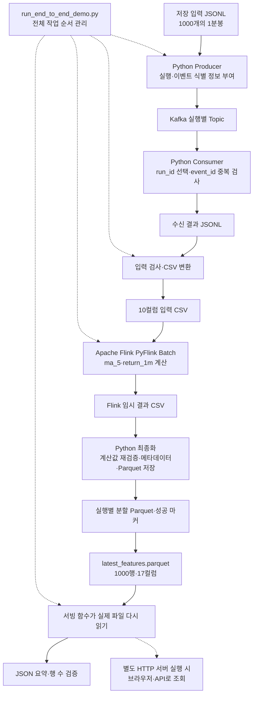
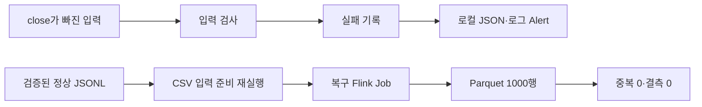

# 7차시 최종 통합 보고서: 비트코인 데이터가 수집되어 화면에 보이기까지

> 작성·재검토: 2026-09-05  
> 대표 전체 실행: 2026-09-04 15:13:33~15:13:50, 한국 시각  
> 대상: Binance USDT-M BTCUSDT 1분봉 데이터  
> 결과: 입력 1,000건 → Kafka 수신 1,000건 → 피처 저장 1,000행 → 파일 조회 1,000행

이 문서는 프로젝트의 목적부터 데이터의 이동 과정, 도구를 선택한 이유, 실제 결과, 장애 복구,
실행 방법과 남은 작업까지 한곳에 모은 최종 발표용 보고서다. 다른 설명 문서를 먼저 읽지 않아도
이 문서의 순서대로 이해할 수 있도록 작성했다.

먼저 기억할 사실은 두 가지다. **데이터를 받아 가공하고 저장한 뒤 실제로 읽는 흐름은 실행으로
확인했다. 수익을 내는 자동매매 모델과 실거래 운영은 아직 완성되지 않았다.**

본문의 표와 JSON 발췌만으로도 결과를 이해할 수 있다. 실제 화면 사진은 같은 제출 폴더의
`evidence/` 이미지를 연결했다. GitHub에서 사진까지 보려면 이 문서와 해당 이미지 폴더를
함께 올려야 한다. Markdown 파일 자체 안에 PNG 파일이 포함되는 것은 아니다.

### 문서 안에서 바로 이동하기

- [프로젝트 목적과 쉬운 설명](#purpose)
- [실제 입력 데이터와 메시지](#data)
- [전체 흐름과 Mermaid 구성도](#flow)
- [대표 실행의 정확한 수치](#execution)
- [부하·장애·복구 결과](#recovery)
- [직접 실행하는 방법](#commands)
- [완료한 작업과 남은 작업](#remaining)
- [GitHub 제출과 핵심 설명](#submission)

---

<a id="purpose"></a>

## 1. 무엇을 만들고 있는가?

### 1.1 출발점

최종 목표는 비트코인 선물 시장을 분석하는 머신러닝을 만들고, 충분한 검증을 거쳐 자동매매
후보로 연결하는 것이다. 그런데 머신러닝부터 실행하면 먼저 해결해야 할 문제가 생긴다.

- 가격 기록이 빠져 있으면 실제 가격 변화를 잘못 배운다.
- 같은 기록이 두 번 들어가면 특정 상황이 실제보다 자주 발생한 것으로 배운다.
- 미래 가격을 미리 넣으면 과거 시험에서는 잘 맞지만 실제로는 쓸 수 없는 모델이 된다.
- 처리 프로그램이 성공했다고 해도 최종 파일이 잘못 저장되면 다음 단계에서 사용할 수 없다.

그래서 먼저 **믿고 사용할 수 있는 데이터를 만드는 과정**을 구축했다. 이것이 이 프로젝트의
데이터 엔지니어링 부분이다.

### 1.2 초등학생도 이해할 수 있는 예

반 학생들의 매일 키를 기록한다고 생각해 보자.

```text
학생들의 키 기록을 받는다.
→ 같은 학생의 같은 날 기록이 두 번 들어왔는지 확인한다.
→ 최근 며칠 평균과 어제보다 얼마나 자랐는지 계산한다.
→ 정리한 표를 파일로 보관한다.
→ 그 파일을 열어 표와 숫자를 확인한다.
```

우리 프로젝트는 학생의 키 대신 **비트코인의 가격과 거래량**을 다룬다.
가격 기록을 받는 것부터 마지막 표를 읽는 것까지 이어진 길을 데이터 파이프라인이라고 부른다.

### 1.3 7차시에서 완성한 부분

앞선 작업에서는 메시지 전송, 가공, 저장, 복구를 확인했다. 이번에는 그 끝에
**저장된 결과를 읽어서 사람과 프로그램에게 보여주는 서빙 레이어**를 붙였다.

```text
이미 저장한 실제 시장 기록
→ 전송
→ 수신
→ 가공
→ 최종 파일 저장
→ 같은 파일을 다시 읽어 숫자와 표로 확인
```

여기서 서빙은 음식 서빙처럼 “준비된 결과를 꺼내 제공한다”는 뜻이다.
이번 서빙은 가공 데이터 조회이며, 매수·매도 주문이나 예측 결과 제공은 포함하지 않는다.

---

## 2. 과제 요구사항과 실제로 한 일

| 과제 요구 | 이번 구현 | 확인 결과 |
| --- | --- | --- |
| 최종 저장 결과를 실제로 읽기 | Python이 Parquet 파일을 읽고 JSON 및 웹 화면으로 제공 | 1,000행, 17컬럼, healthy |
| 입력부터 읽기까지 한 번에 실행 | `run_end_to_end_demo.py`가 하위 작업을 순서대로 호출 | 대표 실행 success, 16.969초 |
| 최신 구조와 데이터 모델 | 이 문서에 실제 파일 전달 경로와 17개 컬럼 수록 | Kafka 직접 스트리밍과 배치 데모 구분 |
| 부하·장애·복구 결과와 한계 설명 | 기존 실험의 수치·실패 지점·복구 위치를 재사용 | 10,000개 고유 이벤트 저장, 중복 500개 제거 |
| 실행 방법과 결과 확인 방법 | 파일 조회, HTTP 조회, 전체 재현 명령 수록 | 작은 파일 조회는 Docker 없이 가능 |
| 아직 안 되는 부분 구분 | 모델 승인, 장기 Paper, 주문 기능을 별도 표시 | 현재 research_only / no_trade |
| 짧은 발표 시연 | 저장 파일을 한 번 읽고 종료 | 외부 시장 API나 장애 재현 불필요 |

이번 대표 실행은 **Python 명령 하나**로 재현한 기록이다.
Airflow DAG 한 번으로 이번 Kafka 데모까지 수행했다고 설명하지 않는다.
Airflow 날짜 입력 백필은 별도로 구현·검증한 프로젝트 경로다.

---

## 3. 사용하는 말부터 쉽게 이해하기

| 말 | 쉬운 뜻 | 우리 프로젝트에서의 역할 |
| --- | --- | --- |
| Binance | 시장 기록을 제공하는 거래소 | 원래 가격 데이터의 출처 |
| BTCUSDT | 비트코인 가격을 USDT 기준으로 나타내는 종목 | 이번 입력의 종목 |
| USDT-M | USDT 등을 증거금·정산에 사용하는 선물 상품군 | 이번 데이터의 시장 구분 |
| 1분봉 | 1분 동안 가격과 거래량을 요약한 한 줄 | 입력 1건의 단위 |
| OHLCV | 시작·최고·최저·끝 가격과 거래량 | 원래 가격 기록의 다섯 값 |
| 이벤트 | 시스템 사이로 전달하는 기록 한 건 | JSON으로 만든 1분봉 한 건 |
| JSON | 이름과 값을 묶어 적는 데이터 형식 | 메시지와 실행 결과 기록 |
| JSONL | JSON 한 개를 한 줄에 적은 파일 | 1,000줄이면 이벤트 1,000건 |
| Producer | 데이터를 보내는 프로그램 | Python Kafka 전송 코드 |
| Consumer | 데이터를 받아 읽는 프로그램 | Python Kafka 수신 코드 |
| Kafka | 메시지를 저장하고 읽게 해 주는 중간 시스템 | 전송·수신 속도를 분리하고 메시지 보관 |
| Topic | Kafka 안에서 메시지를 모으는 이름 있는 공간 | 이번 실행 전용 메시지 보관 구분 |
| Partition | Topic을 내부적으로 나눈 저장 단위 | 병렬 처리와 순서 관리의 단위 |
| Flink | 데이터를 계산하고 처리하는 실행 엔진 | 이동평균·수익률 계산 |
| PyFlink | Python으로 Flink 작업을 작성·실행하는 인터페이스 | 별도 엔진이 아니라 Apache Flink 사용 방법 |
| 피처 | 분석이나 학습에 쓸 수 있게 만든 값 | ma_5, return_1m |
| Parquet | 표 데이터를 컬럼 중심으로 압축 저장하는 파일 형식 | 최종 저장 파일 |
| Feature Store | 피처를 보관하는 저장 공간이라는 역할 이름 | 이 프로젝트에서는 주로 Parquet 파일과 메타데이터 |
| API | 프로그램이 정해진 주소로 결과를 요청하는 창구 | /api/summary 등 |
| Airflow | 여러 작업의 순서·일정을 관리하는 도구 | 과거·일일 데이터 수집 자동화 |
| DAG | 순환 없이 연결한 작업 순서도 | 수집 후 가공, 가공 후 검증 실행 |
| Docker | 프로그램 실행 환경을 컨테이너로 묶는 도구 | Kafka·Flink 등의 실행 환경 |
| ZooKeeper | 현재 구성의 Kafka가 사용하는 관리 서비스 | Kafka 클러스터 메타데이터 조정 |
| 스키마 | 어떤 이름과 타입의 값이 있어야 하는지 정한 약속 | 서로 다른 프로그램이 같은 데이터를 이해하도록 함 |
| 멱등성 | 같은 작업을 반복해도 결과가 불필요하게 늘어나지 않는 성질 | 중복 제거와 재실행 설계의 목표 |
| Alert | 오류를 알리는 기록이나 알림 | 기존 실험에서는 로컬 JSON·로그 |
| Fallback | 정상 경로가 실패했을 때 사용하는 대체 경로 | 검증된 파일에서 다시 가공 |
| 백테스트 | 과거 기록으로 거래 규칙을 시험하는 과정 | 모델의 비용 포함 성과 확인 |
| no_trade | 거래하지 않겠다는 결과 | 승인되지 않은 모델의 현재 출력 |

Kafka를 설치한다고 우리 데이터에 맞는 Producer와 Consumer가 자동으로 만들어지는 것은 아니다.
이번에는 `kafka-python` 라이브러리를 사용하는 Python 프로그램이 보내고 받는다.
Flink 역시 설치만으로 이동평균을 계산하지 않는다. 계산 규칙을 작업 코드에 작성해야 한다.

---

<a id="data"></a>

## 4. 실제로 어떤 데이터를 사용했는가?

### 4.1 이번 입력의 범위

| 항목 | 값 |
| --- | --- |
| 입력 파일 | `input/binance_usdm_btcusdt_1000.jsonl` |
| 출처 표시 | `binance_usdm_public_ohlcv` |
| 종목 | BTCUSDT |
| 시장 | USDT-M |
| 한 건의 의미 | 완료된 1분봉 한 개 |
| 기록 수 | 1,000건 |
| 첫 봉 시작 시각 | 2026-08-21 22:02:00 UTC |
| 마지막 봉 시작 시각 | 2026-08-22 14:41:00 UTC |
| 이번 전체 실행 중 Binance API 호출 | 없음 |

**실제 시장에서 가져와 저장해 둔 데이터를 로컬에서 다시 전송한 실행**이다.
실시간 WebSocket으로 1,000개 체결을 새로 받은 실행도 아니고, 이번에 거래소에서 1,000건을
새로 다운로드한 실행도 아니다.

1,000개의 1분봉은 1,000개의 개별 거래라는 뜻이 아니다. 각 봉의 거래량은 그 1분 동안의
거래를 요약한 값이다. 첫 봉과 마지막 봉의 시작 시각 차이는 999분이고, 봉 개수는 1,000개다.

로컬 재생 코드는 실행용 ID를 새로 만들고 첫 시각부터 1분씩 시각을 부여한다.
이번 1,000건은 원본 1,000건과 OHLCV 및 시각이 모두 일치하는지 2026-09-05에 다시 확인했다.
나중에 설명할 10,000건 부하 입력은 원본을 반복 확장했기 때문에 데이터의 성격이 다르다.

### 4.2 입력 파일 첫 줄

다음은 저장 입력의 실제 첫 줄이다.

```json
{
  "schema_version": "market_event_v1",
  "run_id": "binance-usdm-20260822-live",
  "event_id": "binance-usdm-20260822-live-1787349720000",
  "event_sequence": 0,
  "event_time": "2026-08-21T22:02:00Z",
  "symbol": "BTCUSDT",
  "market": "USDT-M",
  "open": 78173.9,
  "high": 78340.6,
  "low": 78150.0,
  "close": 78330.0,
  "volume": 252.37,
  "source": "binance_usdm_public_ohlcv"
}
```

읽는 방법은 간단하다. “BTCUSDT의 이 1분은 78,173.9에서 시작해서 78,330.0으로 끝났고,
그동안 최고가는 78,340.6, 최저가는 78,150.0이었다”는 뜻이다.

파일명이나 과거 run_id에 들어 있는 `live`는 이번 실행이 실시간이라는 증거가 아니다.
이번 실행의 `external_api_called=false`와 `source=local-replay`를 기준으로 구분한다.

### 4.3 전송할 때 새로 붙는 정보

| 필드 | JSON 타입 | 의미 |
| --- | --- | --- |
| schema_version | 문자열 | 이벤트 구조 버전 |
| event_id_schema_version | 문자열 | 이벤트 식별 규칙 버전 |
| run_id | 문자열 | 이번 재생 실행 식별자 |
| event_id | 문자열 | 이벤트 중복 판단용 키 |
| event_sequence | 정수 | 이번 재생에서의 순번, 0부터 시작 |
| event_time | 문자열 | UTC 시각 |
| symbol, market | 문자열 | 종목과 시장 |
| open, high, low, close, volume | 숫자 | 가격과 거래량 |
| source | 문자열 | 이번에는 local_replay_from_binance_usdm_ohlcv |
| source_event_id | 문자열 | 원래 입력 파일의 이벤트 ID |

대표 실행의 첫 전송 메시지에는 다음 식별 정보가 들어간다.

```json
{
  "run_id": "capacity-1000-20260904T061337Z",
  "event_id": "local-replay:usdm:BTCUSDT:candle:1m:1787349720000",
  "event_id_schema_version": "market_event_id_v1",
  "source_event_id": "binance-usdm-20260822-live-1787349720000"
}
```

위 JSON은 식별 필드만 발췌한 것이며 실제 메시지에는 OHLCV 등도 함께 들어간다.

`run_id`는 “어느 실행에서 보냈나”, `event_id`는 “어떤 시장 기록인가”를 구분한다.
현재 규칙의 event_id는 run_id에 의존하지 않는다. 다만 ID가 안정적이라는 사실만으로
Kafka부터 최종 저장까지 모든 재실행 중복이 자동 해결되는 것은 아니다.
현재 데모 Consumer의 중복 판단은 해당 실행에서 읽은 이벤트를 대상으로 한다.

Kafka key는 이 event_id다. 별도 설정이 없으면 key의 분배 규칙에 따라 파티션으로 전달되며,
Kafka offset은 파티션 안의 기록 위치다. **업무 event_id와 Kafka offset은 다른 값**이다.

이번 변환기는 BTCUSDT·USDT-M만 받으며 시간 단위를 `1m`로 넣는다.
날짜·종목을 바꿀 수 있는 Airflow 백필 기능과 이번 고정 샘플 데모의 입력 범위를 혼동하지 않는다.

---

<a id="flow"></a>

## 5. 전체 프로젝트와 이번 데모는 어떻게 연결되는가?

### 5.1 전체 프로젝트의 세 흐름

```mermaid
flowchart TB
    subgraph HIST["과거 데이터 연구 경로"]
        H1["과거 가격·선물 데이터"] --> H2["Airflow가 날짜별 작업 실행"]
        H2 --> H3["배치 수집·가공·품질 검사"]
        H3 --> H4["Parquet 저장소"]
        H4 --> H5["라벨·학습·비용 포함 백테스트"]
        H5 --> H6["현재 승인 실패: research_only"]
    end
    subgraph DEMO["7차시에서 확인한 경로"]
        D1["저장된 1분봉 1000건"] --> D2["Python 실행 명령 하나"]
        D2 --> D3["Kafka 전송·수신"]
        D3 --> D4["PyFlink 계산·Python 저장"]
        D4 --> D5["제출용 Parquet"]
        D5 --> D6["파일 다시 읽기·조회 화면"]
    end
    subgraph LIVE["실시간 연구 경로"]
        L1["WebSocket 수집"] --> L2["Kafka"]
        L2 --> L3["PyFlink Streaming"]
        L3 --> L4["현재 no_trade"]
        L4 --> L5["감사·리스크 경로"]
        L5 -.-> L6["장기 Paper·주문 운영은 추가 작업"]
    end
```



세 흐름은 같은 프로젝트 안에 있지만, 이번 1,000건 실행이 세 흐름 전체를 동시에 실행한 것은 아니다.
5년 모델 학습도 이번 데모 명령에는 들어 있지 않다.

### 5.2 7차시의 실제 파일 전달 구조



실선은 데이터가 이동하는 길이고, 점선은 실행 제어 또는 별도로 시작하는 조회 연결이다.
이 그림은 GitHub에서 Mermaid로 렌더링된다. mermaid.ai에서 다시 그릴 때는
`flowchart TB`부터 마지막 줄까지 코드 본문만 붙여넣으면 된다.

**이번 Flink Batch 입력은 파일이다.** Kafka Consumer가 먼저 받은 데이터를 JSONL로 남기고,
변환기가 CSV로 바꾼다. Flink가 계산한 결과도 일단 CSV로 내보내고 Python 최종화 코드가
검증한 뒤 Parquet로 저장한다. 다른 실시간 경로의 Flink Kafka Streaming과 구분해야 한다.

---

## 6. 데이터 한 건이 끝까지 이동하는 과정

### 6.1 준비와 전송

`run_end_to_end_demo.py`는 입력 파일이 있는지, 요청 건수가 100~1,000건 범위인지 확인한다.
이어서 필요한 Docker 서비스를 시작하고 하위 파이프라인 실행기를 호출한다.

Producer는 입력의 OHLCV를 읽고 이번 run_id, event_id, 순번을 붙여 Kafka로 전송한다.
대표 Topic 이름은 다음과 같다.

```text
assignment7.market.events.v1.1000.20260904t061337z
```

이름 끝 시각은 실행 구분에 사용된다. 다시 실행하면 새로운 이름이 생긴다.
실행별 Topic은 작은 검증 작업을 구분하기 위한 선택이다.
실제 장기 운영에서 실행마다 Topic을 계속 늘리는 정책으로 확정한 것은 아니다.

### 6.2 수신과 입력 검사

Consumer는 이번 run_id의 메시지를 선택하고 같은 event_id가 반복되는지 검사한다.
수신 결과는 JSONL 파일로 기록된다.

다음 변환기는 필수 OHLCV를 읽을 수 있는지, 가격이 양수인지, 고가·저가 관계가 맞는지,
거래량이 음수가 아닌지 등을 확인한다. 유효한 데이터는 시각순으로 정렬해 CSV로 만든다.
이번 결과는 1,000건 모두 유효했고 제거된 입력은 0건이었다.

파일을 중간에 남기면 어느 단계까지 성공했는지 확인하기 쉽다.
이전 장애 실험에서도 검증된 JSONL을 다시 사용해 수집·전송을 반복하지 않고 복구했다.

### 6.3 Flink 피처 계산

이번에 만든 피처는 두 개다.

```text
ma_5 = 현재 봉까지 최근 최대 5개 종가의 평균
return_1m = 현재 종가 / 직전 종가 - 1
```

예를 들어 종가가 100, 102, 101, 103, 104라면 ma_5는 102다.
직전 종가가 100이고 현재가 101이면 return_1m은 0.01, 즉 1%다.

첫 행에는 직전 가격이 없으므로 이번 데모는 return_1m을 0으로 둔다.
처음 네 행은 아직 다섯 개 값이 없으므로 있는 값만으로 평균을 낸다.
대표 출력 첫 행의 close와 ma_5는 모두 78,330.0이며 return_1m은 0.0이다.

이러한 초기 구간 처리는 모델 학습 때도 명확히 알아야 한다.
0이라는 값이 “실제로 이전 봉 대비 변화가 없었다”는 뜻으로 항상 해석되지는 않는다.
또한 현재 봉의 종가로 만든 피처는 **그 봉이 완료된 뒤** 사용할 수 있다.

### 6.4 최종 저장

Flink 제출기는 계산 결과의 행 수와 피처 값을 확인한다.
Python 쪽에서 같은 계산을 비교해 검증하고, 시장·시간·버전 정보를 정리해 Parquet로 저장한다.

실행별 분할 결과를 확인한 뒤 데모 실행기가 하나로 정렬해 다음 파일을 만든다.

```text
assignment7_submission/output/latest_features.parquet
```

그 다음 서빙 함수가 이 파일을 실제로 다시 읽는다.
계산 중 메모리에 있던 표의 행 수만 출력하고 끝내는 방식이 아니다.

### 6.5 파일 읽기와 화면 보기

서빙 코드의 핵심 함수는 `build_dataset_view()`다.
Parquet를 읽고 필수 컬럼, 빈 파일 여부, 중복 timestamp, 필수값 결측 등을 검사해
행 수, 기간, 최근 가격, 최근 10행과 해시를 반환한다.

전체 실행 명령은 이 함수를 직접 호출해 읽기 결과를 JSON으로 저장한다.
HTTP 서버까지 자동으로 실행하려면 `--serve`를 사용하거나 서버 명령을 별도로 실행해야 한다.
따라서 **기본 전체 명령의 성공은 파일 재조회 성공을 포함하지만 브라우저 자동 실행을 뜻하지 않는다.**

---

## 7. 왜 이 도구들을 골랐는가?

| 구성 | 해결하려는 문제 | 선택 이유와 현재 범위 |
| --- | --- | --- |
| Airflow | 날짜를 바꿀 때마다 수집·가공을 따로 실행해야 함 | 순서·일정·파라미터를 관리한다. 이번 데모 실행기는 Python이다. |
| Kafka | 보내는 쪽과 가공하는 쪽의 속도가 다름 | 메시지를 보관해 Consumer가 읽을 수 있게 한다. 용량과 보존 기간은 유한하다. |
| Producer·Consumer | 거래소 형식과 우리 처리 형식이 다름 | Python 코드에 메시지 구조와 선택·중복 규칙을 넣는다. |
| PyFlink | 배치 계산과 실시간 계산을 연구할 공통 엔진이 필요함 | 기존 프로젝트 엔진을 재사용한다. 1,000건에 반드시 필요한 크기라는 뜻은 아니다. |
| 중간 CSV | 기존 Flink 파일 입력과 연결해야 함 | 전달 형식을 단순하게 맞추고 실패 지점의 파일을 확인한다. |
| Parquet | 많은 표 데이터를 효율적으로 보관해야 함 | 컬럼 기반 압축 저장을 사용하고 pandas·pyarrow로 다시 읽는다. |
| Python HTTP 서버 | 최종 파일이 실제 사용되는 모습을 보여줘야 함 | Python 표준 라이브러리의 ThreadingHTTPServer로 조회 API를 제공한다. |
| JSON 실행 보고서 | 성공 여부와 건수를 다시 확인해야 함 | 사람이 읽을 수 있고 코드로 수치를 비교할 수 있다. |
| Docker | Kafka·Flink 실행 환경을 맞춰야 함 | 서비스 환경을 묶는다. 초기 이미지 준비 시간은 따로 필요하다. |

이번 API는 FastAPI나 Streamlit으로 작성한 것이 아니다.
Python 표준 HTTP 서버와 pandas·pyarrow를 사용하는 작은 읽기 전용 서빙이다.
현재는 제출용 작은 파일을 읽는 용도이며, 대규모 사용자 동시 접속용 서비스로 검증하지 않았다.

과거 날짜 배치는 파일 중심으로 처리할 수 있으므로 Kafka가 항상 필요한 것은 아니다.
반면 이번 과제에서는 기존 Kafka 전달 경로부터 저장 결과 활용까지 연결되는지 확인하려고
저장된 데이터를 Kafka로 다시 보냈다.

---

## 8. 최종 17개 컬럼을 읽는 방법

| 컬럼 | 자료형 | 쉬운 설명 |
| --- | --- | --- |
| timestamp | int64 | 봉 시작 시각을 밀리초 숫자로 표현 |
| datetime_utc | UTC timestamp | 같은 시각을 날짜·시간으로 표현 |
| symbol | 문자열 | BTCUSDT |
| market | 문자열 | 표준화된 시장 이름 usdm |
| timeframe | 문자열 | 한 행이 나타내는 시간 단위 1m |
| run_id | 문자열 | 어떤 처리 실행에서 생성됐는지 추적 |
| open | float64 | 시작 가격 |
| high | float64 | 최고 가격 |
| low | float64 | 최저 가격 |
| close | float64 | 끝 가격 |
| volume | float64 | 1분 동안의 BTC 거래량 |
| ma_5 | float64 | 최근 최대 5개 종가 평균 |
| return_1m | float64 | 직전 봉 대비 종가 변화 비율 |
| feature_schema_version | 문자열 | 피처 정의 버전, ohlcv_basic_v2_boundary4 |
| event_time_ms | int64 | 표준 이벤트 시각, 이 출력에서는 timestamp와 같음 |
| timestamp_unit | 문자열 | milliseconds |
| metadata_schema_version | 문자열 | 시장 메타데이터 버전, market_metadata_v1 |

pandas에서 문자열 컬럼의 dtype이 `object`로 표시돼도 여기서는 문자열 값이 들어 있다.
원래 입력의 `USDT-M`과 최종 출력의 `usdm`은 이번 경로에서 같은 시장을 표준화한 값이다.

마지막 저장 행에서 중요한 값은 다음과 같다.

```json
{
  "timestamp": 1787409660000,
  "datetime_utc": "2026-08-22T14:41:00+00:00",
  "symbol": "BTCUSDT",
  "close": 77025.3,
  "volume": 44.623,
  "ma_5": 77039.3,
  "return_1m": -0.0001129371446374483
}
```

return_1m을 퍼센트로 읽으려면 100을 곱한다. 위 값은 약 -0.0112937%다.
화면의 77,025.3은 이 저장 파일 마지막 봉의 종가이며 현재 실시간 비트코인 가격이 아니다.

---

<a id="execution"></a>

## 9. 실제 전체 실행 기록

### 9.1 어느 실행의 기록인가?

| 항목 | 대표 실행 값 |
| --- | --- |
| 실행 ID | 20260904T061333Z |
| 시작 UTC | 2026-09-04T06:13:33.053884+00:00 |
| 종료 UTC | 2026-09-04T06:13:50.031261+00:00 |
| 한국 시작 시각 | 2026-09-04 15:13:33.053884 |
| 한국 종료 시각 | 2026-09-04 15:13:50.031261 |
| 전체 측정 시간 | 16.969초 |
| run_id | capacity-1000-20260904T061337Z |
| Flink Job ID | bc072c4512feba9f02a6ebbf744f3a16 |
| 전체 상태 | success |
| Flink 상태 | FINISHED |
| 서빙 파일 검사 | healthy |
| 외부 시장 API 호출 | false |
| 저장 파일 크기 | 78,920바이트 |

UTC에 9시간을 더하면 한국 시각이다.
벽시계 시작·종료 차이와 타이머로 기록한 경과 시간은 측정 호출 위치 때문에 몇 밀리초 차이가
있을 수 있다. 여기서는 원본 보고서의 `total_elapsed_seconds=16.969`를 그대로 인용한다.

### 9.2 입력부터 읽기까지 한 표

| 단계 | 입력·처리·저장 수 | 무엇을 확인했나? |
| --- | ---: | --- |
| 저장 입력 | 1,000건 | JSONL의 1분봉 |
| Producer 전송 | 1,000건 | 전송 보고서 |
| Consumer 고유 수신 | 1,000건 | 수신 보고서 |
| 이번 Consumer 중복 제거 | 0건 | 대표 실행에는 의도적 중복을 추가하지 않음 |
| PyFlink 유효 입력 | 1,000행 | 입력 변환 보고서 |
| 잘못된 OHLCV 입력 | 0건 | 입력 검증 |
| 최종 Parquet 저장 | 1,000행 | 저장 보고서와 파일 재조회 |
| 서빙 조회 | 1,000행 | 같은 최종 파일을 다시 읽음 |
| 예상 대비 미처리 | 0건 | 입력 수와 조회 행 수 비교 |
| 저장 timestamp 중복 | 0건 | 최종 파일 검사 |
| 필수값 결측 | 0개 | 필수 컬럼의 빈 값 검사 |

건수 일치만으로 내용까지 맞다고 결론 내릴 수는 없다.
그래서 이번 문서 재검토 때 원본과 출력의 가격·거래량·시각 및 피처 계산도 추가 대조했다.

### 9.3 시간이 여러 개 나오는 이유

| 측정 범위 | 기록 |
| --- | ---: |
| Producer 전송 구간 | 0.266초 |
| Kafka 송수신 실행 구간 | 3.093초 |
| JSONL→CSV 준비 | 0.125초 |
| Flink 제출·대기·최종화 호출 | 8.437초 |
| Kafka부터 Parquet까지 하위 파이프라인 | 12.750초 |
| 최종 읽기 등을 포함한 최상위 전체 실행 | 16.969초 |
| Flink REST가 기록한 Job 자체 duration | 388ms |

각 구간은 서로 포함 관계가 있으므로 전부 더하면 안 된다.
화면의 388ms는 Flink Job 시작부터 끝까지의 값이다.
컨테이너 호출, Python 준비, 파일 검증·저장, 최종 조회까지 포함한 16.969초와 다르다.

1,000 / 16.969로 계산한 이번 전체 실행의 평균은 약 58.93행/초다.
이는 작은 배치를 처음부터 끝까지 처리한 측정값이며 Kafka의 최대 수용량이 아니다.

### 9.4 원본 실행 JSON 핵심 발췌

```json
{
  "execution_id": "20260904T061333Z",
  "status": "success",
  "external_api_called": false,
  "total_elapsed_seconds": 16.969,
  "counts": {
    "input": 1000,
    "producer_sent": 1000,
    "consumer_received": 1000,
    "pyflink_input": 1000,
    "parquet_saved": 1000,
    "serving_read": 1000,
    "unprocessed": 0
  },
  "all_counts_match": true,
  "flink_job_id": "bc072c4512feba9f02a6ebbf744f3a16",
  "serving_status": "healthy",
  "duplicate_timestamps": 0,
  "missing_required_values": 0
}
```

출처는 `results/latest_end_to_end_run.json`이다.
JSON 발췌는 설명을 위해 필드를 줄였으며 수치는 원본 그대로다.

---

## 10. 저장 결과를 실제로 사용하는 장면

이 절의 두 PNG는 프로젝트를 설명하기 위해 새로 그린 그림이 아니라, 로컬에서 실제 프로그램을
실행한 뒤 저장한 화면 캡처다. 다만 화면에 보이는 범위만 증명할 수 있으므로, 화면 밖의 단계별
건수는 같은 실행에서 생성된 JSON·Parquet과 함께 확인한다.

| 증거 | 이 증거로 확인하는 것 | 이 증거만으로는 확인할 수 없는 것 |
| --- | --- | --- |
| Feature Store 화면 PNG | 최종 Parquet를 읽어 1,000행·17컬럼·최근 값·중복/결측을 표시 | Kafka가 실제로 몇 건을 전송했는지 |
| Flink 화면 PNG | 실행 시각이 맞는 Flink 작업이 FINISHED로 끝남 | Producer·Consumer·최종 조회의 건수 |
| `latest_end_to_end_run.json` | 입력부터 조회까지 여섯 단계의 1,000건 일치와 Job ID | 사람이 본 화면의 모양 |
| `flink_job_result.json` | 정확한 Job ID·시작/종료 시각·FINISHED 상태 | 최종 Parquet의 내용 |
| `latest_serving_response.json` | 실제 Parquet를 읽은 행·컬럼·품질·최근 10행·파일 해시 | Kafka Topic 내부 메시지 원문 전체 |
| `latest_features.parquet` | 최종 저장 데이터 자체 | 앞 단계가 어떤 순서로 실행됐는지 |

따라서 사진과 결과 파일은 서로 대신하는 자료가 아니라 연결해서 보는 자료다. 핵심 연결은
`전체 실행 JSON의 Job ID = Flink 결과 JSON의 Job ID`, `서빙 JSON의 SHA-256 = 실제 Parquet의
SHA-256`, `서빙 JSON의 요약값 = 화면에 표시된 값`이다.

### 10.1 저장 파일 조회 화면


> **사진 1이 설명하는 내용:** PyFlink 계산 후 Python 최종화 코드가 만든
> `output/latest_features.parquet`을 조회 서버가 실제로 열 수 있으며, 그 파일 안에 1,000행과
> 17개 컬럼이 있다는 것을 보여준다. `0 / 0`은 timestamp 중복과 필수값 결측이 각각 0이라는
> 의미다. 아래 표는 같은 파일의 최근 10행이다.

화면의 네 숫자는 다음을 의미한다.

| 표시 | 의미 |
| --- | --- |
| 1,000 | 최종 파일에 저장된 행 수 |
| 17 | 최종 파일의 컬럼 수 |
| 77,025.3 | 파일의 마지막 봉 종가 |
| 0 / 0 | 중복 timestamp / 필수값 결측 |

아래 표는 파일의 최근 10행을 보여준다.
값들은 `results/latest_serving_response.json`의 최근 행과 일치한다.
이 이미지는 기존 제출 폴더의 캡처이며, 이번 문서 작성 중 새로 촬영한 화면은 아니다.

사진에 표시된 데이터 기간은 `2026-08-21 22:02:00 UTC`부터 `2026-08-22 14:41:00 UTC`다.
사진의 최근 종가 `77,025.3`, 행 수 `1,000`, 컬럼 수 `17`, 중복·결측 `0 / 0`이 실제 서빙
응답 JSON과 모두 일치한다. 그래서 단순히 화면에 고정된 숫자를 적어 놓은 것이 아니라 같은 최종
파일을 읽은 결과임을 대조할 수 있다.

### 10.2 프로그램이 읽는 JSON

```json
{
  "status": "healthy",
  "storage_format": "parquet",
  "row_count": 1000,
  "column_count": 17,
  "event_time_start": "2026-08-21T22:02:00+00:00",
  "event_time_end": "2026-08-22T14:41:00+00:00",
  "latest_close": 77025.3,
  "duplicate_timestamps": 0,
  "missing_required_values": 0
}
```

같은 저장 결과를 사람이 보면 화면이고, 프로그램이 받으면 JSON이다.
이번 파일의 healthy는 이 서빙 코드의 필수 컬럼·비어 있지 않음·중복·결측 검사 범위에서의
판정이다. 전체 시장 데이터의 정확성이나 모델 수익성까지 보증하는 이름은 아니다.

### 10.3 Flink 완료 화면


> **사진 2가 설명하는 내용:** Apache Flink Dashboard의 Completed Job 목록이며, 맨 위 작업이
> 대표 전체 실행 중 `ma_5`와 `return_1m`을 계산한 작업이다. 시작 시각
> `2026-09-04 15:13:48.631 KST`, 실행 시간 `388ms`, 상태 `FINISHED`가 표시된다.

화면 맨 위 완료 행에는 `2026-09-04 15:13:48.631` 시작, `388ms`, `FINISHED`가 보인다.
다른 완료 행들은 다른 실행이다. Finished 6이라는 전체 개수만으로 이번 실행을 식별하지 않는다.

정확한 연결은 저장된 Flink JSON으로 확인한다.

```json
{
  "jid": "bc072c4512feba9f02a6ebbf744f3a16",
  "state": "FINISHED",
  "start_time_utc": "2026-09-04T06:13:48.631000+00:00",
  "end_time_utc": "2026-09-04T06:13:49.019000+00:00",
  "duration": 388
}
```

이 Job ID가 전체 실행 보고서의 flink_job_id와 같다.
화면, 실행 보고서, 최종 저장 결과를 이 식별자로 연결해서 확인한다.
서버를 재시작한 뒤 과거 Job이 화면에 안 보일 수 있으므로 저장된 JSON과 캡처도 보존한다.

이 캡처에는 Job ID가 직접 보이지 않으므로, 화면의 시작 시각·duration을
`results/flink_job_result.json`과 대조한다. 두 값이 일치하고 그 JSON의 Job ID가
`results/latest_end_to_end_run.json`의 Job ID와 같기 때문에 대표 실행의 Flink 작업으로 연결할
수 있다. 사진 아래의 다른 FINISHED 행은 이전 점검 실행이며 이번 대표 실행 건수에 더하지 않는다.

### 10.4 Kafka·Consumer 화면이 없는 이유와 확인 방법

이번 7차시 제출 폴더에는 Kafka 관리 UI 캡처가 없다. 따라서 사진이 있는 것처럼 설명하지 않는다.
Producer와 Consumer의 실제 실행 건수는 다음 연결로 확인한다.

```text
latest_end_to_end_run.json
  producer_sent = 1000
  consumer_received = 1000
  topic = assignment7.market.events.v1.1000.20260904t061337z

로컬 상세 실행 보고서
  producer_sent_count = 1000
  consumer_matching_message_count = 1000
  duplicate_message_count = 0
  kafka_end_to_end_seconds = 3.093
```

로컬 상세 보고서는 `runtime_reports/`에 있고 컴퓨터 절대 경로가 포함돼 GitHub 제출에서는 제외했다.
GitHub에 포함한 `results/latest_end_to_end_run.json`에는 발표에 필요한 건수·Topic·run_id·Job ID를
남겼다. 그러므로 발표에서는 “Kafka 화면을 캡처했다”고 말하지 않고 “실행 보고서에서 Producer와
Consumer 건수를 확인했다”고 설명한다.

---

<a id="recovery"></a>

## 11. 부하·장애·복구에서는 무엇을 확인했는가?

### 11.1 이번 정상 실행과 구분

아래는 2026-08-31의 기존 부하·복구 실험을 6차시 보고서로 정리한 수치다.
7차시의 16.969초짜리 실행에서 장애까지 함께 발생시킨 것이 아니다.
기존 실험을 다시 하지 않아도 되는 과제 조건에 따라 근거를 재사용했다.

입력은 저장해 둔 실제 OHLCV 1,000건이다.
부하 입력 10,000건은 이 값을 순환 사용하며 시각·ID를 확장한 로컬 실험 데이터다.
서로 다른 실제 시장 원본 10,000건을 새로 수집했다는 뜻은 아니다.

### 11.2 기준·부하 비교

| 항목 | 기준 실행 | 부하 실행 |
| --- | ---: | ---: |
| 고유 입력 | 1,000 | 10,000 |
| 추가한 의도적 중복 | 0 | 500 |
| 총 전송 | 1,000 | 10,500 |
| Consumer 고유 수신 | 1,000 | 10,000 |
| 제거한 중복 | 0 | 500 |
| Flink 입력·최종 저장 | 1,000 | 10,000 |
| 예상하지 못한 미처리 | 0 | 0 |
| 전체 파이프라인 시간 | 11.141초 | 12.875초 |
| 최종 처리량 | 89.759행/초 | 776.699행/초 |
| timestamp 중복 | 0 | 0 |
| 필수값 결측 | 0 | 0 |
| 기록된 오류 | 없음 | 없음 |

10,500건을 보내고 10,000행이 저장된 차이 500은 데이터 유실이 아니라 의도한 중복 제거다.
작은 배치는 시작 준비 시간이 차지하는 비중이 커서 입력이 10배라고 시간이 반드시 10배가
되지는 않는다. 이 표로 무제한 확장성이나 최대 처리 한계를 결론 내리지 않는다.

별도 100,000건 처리 실험 기록도 프로젝트에 있지만, 위 표와 7차시 대표 실행은 각각 별개의
실행이다. 지금까지의 유한 배치 결과로 장기간 지속 부하 한계를 찾았다고 말할 수는 없다.

### 11.3 어떤 장애를 만들었나?

필수 가격인 `close`를 제거한 입력을 사용했다.
입력 변환기가 유효한 이벤트를 만들지 못해 다음 오류로 중단됐다.

```text
실패 단계: Flink 제출 전 입력 검사
종료 코드: 1
오류: RuntimeError: Flink input preparation produced no valid events.
```

Flink가 이미 작업을 시작한 뒤 죽은 상황이 아니다.
제출 전에 막혔으므로 이 오류에 대응하는 Failed Flink Job이 없어도 모순이 아니다.

### 11.4 어디부터 다시 실행했나?



정상임을 확인한 JSONL부터 다시 처리해 최종 1,000행을 복구했다.
Kafka로 전부 다시 보내지 않고 복구 가능한 위치를 확인한 것이다.

```json
{
  "alert": {
    "triggered": true,
    "code": "REQUIRED_FIELD_MISSING",
    "delivery": "local JSON report and log",
    "external_notification_configured": false
  },
  "fallback": {
    "recovery_job_id": "10a25bbb76ecde40b0b1106aabd34e4a",
    "expected_rows": 1000,
    "stored_rows": 1000,
    "duplicate_timestamps": 0,
    "missing_required_values": 0,
    "succeeded": true
  },
  "final_status": "resolved"
}
```

Alert JSON은 기존 실패·복구 기록을 보고서 생성기가 읽어 작성한 로컬 판정이다.
이메일이나 메신저로 장애 순간에 외부 알림을 보낸 증거는 아니다.
검증된 파일에서 재처리하는 복구는 확인했지만, 모든 장애를 사람이 개입하지 않고 자동 해결하는
운영 체계를 완성했다고 설명하지 않는다.

### 11.5 아직 확인하지 않은 한계

- 장기간 부하가 계속될 때의 Kafka lag, 메모리·디스크 증가와 처리 지연.
- 단일 브로커보다 큰 다중 브로커 환경의 장애 전환.
- 저장 디스크 또는 Docker volume 자체 손상 이후 복구.
- 모든 단계에 걸친 실행 간 exactly-once 저장 보장.
- 파일 쓰는 중 조회하는 경우의 일관된 결과 제공.
- 대규모 조회 사용자가 동시에 접근하는 API 운영 성능.

현재 서빙은 요청할 때 파일 전체를 읽는다.
최종 파일과 최신 실행 JSON도 단순 latest 경로를 사용하므로, 이번에는 **전체 실행 완료 후 조회**를
기준으로 검증했다. 모델 운영용으로 확장할 때는 원자적 파일 교체와 실행 버전 연결도 보강해야 한다.

---

## 12. 2026-09-05에 다시 확인한 내용

이번에는 기존 대표 실행을 덮어쓰지 않고 저장된 결과를 다시 읽어 보고서와 대조했다.
Kafka·Flink 전체 실험을 오늘 새로 실행했다고 기록하지 않는다.

| 재검증 | 결과 |
| --- | --- |
| 입력 JSONL 실제 행 수 | 1,000 |
| 출력 Parquet 실제 행 수 | 1,000 |
| 입력·출력 OHLCV 값 비교 | 모두 일치 |
| 입력·출력 시각 비교 | 모두 일치 |
| 1분 간격 공백 검사 | 0 |
| ma_5 재계산 비교 | 일치 |
| return_1m 재계산 비교 | 일치 |
| 기존 서빙 응답의 SHA-256과 파일 비교 | 일치 |
| 전체 실행 JSON의 여섯 단계 건수 | 모두 1,000 |
| 기존 서빙 테스트 실행 | 5개 통과 |

파일의 SHA-256은 다음과 같다.

```text
9ed5040a6addaf9e1a628953978d065560019e3b952dab398c76e29fb11420c4
```

해시는 파일 내용으로 계산한 지문이다. 같은 지문을 비교하면 이전에 확인한 파일이 현재도
동일한 바이트 내용인지 확인하는 데 도움이 된다. 지문 자체가 거래소 출처를 증명하지는 않는다.

재검토에서 수정한 설명은 다음과 같다.

| 기존에 혼동할 수 있던 내용 | 확인 후 정리 |
| --- | --- |
| 실행 시각 14:56과 최신 실행 ID 혼용 | 대표 실행을 15:13:33 KST 시작 기록으로 통일 |
| Flink에서 Parquet까지 한 단계로 표시 | Flink CSV 출력과 Python Parquet 최종화 구분 |
| 이번 명령이 HTTP 요청까지 수행한 것처럼 보임 | 직접 파일 읽기와 별도 서버 조회 구분 |
| API가 프로젝트의 모든 저장소를 기본 조회하는 듯한 구성 | 기본 입력은 제출용 latest_features.parquet 한 개 |
| 외부 Alert를 구현된 기능 목록에 포함 | 외부 알림은 미연결 계획으로 분류 |
| 체결 결합 데이터 3.79일을 현재 전체 축적량으로 표현 | 과거 결합 실험과 후속 11일 저장 스냅샷 구분 |
| healthy이면 모든 품질과 성능이 보장되는 듯한 표현 | 실제 검사 범위를 명시 |

---

<a id="commands"></a>

## 13. 실행 방법: 처음 보는 사람도 따라 하기

### 13.1 공통 준비

프로젝트 전체 코드를 내려받은 후 **프로젝트 루트 폴더**에서 터미널을 연다.
그 위치에는 `docker-compose.yml`과 `assignment7_submission/` 폴더가 함께 있어야 한다.

설명 문서 하나는 혼자 읽을 수 있지만, 문서만으로 코드가 실행되는 것은 아니다.
아래 전체 명령은 프로젝트 공통 Producer, Consumer, Flink 제출기와 Docker 설정을 사용한다.
`assignment7_submission` 폴더만 따로 떼면 전체 재생 명령의 의존 코드가 없을 수 있다.

로컬 조회·데모용 Python 패키지는 다음과 같이 준비한다.

```powershell
python --version
python -m pip install -r assignment7_submission/requirements.txt
```

기록된 Python 환경은 3.11.9이고 Flink 화면 버전은 2.2.0이다.
프로젝트 루트 requirements에는 ML 및 PyFlink 등 더 넓은 의존성이 있으므로,
저장 결과만 조회할 때는 제출 폴더의 작은 requirements로 시작할 수 있다.
전체 데모의 Flink 엔진은 Docker 쪽 환경을 사용한다.

### 13.2 가장 짧은 확인: 저장 파일 읽고 종료

```powershell
python -m assignment7_submission.serving.feature_store_api --once
```

다음 값이 나오는지 확인한다.

```text
status: healthy
row_count: 1000
column_count: 17
latest_close: 77025.3
duplicate_timestamps: 0
missing_required_values: 0
```

실제 출력 형식은 JSON이다. 이 명령은 Docker, Kafka 또는 Binance 접속 없이 저장 파일을 읽는다.
새로운 전체 실행으로 latest 파일을 바꾸면 값도 해당 실행 결과로 바뀐다.

### 13.3 브라우저로 확인

```powershell
python -m assignment7_submission.serving.feature_store_api
```

터미널을 켜 둔 상태에서 `http://127.0.0.1:8077`을 연다.
서버를 종료할 때는 그 터미널에서 `Ctrl+C`를 누른다.

포트 8077을 다른 프로그램이 쓰고 있다면 다음처럼 다른 번호로 실행한다.

```powershell
python -m assignment7_submission.serving.feature_store_api --port 8078
```

이 경우 브라우저 주소도 `http://127.0.0.1:8078`이다.
GitHub는 Markdown을 보여주는 곳이며 이 Python 서버를 자동으로 실행해 주지는 않는다.

### 13.4 프로그램에서 HTTP 결과 요청

서버가 실행 중일 때 다른 PowerShell에서 실행한다.

```powershell
Invoke-RestMethod http://127.0.0.1:8077/api/health
Invoke-RestMethod http://127.0.0.1:8077/api/summary
Invoke-RestMethod 'http://127.0.0.1:8077/api/rows?limit=3'
```

| 주소 | 응답 |
| --- | --- |
| / | HTML 조회 화면 |
| /api/health | 상태와 행 수 |
| /api/summary | 파일 요약·품질·최근 10행 |
| /api/rows?limit=3 | 최근 3행 |
| /api/schema | 컬럼별 자료형 |
| /api/run | 마지막 전체 실행 보고서 |

이번 화면의 품질 숫자와 행 데이터는 `/api/summary`에서 온다.
파일이 없으면 파일을 만들었다고 가정하지 않고 원래 결과 파일 위치를 확인해야 한다.

### 13.5 입력부터 저장·읽기까지 전체 재현

Docker Desktop과 필요한 이미지가 준비된 환경에서 실행한다.

```powershell
python assignment7_submission/run_end_to_end_demo.py
```

이 명령은 ZooKeeper, Kafka, JobManager, TaskManager, flink-client와 관련 의존 서비스를 시작한다.
Airflow 서버를 새로 시작하지 않는다. 이미 다른 경로에서 실행 중인 Airflow를 중지시키는 명령도 아니다.

전체 실행 후 HTTP 서버까지 켜려면 다음 명령을 사용한다.

```powershell
python assignment7_submission/run_end_to_end_demo.py --serve
```

완료하면 다음 세 파일이 최신 결과로 바뀐다.

```text
assignment7_submission/output/latest_features.parquet
assignment7_submission/results/latest_end_to_end_run.json
assignment7_submission/results/latest_serving_response.json
```

대표 16.969초는 준비된 환경의 과거 측정값이다.
처음 Docker 이미지를 다운로드·빌드하는 시간까지 17초라는 뜻은 아니다.
전체 재실행은 새 Topic과 중간 실행 폴더도 만들기 때문에 발표 도중 반복 실행할 필요는 없다.

`results/flink_job_result.json`과 기존 PNG 캡처는 별도 보존 자료이므로 이 명령만으로
새 Job에 맞춰 자동 교체되지 않는다. 다시 제출할 때는 새 실행의 Job ID와 기존 캡처를 섞지 않는다.

### 13.6 대표 실행 결과를 파일에서 확인

```powershell
Get-Content assignment7_submission/results/latest_end_to_end_run.json -Encoding UTF8
Get-Content assignment7_submission/results/flink_job_result.json -Encoding UTF8
Get-FileHash assignment7_submission/output/latest_features.parquet -Algorithm SHA256
```

순서는 상태 확인, 건수 비교, Job ID 비교, 저장 파일 조회다.
문서의 숫자만 보는 것보다 원본 JSON과 실제 파일을 함께 확인하면 연결이 명확하다.

---

## 14. 실제 1~2분 확인 순서

이 순서는 서비스를 새로 구축하거나 장애를 만드는 시간이 아니라 준비된 결과를 확인하는 시간이다.

| 순서 | 행동 | 확인할 사실 |
| --- | --- | --- |
| 0~20초 | 이 문서 9절의 단계별 표 표시 | 모든 단계 1,000건 |
| 20~50초 | --once 명령 실행 | 저장 파일 재조회 healthy |
| 50~80초 | 미리 켜 둔 조회 화면 표시 | 같은 1,000행·17컬럼과 최근 값 |
| 80~110초 | Flink 캡처와 Job JSON 표시 | 동일 실행의 FINISHED 기록 |
| 마지막 | 남은 작업 표 확인 | 데이터 조회 완료와 모델·주문 미완료 구분 |

Docker가 준비되지 않았으면 대용량 재실행으로 시간을 보내지 않고, 저장 파일 조회와 기존
실행 증거를 확인한다. 조회 서버에 문제가 있더라도 `--once`가 파일을 직접 읽을 수 있다.
두 방법 모두 실패하면 파일 경로와 패키지를 확인하고 이 문서의 기존 실행 표·캡처를 참고한다.
실패한 새 시연을 성공한 새 실행으로 표현하지 않는다.

---

<a id="remaining"></a>

## 15. 프로젝트에서 완료한 것과 남은 것

아래의 장기 데이터 수치는 `2026-09-04` 저장 보고서의 스냅샷이다.
실행 중인 서비스의 현재 상태를 실시간으로 조사한 표는 아니다.

| 영역 | 확인된 상태 | 다음 작업 |
| --- | --- | --- |
| 5년 1분봉·선물 문맥 | 약 263만 1분 행 수집·품질 검사 기록 | 일일 증분 및 데이터별 가용성 유지 |
| Airflow 배치 | 날짜·종목 입력, 청크 처리·재개 경로 검증 | 일정 실행과 누락 감시 |
| Kafka·Flink | 유한 재생·배치 계산·실시간 기반 기능 검증 | 장기 지속 부하·운영 모니터링 |
| 7차시 파일 서빙 | 1,000행 실제 재조회와 화면 | 원자적 결과 교체·버전 연결·조회 규모 대응 |
| aggTrade 장기 저장 | 2026-08-24~09-03 연속 11일, 16,432,710건 → 15,840분 행 | 설정한 90일 기간 관문까지 79일치 확보 |
| 체결 피처 결합 | 이전 4일 원천으로 5,461행·61컬럼 결합 시험 | 늘어난 데이터로 결합·품질 재검증 |
| depth·bookTicker | 실시간 수집·호가 복구 기능 시험 | 장기 압축 저장·공백 관리 |
| 머신러닝 | 학습·검증 코드는 실행됨, 비용 후 성과 미통과 | 피처 개선과 시간순 검증 |
| 모델 제공 | 현재 no_trade | 승인된 버전의 추론 검증 |
| 장기 Paper | 운영 성과 검증 미완료 | 실제 시장 조건의 가상 체결 비교 |
| 외부 Alert | 미연결 | 알림 전달·실패 대응 구현 |
| Testnet·실주문 | 미실행 또는 차단 | 주문 상태·재시도·복구 검증 후 별도 판단 |

11일은 aggTrade 저장 구간이고 3.79일은 과거 결합 데이터셋의 실제 유효 기간이다.
서로 다른 단계와 시점의 숫자이므로 같은 표에서 현재 학습량처럼 섞으면 안 된다.
90일은 프로젝트가 정한 연구용 기간 관문이며 그 기간만 채우면 수익 모델이 보장된다는 뜻은 아니다.

전체 5년 선물 문맥 표가 존재해도 open interest 같은 모든 컬럼이 5년 내내 완전하다는 뜻은 아니다.
각 데이터의 가용성과 결측 상태를 피처 선택에서 따로 고려해야 한다.

### 머신러닝은 나중에 어떻게 학습하는가?

```text
시각별 피처를 모은다.
→ 해당 시각 이후의 가격으로 정답(라벨)을 만든다.
→ 오래된 구간은 학습, 다음 구간은 조정, 더 나중 구간은 시험에 쓴다.
→ 수수료·슬리피지·펀딩 등을 반영해 거래 성과를 시험한다.
→ 기간을 옮겨 반복 검증한다.
→ 통과한 후보만 실시간 가상 거래로 비교한다.
```

미래 값은 라벨을 만드는 데 쓰지만, 과거 시점의 입력 피처에 미리 넣어서는 안 된다.
또한 과거 시험 점수를 보고 계속 규칙을 바꾸면 시험 데이터에 맞춰지는 문제가 생길 수 있다.
그래서 시간순 분할과 별도 검증 기간을 사용한다.

현재 기준선·후속 모델은 비용 포함 승인 조건을 통과하지 못했다.
따라서 데이터 조회 성공을 자동매매 수익성 성공으로 바꾸어 설명하지 않는다.

---

## 16. 파일마다 어떤 근거가 들어 있는가?

이 문서로 설명을 마칠 수 있도록 핵심 숫자는 본문에 넣었다.
아래 파일은 숫자를 직접 확인하거나 코드를 따라갈 때 사용하는 근거다.
경로는 이 Markdown이 놓인 `assignment7_submission/`을 기준으로 한다.

| 파일 | 내용 | 확인할 값 |
| --- | --- | --- |
| `input/binance_usdm_btcusdt_1000.jsonl` | 원래 저장 입력 | event_time, OHLCV, source |
| `run_end_to_end_demo.py` | 전체 실행 순서 | main, counts, build_dataset_view 호출 |
| `serving/feature_store_api.py` | 실제 파일 읽기·API | pd.read_parquet, build_dataset_view, API 경로 |
| `output/latest_features.parquet` | 최종 결과 | 1,000행, 17컬럼 |
| `results/latest_end_to_end_run.json` | 전체 실행 기록 | 실행 ID, counts, Job ID |
| `results/latest_serving_response.json` | 저장 파일 조회 결과 | hash, row_count, latest_rows |
| `results/flink_job_result.json` | Flink 실행 결과 | jid, FINISHED, duration |
| `evidence/feature_store_dashboard.png` | 기존 조회 화면 | 1,000, 17, 77,025.3, 0/0 |
| `evidence/flink_completed_job.png` | 기존 Flink 화면 | 대표 실행의 시작 시각·FINISHED |
| `../scripts/run_pipeline_capacity_test.py` | Kafka·Flink 하위 실행 | 단계별 보고서 생성 |
| `../assignment4_kafka_spark/kafka_market_event_producer.py` | Kafka 전송 | local-replay, event_id |
| `../assignment4_kafka_spark/kafka_market_event_consumer.py` | Kafka 수신 | run_id 선택·중복 제거 |
| `../assignment4_kafka_spark/prepare_flink_input.py` | CSV 변환 | OHLCV 검사, 1m 고정 |
| `../flink_jobs/batch_feature_job.py` | Flink 계산 | AVG, LAG, CSV 입출력 |
| `../flink_batch_submitter.py` | 제출·검증·최종화 | verify_feature_values, write_final_partitions |
| `../assignment6_submission/results/assignment6_pipeline_review.json` | 기존 부하 비교 | baseline_and_load |
| `../assignment6_submission/results/assignment6_alert_and_fallback.json` | 기존 복구 판정 | alert, fallback, resolved |

대표 실행의 추가 구간 시간은 로컬에 남은 다음 보고서에서 확인했다.

```text
runtime_reports/assignment7/20260904T061333Z/pipeline/capacity_test_report.json
```

이 runtime_reports 경로는 GitHub 제외 대상이며, 이 문서에 필요한 수치와 측정 범위를 발췌했다.
검토용 로컬 절대 경로가 포함된 보고서를 통째로 공개하지 않는다.

---

## 17. 처음 보는 사람이 자주 헷갈리는 질문

### 실제 데이터인가, 테스트 데이터인가?

7차시 입력은 실제 Binance 가격 기록을 저장해 둔 것이다.
그 데이터를 로컬 테스트에 재사용했다. 10,000건 부하 입력은 그 기록을 확장한 별도 테스트 데이터다.

### 왜 화면에 보이는 가격이 지금 가격과 다른가?

실시간 가격 화면이 아니라 저장된 과거 파일의 조회 화면이기 때문이다.
화면 아래 기간이 2026-08-21~22로 표시돼 있다.

### Kafka가 데이터를 가공한 것인가?

Kafka는 메시지 전달·보관을 맡고 계산은 PyFlink가 했다.
Consumer가 중복을 판단하고, 입력 변환기와 최종화 코드가 검증도 수행한다.

### Flink가 모든 저장까지 직접 한 것인가?

이번 작업의 Flink 출력은 임시 CSV다.
Python 최종화 코드가 그 결과를 검증하고 Parquet 파일로 만든다.

### Airflow는 이번에 어디에 쓰였나?

과거·일일 수집의 자동화에 쓰인다.
이번 1,000건 대표 실행은 Python 실행기 하나로 연결한 별도 흐름이다.

### Spark는 왜 없나?

기존 프로젝트가 Apache Flink를 사용하므로 같은 엔진을 연결했다.
이번 제출에서 Spark를 실행했다고 주장하지 않는다.

### Feature Store 안에 머신러닝이 설치되어 있나?

아니다. 여기서는 계산된 표를 저장하는 역할 이름이다.
학습 코드는 나중에 그 파일을 읽는다.

### 성공 1,000건이면 모든 데이터 오류가 없다는 뜻인가?

이번 데이터와 검사 범위에서 확인한 결과다.
행 수 외에도 값·시각·계산을 대조했지만 다른 기간과 다른 장애까지 자동으로 보장하지 않는다.

### Kafka가 죽어도 절대 데이터가 안 없어지나?

그렇게 검증한 것은 아니다. 프로세스 재시작과 저장 디스크 손상은 다르다.
현재 단일 브로커 구성에는 다중 복제 장애 전환 등 추가할 영역이 있다.

### 이 Markdown 하나만 올리면 되나?

설명과 발표 자료는 이 파일 하나로 읽을 수 있다.
사진은 evidence 폴더, 재실행은 실제 코드와 입력·결과 파일이 필요하다.
문서 하나만 올리고 모든 실행 코드까지 포함됐다고 설명해서는 안 된다.

---

<a id="submission"></a>

## 18. GitHub에 올리는 방법과 발표의 핵심

이 파일을 `assignment7_submission/COMPLETE_FINAL_REPORT.md` 위치 그대로 올리면
상대 이미지 경로를 유지할 수 있다. 기존 제출 폴더의 입력 샘플, 작은 Parquet, JSON 결과,
evidence 이미지와 공통 실행 코드도 저장소에 함께 둔다.

발표 자료 링크로는 GitHub에서 이 파일을 연 주소를 사용하면 된다.
설명 자료를 여러 개 오가며 읽을 필요는 없다.
API key, 개인정보, 5년 대용량 원천과 Docker 내부 상태는 올리지 않는다.

이 프로젝트에서 설명할 핵심은 다음 여섯 문장이다.

1. 비트코인 분석 모델에 사용할 데이터가 중간에 빠지거나 잘못 저장되지 않도록 파이프라인을 구축했다.
2. 이번에는 저장된 실제 1분봉 1,000건을 Kafka로 전송하고 Consumer로 받았다.
3. 입력을 검사한 뒤 Flink로 이동평균·수익률을 계산하고 Python으로 Parquet에 저장했다.
4. 서빙 코드가 같은 최종 파일을 다시 읽었으며 입력부터 조회까지 1,000건이 일치했다.
5. 이전 실험에서는 부하 증가, 중복 제거, 잘못된 입력 차단과 정상 파일부터의 복구를 확인했다.
6. 현재 완료한 것은 데이터 처리와 결과 조회이고, 수익 모델 승인과 실제 주문 운영은 남아 있다.
