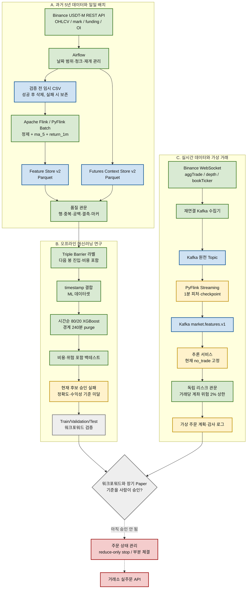

# BTCUSDT 자동매매 데이터·머신러닝 프로젝트 완전 해설서

작성 기준일: 2026-08-28 KST  
대상 시장: Binance USDT-M 선물 `BTCUSDT`  
기준 주기: 1분  
현재 안전 상태: **연구·가상 거래 전용, 거래소 실주문 차단**

---

## 0. 이 문서를 먼저 읽는 이유

이 파일은 프로젝트를 처음 보는 사람도 아래 질문에 스스로 답할 수 있도록 만든 단일 안내서다.

1. 이 프로젝트는 무엇을 만들려는가?
2. 거래소 데이터는 어디에서 들어와 어디에 저장되는가?
3. Airflow, Kafka, Flink, Parquet, XGBoost는 각각 왜 필요한가?
4. 과거 데이터와 실시간 데이터의 길은 왜 다른가?
5. 원천 데이터는 언제 지우고, 실패하면 왜 남기는가?
6. 피처와 라벨은 무엇이고 어떻게 만드는가?
7. 머신러닝은 무엇을 배우며, 무엇을 스스로 정할 수 없는가?
8. 지금까지 실제로 무엇을 실행했고 결과는 어땠는가?
9. 무엇이 완성됐고 무엇이 아직 미완성인가?
10. PC를 다시 켠 뒤 어떻게 실행하고 어디에서 확인하는가?

이 문서에서는 어려운 단어가 나오면 바로 쉬운 뜻과 필요한 이유를 함께 설명한다.
명령과 수치는 현재 저장된 코드와 실행 보고서를 기준으로 작성했다.

### 빠른 탐색

- [전체 구조와 데이터 흐름](#4-전체-데이터-흐름도)
- [도구를 선택한 이유](#7-도구를-왜-선택했는가)
- [과거 5년 백필의 실제 흐름](#8-과거-5년-백필의-실제-흐름)
- [실시간 데이터 흐름](#10-실시간-데이터-흐름)
- [라벨·학습·백테스트](#12-라벨은-무엇이며-어떻게-정답을-만드는가)
- [실제 5년 실행 결과](#16-지금까지-실제로-실행한-최종-결과)
- [문제와 해결 방법](#17-진행-중-생긴-주요-문제와-해결-방법)
- [Kafka·Flink 1,000건 검증](#보충-a-kafkaflink-1000건-과제-검증)
- [Airflow 입력값 변경 검증](#보충-b-airflow-매개변수-과제-검증)
- [파일을 보는 순서](#18-현재-파일과-폴더를-어떤-순서로-보면-되는가)
- [실행·확인 방법](#20-처음부터-실행하는-방법)
- [남은 작업](#24-현재-아키텍처에서-솔직히-남은-일)
- [발표 대본](#26-프로젝트를-설명하는-발표-대본)
- [용어 사전](#27-용어-사전)

---

## 1. 한 문장으로 설명하는 프로젝트

> 비트코인 선물 시장의 과거·실시간 데이터를 모으고, 데이터를 학습 가능한 숫자로 바꾸고,
> 머신러닝 후보 모델을 검증한 뒤, 안전 기준을 통과한 모델만 가상 거래에 사용하는 프로젝트다.

중요한 점은 **자동으로 주문하는 프로그램부터 만드는 프로젝트가 아니라는 것**이다.
순서는 다음과 같다.

```text
데이터를 빠짐없이 모은다
  -> 잘못된 데이터가 없는지 검사한다
  -> 머신러닝이 보기 좋은 피처로 바꾼다
  -> 정답 역할을 하는 라벨을 만든다
  -> 과거의 앞부분으로 학습한다
  -> 과거의 뒷부분으로 시험한다
  -> 수수료와 슬리피지를 넣어 백테스트한다
  -> 기준을 통과한 경우에만 장기 가상 거래한다
  -> 충분히 검증한 뒤에만 별도 승인으로 실거래를 검토한다
```

현재는 위 과정 중 **5년 데이터 수집부터 첫 기준선 백테스트까지 실제 실행**했다.
하지만 후보 모델의 성능은 기준을 통과하지 못했다. 따라서 실시간 추론은 `no_trade`만
내보내며 거래소 주문 API는 연결하지 않았다.

---

## 2. 아주 쉬운 비유로 먼저 이해하기

이 프로젝트를 큰 주방이라고 생각하면 이해하기 쉽다.

| 프로젝트 구성 | 주방 비유 | 실제 역할 |
| --- | --- | --- |
| Binance API | 식재료를 주는 시장 | 가격, 거래량, 펀딩비 등을 제공한다. |
| Airflow | 작업 순서를 적은 반장 | 언제 무엇을 수집·가공·검사할지 순서대로 실행한다. |
| Kafka | 재료가 잠시 기다리는 컨베이어 벨트 | 실시간 데이터가 몰려도 처리기가 자기 속도로 읽게 한다. |
| Flink | 재료를 씻고 자르는 조리 기계 | 원천 데이터를 정제하고 피처를 만든다. |
| Parquet | 칸이 잘 나뉜 압축 보관함 | 가공 데이터를 작고 빠르게 저장한다. |
| Feature Store | 조리된 재료 보관 구역 | 모델이 사용할 피처를 모아 둔다. |
| 라벨 | 연습 문제의 정답지 | 그 시점 이후 long, short, no_trade 중 무엇이 나았는지 기록한다. |
| XGBoost | 정답지를 보고 규칙을 배우는 학생 | 현재 피처를 보고 방향 클래스를 예측한다. |
| 백테스트 | 과거 시험지 | 학습하지 않은 뒤쪽 기간에서 성능과 손실을 계산한다. |
| 리스크 관문 | 지출 한도를 막는 안전 담당 | 모델이 거래하자고 해도 계좌 위험 2% 상한 등을 검사한다. |
| Paper Trading | 가짜 돈 연습장 | 실제 주문 없이 주문 계획과 결과를 검증한다. |
| 실거래 주문 API | 실제 돈이 나가는 문 | 현재 잠겨 있다. |

Airflow가 데이터를 직접 계산하는 것은 아니다. Airflow는 다른 프로그램을 **순서대로
실행하는 관리자**다. Flink가 스스로 날짜를 골라 수집하는 것도 아니다. Flink는 주어진
입력 데이터를 **가공하는 엔진**이다. 서로 하는 일이 다르다.

---

## 3. 반드시 구분해야 하는 네 가지 상태

문서나 아키텍처에서 아래 상태를 섞어 말하면 프로젝트를 실제보다 많이 완성한 것처럼 보일 수 있다.

| 상태 | 뜻 | 예시 |
| --- | --- | --- |
| 실행 검증 완료 | 실제 입력으로 끝까지 실행하고 결과를 확인함 | 5년 OHLCV 백필, PyFlink 배치, 품질 검사 |
| 코드 구축 | 실행 가능한 코드와 연결 구조가 있음 | 실시간 Kafka 수집·피처 경로 |
| 부분 구현 | 기본 길은 있지만 운영에 필요한 기능이 더 필요함 | 워터마크, 승인 모델 로딩, 현실적인 실시간 체결 모델 |
| 차단 | 안전상 의도적으로 동작하지 못하게 함 | 거래소 주문 API |

현재 프로젝트의 가장 정확한 요약은 다음과 같다.

```text
데이터 엔지니어링 파이프라인: 실행 검증 완료
5년 기준선 머신러닝 연구: 실행 완료, 성능 승인 실패
실시간 데이터 파이프라인: 기본 경로 실행 검증, 운영 기능 일부 미완성
장기 페이퍼 트레이딩: 승인 모델이 없어 시작 전
실거래: 의도적으로 차단
```

---

## 4. 전체 데이터 흐름도

아래 Mermaid 코드는 GitHub와 Mermaid Live Editor에서 바로 그림으로 볼 수 있다.



### 색깔 읽는 법

| 색 | 뜻 |
| --- | --- |
| 초록 | 코드가 있고 실제 실행·검증까지 한 처리 단계 |
| 파랑 | 데이터가 저장되거나 지나가는 저장소·토픽 |
| 노랑 | 기본 구조는 있지만 추가 검증이나 구현이 필요한 단계 |
| 회색 | 앞으로 구현할 단계 |
| 빨강 | 현재 안전을 위해 연결을 막은 실거래 단계 |

파란색은 “완성” 또는 “미완성”을 뜻하는 색이 아니다. **저장 공간이나 메시지 통로**라는
종류를 표시한다. 실제 완성 여부는 이 문서의 상태표와 함께 봐야 한다.

---

## 5. 과거 데이터와 실시간 데이터가 왜 두 갈래인가

### 5.1 과거 데이터는 끝이 정해진 상자다

예를 들어 `2024-01-01`부터 `2024-01-15` 전까지의 1분봉을 요청하면 시작과 끝이 분명하다.
이런 유한한 묶음을 **배치 데이터**라고 한다.

```text
시작 날짜를 정한다
  -> 끝 날짜를 정한다
  -> API에서 해당 구간을 받는다
  -> 파일로 저장한다
  -> 가공한다
  -> 끝난다
```

과거 배치에서는 데이터가 이미 거래소에 쌓여 있으므로 처리 속도를 직접 조절할 수 있다.
실패하면 같은 날짜를 다시 요청하면 된다. 그래서 Kafka가 없어도 파일과 성공 마커만으로
안전하게 재실행할 수 있다.

### 5.2 실시간 데이터는 계속 흐르는 수도꼭지다

WebSocket 데이터는 프로그램이 준비될 때까지 기다려 주지 않는다. 거래가 일어날 때마다 계속 온다.
수집기는 빠른데 가공기가 잠시 느려지거나 재시작될 수 있으므로 Kafka를 중간에 둔다.

```text
WebSocket이 계속 보냄
  -> Kafka가 잠시 보관
  -> Flink가 자기 속도로 읽음
  -> 처리 후 다음 Topic에 기록
```

Kafka의 목적은 단순히 “데이터가 많아 터지는 것을 막는 것”만이 아니다.

- 수집기와 가공기를 서로 독립적으로 재시작한다.
- Consumer가 읽은 위치를 기억한다.
- 한 데이터를 여러 Consumer가 각자의 목적으로 읽을 수 있다.
- 잠시 느려진 가공기가 남은 이벤트를 이어 읽을 수 있다.
- 같은 종목의 이벤트를 같은 partition으로 보내 순서를 관리할 수 있다.

### 5.3 과거 배치에 Kafka를 억지로 넣지 않은 이유

과거 데이터에서도 Kafka를 기술적으로 사용할 수는 있다. 그러나 현재 개인 PC 구조에서는
다음 비용이 더 크다.

- REST로 받은 데이터를 Kafka Producer가 다시 쪼개 보내야 한다.
- Kafka 보관 기간과 디스크를 추가로 관리해야 한다.
- Consumer offset과 재처리 중복을 별도로 관리해야 한다.
- 이미 날짜와 파일로 재현 가능한 작업에 장애 지점이 늘어난다.

그래서 현재 원칙은 다음과 같다.

```text
유한한 과거 날짜 범위: Airflow + 임시 파일 + Flink Batch
끝없이 들어오는 실시간: WebSocket + Kafka + Flink Streaming
```

---

## 6. 어떤 데이터를 모으는가

### 6.1 OHLCV 1분봉

1분 동안의 가격 움직임을 한 줄로 요약한 데이터다.

| 필드 | 타입 예 | 뜻 |
| --- | --- | --- |
| `timestamp` | 정수 | 해당 1분의 UTC 시작 시각을 밀리초로 표현 |
| `open` | 실수 | 1분 시작 가격 |
| `high` | 실수 | 1분 동안 가장 높은 가격 |
| `low` | 실수 | 1분 동안 가장 낮은 가격 |
| `close` | 실수 | 1분 종료 가격 |
| `volume` | 실수 | 1분 동안 거래된 수량 |

기본 가격 흐름을 학습하는 뼈대다. 하지만 한 줄로 요약됐기 때문에 그 1분 안에서 거래가
어떤 순서로 일어났는지는 알 수 없다.

### 6.2 Mark Price

선물 청산과 미실현 손익 계산에 쓰이는 거래소 기준 가격이다. 일반 체결 가격과 차이가 날 수 있다.
`mark_basis_pct`는 일반 가격과 mark price의 차이를 비율로 나타낸 피처다.

### 6.3 Funding Rate

무기한 선물의 long과 short 참여자 사이에서 일정 주기로 오가는 비용이다. 시장이 어느 한쪽으로
강하게 기울었는지 설명하는 보조 정보로 쓴다.

Funding은 매분 새 값이 생기는 데이터가 아니다. 그래서 가장 최근에 알려진 값을 각 1분 행에
시간 기준으로 붙이고, 마지막 업데이트 뒤 얼마나 지났는지 `funding_rate_age_minutes`로 남긴다.

### 6.4 Open Interest

아직 닫히지 않은 선물 포지션의 규모다. 가격이 오르면서 미결제약정도 늘어나는지처럼 시장 참여
강도를 해석하는 데 쓸 수 있다.

Binance 공개 API가 오래된 모든 구간의 open interest를 동일하게 제공하지 않는다. 이 프로젝트는
없는 값을 0으로 꾸미지 않는다. 값은 null로 두고 `open_interest_status`에 이유를 기록한다.

### 6.5 aggTrade 체결 데이터

실제로 체결된 거래 흐름이다. 1분 안의 거래 수, 거래량, 적극 매수·매도 불균형 등을 만들 수 있다.
OHLCV보다 더 자세하지만 건수가 매우 많다.

현재 최근 데이터 수집 코드는 있으나, 거래가 많은 하루를 한 번에 요청하면 안전 제한인 1,000 API
페이지를 넘을 수 있다. 불완전한 하루를 정상 데이터처럼 저장하지 않고 실패하도록 만들었다.
다음 개선은 하루를 더 작은 시간 구간으로 자동 분할하는 것이다.

### 6.6 호가창 depth와 bookTicker

- `bookTicker`: 가장 가까운 매수 1호가와 매도 1호가
- `depth`: 여러 가격 단계의 주문 수량 변화

스프레드와 매수·매도 잔량 불균형을 만드는 데 사용한다. 공개 REST만으로 과거 5년의 완전한
호가창을 복원하기는 어렵다. 따라서 호가창은 WebSocket으로 **지금부터 축적하는 실시간 데이터**다.

현재 수집기는 depth update ID를 기록하지만, 거래소 snapshot과 delta를 결합해 완전한 로컬
호가창을 재구축하고 누락 sequence를 자동 복구하는 기능은 아직 완성되지 않았다.

---

## 7. 도구를 왜 선택했는가

### 7.1 Docker Compose

Kafka, Flink, Airflow는 설치 방법과 실행 환경이 서로 다르다. Docker Compose는 이들을
컨테이너로 묶어 같은 명령으로 시작하게 한다.

현재 주요 서비스는 다음과 같다.

| 서비스 | 역할 | 로컬 주소 또는 특징 |
| --- | --- | --- |
| `airflow` | DAG 실행과 기록 | `http://localhost:8080` |
| `jobmanager` | Flink 작업 관리 | `http://localhost:8081` |
| `taskmanager` | Flink 실제 계산 | 로컬 2 slot |
| `zookeeper` | 현재 Kafka 이미지의 메타데이터 관리 | streaming profile |
| `kafka` | 실시간 이벤트 버퍼 | 호스트 `9092`, 컨테이너 `29092` |
| `realtime-collector` | WebSocket을 Kafka로 전송 | paper/research 전용 |
| `realtime-feature-worker` | 개발용 Python 피처 worker | 실제 PyFlink 제출 시 중지 |
| `realtime-inference` | 현재 안전한 `no_trade` 출력 | 승인 모델 로딩 차단 |
| `realtime-risk-paper` | 위험 검사와 가상 주문 계획 | 실주문 호출 없음 |

로컬 Kafka는 개발용 설정이다. 보관 기간은 1시간, replication factor는 1이며 기본 partition도
1개다. 운영 서버의 고가용성 설정이 아니다.

### 7.2 Airflow

Airflow는 다음을 사람이 기억하지 않아도 되게 한다.

- 어느 날짜까지 처리했는지
- 다음 청크가 어디서 시작하는지
- 어떤 작업 다음에 어떤 작업이 와야 하는지
- 실패한 단계가 무엇인지
- 같은 날짜를 매번 명령으로 입력해야 하는지

현재 DAG는 세 개다.

| DAG ID | 일정 | 목적 |
| --- | --- | --- |
| `btcusdt_usdm_historical_backfill` | `@hourly` | 목표 과거 기간을 청크로 채우기 |
| `btcusdt_usdm_daily_collection` | 매일 UTC 00:15 | 끝난 전날 하루를 수집하기 |
| `btcusdt_offline_ml_research` | 수동 | 라벨→데이터셋→학습→백테스트 실행 |

UTC 00:15는 한국 시간으로 오전 9:15다. 일일 수집은 아직 끝나지 않은 오늘 데이터가 아니라
완전히 끝난 전날 UTC 하루를 사용한다. 그래야 1분봉 마지막 행이 나중에 바뀌는 일을 피할 수 있다.

과거 백필은 한 시간마다 **1시간치 데이터를 받는 것이 아니다**. 한 번 실행될 때 기본적으로
14일 청크 4개, 즉 최대 56일 범위를 처리한다. 한 시간은 다음 Airflow 실행을 시도하는 간격이다.
5년 백필 완료 뒤에는 이 DAG를 계속 돌릴 이유가 없어 현재 자동 백필은 멈춰 두는 것이 맞다.

현재 Airflow는 개인 PC용 `standalone` 구성이다. 외부 PostgreSQL과 여러 worker를 둔 분산 운영
환경이 아니며, 동시 백필 충돌을 막기 위해 `max_active_runs=1`로 설정했다. 과거 백필과 연구 DAG는
잘못된 데이터 작업을 자동 반복하지 않도록 retry가 0이고, 일일 수집은 일시적인 네트워크 실패를
고려해 retry가 2다. 운영 서버로 옮길 때는 metadata DB, executor, log 보관, 알림을 다시 설계해야 한다.

### 7.3 Apache Flink와 PyFlink

Apache Flink는 데이터 처리 엔진이고 PyFlink는 그 엔진의 작업을 Python으로 작성하는 API다.

```text
Apache Flink = 실제 계산 엔진
PyFlink       = Python으로 Flink 작업을 작성하는 방법
```

`flink_jobs/batch_feature_job.py`는 Python 파일이지만 pandas만 실행하는 것이 아니다.
`flink run --python ...`으로 JobManager와 TaskManager에 제출되는 실제 PyFlink Job이다.

Flink를 선택한 이유는 배치와 스트리밍을 같은 엔진 계열에서 다룰 수 있기 때문이다. Spark도 과거
대규모 배치에 좋은 선택이지만, 이 프로젝트는 실시간 처리까지 목표로 하므로 Flink를 중심에 뒀다.

### 7.4 Kafka

Kafka는 실시간 원천 이벤트를 잠시 보관하는 메시지 시스템이다. 과거 백필의 필수 도구가 아니라
실시간 수집기와 처리기를 분리하기 위한 도구다.

현재 Topic은 데이터 종류별로 분리돼 있다.

| Topic | 내용 |
| --- | --- |
| `market.trade.v1` | aggTrade 체결 이벤트 |
| `market.book-ticker.v1` | 최우선 bid/ask 이벤트 |
| `market.depth.delta.v1` | depth 변경 이벤트 |
| `market.features.v1` | Flink가 만든 1분 피처 |
| `signal.trading.v1` | 추론 서비스의 거래/비거래 신호 |
| `paper.execution.v1` | 통과한 가상 주문 계획 |
| `risk.audit.v1` | 승인·거절 이유와 위험 계산 로그 |

현재는 BTC 한 종목과 로컬 테스트 규모라 각 Topic 기본 partition이 1개다. 종목이 늘면 Topic을
무조건 종목마다 만들기보다 `symbol`을 Kafka key로 사용하고 처리량에 맞춰 partition 수를 늘리는
방식이 일반적이다. 같은 key는 같은 partition으로 보내 종목 내부 순서를 보존한다.

### 7.5 Parquet와 Feature Store

`Parquet Feature Store`는 세 프로그램 이름이 아니다.

- Parquet: 열 단위 압축 파일 형식
- Feature: 모델이 보는 입력 숫자
- Feature Store: 피처를 모아 둔 저장 구역이라는 개념

CSV는 사람이 텍스트로 열기 쉽지만 모든 열을 읽고 용량도 크다. Parquet는 필요한 열만 빠르게
읽을 수 있고 압축과 데이터 타입 보존에 유리하다. VS Code가 Parquet를 열 때 “binary”라고 표시하는
것은 오류가 아니라 정상이다.

### 7.6 pandas, PyArrow, XGBoost

- pandas: 라벨 결합, 연구용 데이터프레임 처리, 보고서 계산
- PyArrow: Parquet 읽기·쓰기와 메타데이터 확인
- XGBoost: 표 형태 피처로 분류 기준선을 빠르게 만드는 모델

현재 XGBoost는 최종 전략이 아니라 **파이프라인과 피처의 기본 성능을 측정하는 기준선**이다.

---

## 8. 과거 5년 백필의 실제 흐름

### 8.1 왜 14일 청크인가

5년을 한 번에 받으면 다음 문제가 생긴다.

- 중간에 네트워크가 끊기면 처음부터 다시 해야 할 수 있다.
- 메모리와 임시 저장 용량이 커진다.
- 어느 날짜가 실패했는지 찾기 어렵다.
- API 제한에 걸릴 가능성이 커진다.

14일 청크는 정답으로 고정된 숫자가 아니라 개인 PC에서 재시작과 용량을 쉽게 관리하기 위한
현재 절충값이다.

```text
2024-01-01 ~ 2024-01-15 exclusive
2024-01-15 ~ 2024-01-29 exclusive
...
```

여기서 end date는 포함하지 않는다. 이렇게 `[start, end)` 규칙을 사용하면 다음 청크의 시작과
이전 청크의 끝이 정확히 맞고 같은 1분을 두 번 포함하지 않는다.

### 8.2 Airflow가 다음 범위를 찾는다

`airflow/dags/btcusdt_usdm_historical_backfill.py`는 `_SUCCESS` 마커를 읽어 끝에서부터 끊김 없이
이어지는 가장 오래된 날짜를 찾는다. 더 오래된 고립 마커가 있어도 중간에 공백이 있으면 건너뛰지
않는다.

Feature Store와 Context Store 진행 정도에 따라 세 모드가 있다.

| 모드 | 언제 사용 | 하는 일 |
| --- | --- | --- |
| `context_only` | Context가 Feature보다 덜 내려감 | Context만 먼저 따라잡음 |
| `feature_only` | Feature가 Context보다 덜 내려감 | Feature만 먼저 따라잡음 |
| `paired_backfill` | 둘의 시작 경계가 같음 | 같은 과거 범위를 함께 확장 |

OHLCV가 성공했는데 open interest API가 실패했다고 이미 검증된 OHLCV를 지우지 않기 위해 두
저장소와 마커를 독립적으로 둔 것이다.

### 8.3 OHLCV를 다운로드한다

`1_chunk_downloader.py`가 하는 일은 다음과 같다.

1. `symbol`, `market`, `timeframe`, `start-date`, `days`를 입력받는다.
2. ccxt로 Binance USDT-M 1분봉을 페이지당 최대 1,000개씩 요청한다.
3. timestamp를 정수로 바꾸고 정렬한다.
4. 같은 timestamp가 있으면 중복을 제거한다.
5. 요청 기간에 있어야 할 모든 1분 timestamp 집합을 만든다.
6. 실제 timestamp와 비교한다.
7. 빠진 분이나 범위 밖 데이터가 있으면 실패한다.
8. 정상일 때만 `temp_raw_data_v3/raw_....csv`에 저장한다.

과거 배치에서는 `--no-kafka`를 사용한다. 이 CSV는 영구 보관 목적이 아니라 Flink에 넘기기 위한
임시 원천 파일이다.

### 8.4 Flink가 피처를 만든다

`backfill_runner.py`가 `flink_batch_submitter.py`를 호출하고, submitter는 다음 실제 명령 형태로
Job을 제출한다.

```text
/opt/flink/bin/flink run --detached
  --jobmanager jobmanager:8081
  --python /opt/airflow/project/flink_jobs/batch_feature_job.py
```

PyFlink Job은 OHLCV를 정제하고 현재 기본 피처 두 개를 만든다.

```text
ma_5 = 현재 분을 포함한 최근 5개 종가의 평균
return_1m = 현재 종가 / 직전 1분 종가 - 1
```

### 8.5 청크 경계에서 왜 이전 4행이 필요한가

새 14일 청크의 첫 행만 보면 직전 4분을 알 수 없어 `ma_5`가 잘못될 수 있다. 그래서 submitter가
이미 저장된 이전 청크의 마지막 4행을 계산 문맥으로 붙인다.

```text
이전 청크 마지막 4행 + 새 청크 전체
  -> ma_5와 return_1m 계산
  -> 결과에서는 이전 4행을 제외
  -> 새 청크 행만 저장
```

이 4행은 계산용일 뿐 새 파일에 중복 저장하지 않는다. 이것이 schema 이름의 `boundary4` 뜻이다.

### 8.6 staging, 최종 저장, 마커 순서

Flink 결과를 곧바로 최종 Feature Store에 섞지 않는다.

```text
임시 CSV
  -> Flink staging 출력
  -> 행 수·피처·경계 계산 검증
  -> year/month Parquet 최종 이동
  -> _SUCCESS JSON 마커 작성
  -> 임시 CSV와 staging 삭제
```

마커는 단순한 빈 파일이 아니다. 다음 정보를 가진 영수증이다.

- run ID와 날짜 범위
- 실제 Flink Job ID
- 처리 행 수
- 피처 schema version
- 생성된 Parquet 경로
- 경계 문맥 사용 여부
- 저장 완료 시각

### 8.7 원천 데이터를 언제 삭제하는가

원천 CSV 삭제 조건은 다음을 모두 통과한 뒤다.

1. Flink Job 성공
2. 출력 파일 존재
3. 출력 행 수 일치
4. `ma_5`, `return_1m` 검증
5. 최종 Parquet 이동 성공
6. 성공 마커 생성 성공

중간에 실패하면 CSV를 남긴다. 실패 원인을 조사하거나 같은 청크를 다시 처리할 수 있어야 하기
때문이다. 거래소에서 다시 받을 수 있는 OHLCV 원천만 짧게 보존하고, 검증된 가공 결과를 오래
보존해 디스크 부담을 줄인다.

Context 수집은 API 응답 원문을 별도 raw 파일로 오래 보관하는 구조가 아니다. API 응답을 검증해
1분 Context Parquet로 바로 정리하고 마커를 남긴다. 따라서 “모든 원천을 삭제한다”보다 정확한
설명은 **OHLCV 임시 CSV는 성공 후 삭제하고, 검증된 Feature·Context와 품질 증거를 보존한다**다.

### 8.8 Context Store는 왜 별도인가

`9_futures_context_collector.py`는 mark price, funding rate, open interest를 timestamp에 맞춰
1분 단위 표로 만든다. OHLCV와 API 특성·제공 범위가 달라 별도 Parquet와 별도 마커에 저장한다.

- mark price는 필수다.
- 아주 적은 고립 누락 mark price는 규칙 안에서 이전 값으로 보완하고 보완 건수를 기록한다.
- funding과 OI가 없으면 0을 만들지 않고 null과 상태 문자열을 남긴다.
- 이후 ML 데이터셋 단계에서 timestamp로 결합한다.

최종 5년 Context 품질 보고서에는 보완된 mark price가 2행 기록돼 있다. 숨기지 않고 보고서에
남겼기 때문에 학습 데이터의 출처와 품질을 추적할 수 있다.

### 8.9 전체 품질 관문

청크 하나의 성공만으로 5년 전체가 정상이라고 보지 않는다.

`scripts/verify_feature_store.py`와 `scripts/verify_futures_context_store.py`가 다음을 검사한다.

- Parquet 파일이 실제로 열리는가?
- 필요한 컬럼이 모두 있는가?
- schema version이 예상과 같은가?
- 마커 행 수 합과 Parquet 행 수가 같은가?
- timestamp 중복이 0인가?
- 연속된 1분 사이에 공백이 0인가?
- 필수 컬럼 null이 0인가?
- 마커 날짜가 시작부터 끝까지 연속인가?

실패하면 Airflow Task도 실패한다. 원천을 남긴 상태에서 JSON 보고서를 보고 문제 범위를 고친다.

---

## 9. 일일 자동 수집 흐름

5년 백필은 한 번 과거를 채우는 작업이고, 일일 수집은 앞으로 하루씩 이어 붙이는 작업이다.

`btcusdt_usdm_daily_collection` DAG는 매일 UTC 00:15에 실행되며 다음 순서로 전날 UTC 하루를
처리한다.

```text
완전히 끝난 전날 날짜 결정
  -> OHLCV 다운로드
  -> Flink 기본 피처 생성
  -> mark / funding / OI Context 생성
  -> aggTrade 수집·1분 집계 시도
  -> 각 단계 마커와 실패 manifest 기록
```

PC가 꺼져 있으면 그 시간에는 실행되지 않는다. `catchup=True`이므로 Airflow 상태가 유지된 채
다시 켜지면 놓친 날짜를 순차적으로 실행할 수 있다. 하지만 다음 조건은 필요하다.

- Docker Desktop이 실행돼야 한다.
- Airflow 컨테이너가 실행돼야 한다.
- PC가 장기간 꺼졌다면 Airflow UI에서 누락 날짜와 Task 결과를 확인해야 한다.
- 데이터 제공 API의 과거 조회 범위 안이어야 한다.

현재 가장 큰 일일 경로의 미완성 사항은 aggTrade 한 날을 더 작은 시간 창으로 나누는 것이다.
OHLCV, mark price, funding 중심의 일일 누적과 별도로 관리해야 한다.

---

## 10. 실시간 데이터 흐름

### 10.1 WebSocket 수집

`realtime/kafka_websocket_collector.py`는 Binance combined WebSocket에서 다음 stream을 받는다.

```text
aggTrade
bookTicker
depth@100ms
```

모든 이벤트에 공통 봉투를 씌운다.

```json
{
  "schema_version": "market_raw_v1",
  "event_id": "중복 식별용 ID",
  "event_type": "agg_trade | book_ticker | depth_delta",
  "event_time_ms": 1780000000000,
  "received_at_utc": "2026-08-28T00:00:00+00:00",
  "symbol": "BTCUSDT",
  "market": "USDT-M",
  "source": "binance_usdm_websocket",
  "session_id": "수집기 실행 세션 ID",
  "payload": {}
}
```

Producer 설정의 핵심은 `acks=all`, 재시도 5회, `symbol` key다. 연결이 끊기면 1초부터 최대
30초까지 지수적으로 기다리며 재연결한다. 누적 수신 건수는
`realtime_runtime/collector_metrics.json`에 기록한다.

주의할 점: 현재 코드는 재연결과 update ID 기록은 하지만, 완전한 depth snapshot을 먼저 받은 뒤
모든 delta sequence를 검증하고 누락 시 snapshot부터 복구하는 운영급 호가창 재구축은 남아 있다.

### 10.2 Kafka 원천 Topic

이벤트 종류가 다르면 생산 속도, schema, 소비 목적이 다르므로 trade, book ticker, depth를 Topic으로
나눴다. Topic 안에서는 BTCUSDT를 key로 사용한다.

현재 로컬 보관 시간이 1시간이므로 장기간 원천 보관소가 아니다. 운영 전에는 처리량, 디스크,
재처리 목표에 맞춰 retention, partition, replication을 다시 정해야 한다.

Kafka 원천 메시지에서는 사람이 읽기 쉬운 `market="USDT-M"`를 쓰고, Parquet partition에서는
경로를 일정하게 만들기 위해 `market=usdm`을 쓴다. 값 모양이 다르므로 저장·결합 직전에 정규화해야
하며, 단순 문자열이 다르다는 이유로 서로 다른 시장 데이터로 오해하면 안 된다.

### 10.3 개발용 worker와 실제 PyFlink Job

실시간 피처를 만드는 길은 두 개가 있지만 동시에 쓰지 않는다.

| 경로 | 파일 | 용도 |
| --- | --- | --- |
| 개발용 Python worker | `realtime/kafka_feature_worker.py` | 연결을 빠르게 확인하는 대체 경로 |
| PyFlink Streaming | `flink_jobs/realtime_kafka_feature_job.py` | 프로젝트의 목표 처리 경로 |

실제 PyFlink Job을 제출할 때 스크립트가 개발용 worker를 중지한다. 두 Consumer가 같은 피처 Topic에
중복 결과를 쓰는 일을 피하기 위해서다.

현재 실시간 피처 예시는 다음과 같다.

| 피처 | 뜻 |
| --- | --- |
| `open/high/low/close` | 1분 체결 가격 요약 |
| `volume` | 1분 체결량 |
| `trade_count` | 1분 체결 이벤트 수 |
| `taker_volume_imbalance` | 적극 매수와 적극 매도 거래량 차이의 비율 |
| `book_spread` | 가장 가까운 매도 가격과 매수 가격의 차이 |
| `book_imbalance_top5` | 상위 5단계 bid와 ask 잔량 불균형 |
| `ma_5` | 최근 5분 종가 평균 |
| `return_1m` | 직전 1분 대비 수익률 |

### 10.4 현재 실시간 Flink의 정확한 한계

아키텍처 목표에는 `event time / watermark / checkpoint`가 적혀 있다. 실제 코드는 다음 상태다.

- Kafka 이벤트의 `event_time_ms`를 사용한다.
- 60초 기본 checkpoint를 사용한다.
- 그러나 source에는 현재 `WatermarkStrategy.no_watermarks()`가 설정돼 있다.

따라서 늦게 도착하거나 순서가 뒤바뀐 이벤트를 얼마 동안 기다렸다가 창을 닫을지 결정하는
워터마크 정책은 미완성이다. 운영 전에는 bounded out-of-orderness watermark, 허용 지연,
late-event side output 또는 재집계 정책을 구현하고 테스트해야 한다.

### 10.5 추론 서비스

`realtime/inference_service.py`는 Feature Topic을 읽고 Signal Topic에 결과를 쓴다.

현재 동작은 의도적으로 다음과 같다.

```text
승인 manifest 없음 -> action=no_trade
승인 manifest 있음 -> 모델 로딩 기능이 아직 차단돼 오류
```

즉 모델 파일이 폴더에 존재한다고 실시간 서비스가 자동으로 그 모델을 사용하는 것이 아니다.
5년 기준선 모델은 생성됐지만 성능 승인을 통과하지 않았으므로 연결하면 안 된다.

### 10.6 독립 리스크 관문

머신러닝이 long을 예측해도 주문 계획이 바로 만들어지지 않는다. `realtime/risk_paper_service.py`가
다시 계산한다.

현재 기본 예시는 다음과 같다.

```text
가상 계좌: 10,000 USDT
레버리지: 10배
거래당 계좌 위험: 최대 2%
최대 증거금 사용: 계좌의 35%
```

수량 계산의 기본 구조는 다음과 같다.

```text
risk_budget = account_balance * risk_per_trade_pct
stop_distance = abs(entry_price - stop_price) / entry_price
notional = risk_budget / stop_distance
margin = notional / leverage
quantity = notional / entry_price
```

예를 들어 계좌가 10,000 USDT이고 위험 상한이 2%면 계획 손실 예산은 200 USDT다. 레버리지는
손실 예산 그 자체가 아니다. stop 거리와 포지션 명목가치가 함께 수량을 결정한다.

2%는 “반드시 실제 손실이 2%에서 멈춘다”는 보장이 아니다. 급격한 가격 이동, 슬리피지, 거래소
장애, stop 미체결, 청산은 계획보다 큰 손실을 만들 수 있다. 운영 단계에서는 거래소에
reduce-only stop을 먼저 확인하고, 청산 가격보다 충분한 버퍼를 둬야 한다.

현재 서비스가 만드는 audit와 paper plan에는 항상 다음 값이 들어간다.

```json
{
  "exchange_order_api_called": false
}
```

### 10.7 Paper는 아직 무엇이 부족한가

현재 실시간 Paper 서비스는 신호를 위험 검사하고 **가상 주문 계획과 감사 로그를 만드는 단계**다.
실제 order book에서 queue 위치, 부분 체결, 주문 취소, 네트워크 지연, maker/taker 수수료를 모두
재현하는 운영급 체결 시뮬레이터는 아니다. 따라서 현재 paper plan만으로 수익성을 주장할 수 없다.

---

## 11. 피처는 무엇이며 왜 원천 그대로 학습하지 않는가

원천 데이터의 숫자를 그대로 모델에 줄 수도 있지만 모델이 중요한 관계를 찾기 어렵고, 과거 가격
절대값만 외울 위험이 있다. 피처는 현재 시점에서 알 수 있는 정보를 의미 있는 숫자로 바꾼 것이다.

### 11.1 현재 5년 기준선 모델 입력 16개

```text
open, high, low, close, volume
ma_5, return_1m
hour_utc, minute_utc, day_of_week_utc
mark_price, mark_basis_pct
funding_rate, funding_rate_age_minutes
open_interest, open_interest_value
```

`symbol`, 미래 수익률, 미래 장벽 도달 결과처럼 정답을 알려 주는 컬럼은 입력에 넣지 않는다.

### 11.2 앞으로 개선할 피처

현재 피처는 파이프라인 기준선으로는 충분하지만 자동매매 모델로는 매우 단순하다. 다음 후보를
인과적으로, 즉 그 시점까지 알려진 값만 이용해 만들어야 한다.

- 여러 길이의 수익률과 이동평균 거리
- 변동성, ATR, 고저 범위
- 거래량 z-score와 변화율
- funding 변화와 basis 변화
- open interest 변화율
- 체결 불균형과 거래 강도
- spread와 order book imbalance
- 시장 상태: 추세, 횡보, 고변동, 저변동
- 시간대와 세션 특징

피처가 많다고 무조건 좋아지는 것은 아니다. 미래 정보 누수, 과적합, 중복 피처를 함께 검사해야 한다.

### 11.3 오프라인과 실시간 피처 정의를 같게 해야 하는 이유

학습할 때 `ma_5`를 한 방식으로 만들고 실시간에서 다른 방식으로 만들면 모델은 학습 때 본 숫자와
다른 숫자를 받는다. 이를 training-serving skew라고 한다.

최종 목표는 피처 이름, 입력 범위, 결측 처리, 창 닫는 규칙을 버전으로 고정하고 배치와 실시간에서
같은 테스트 벡터로 결과를 비교하는 것이다. 현재 기본 `ma_5`, `return_1m` 길은 마련됐지만
실시간 watermark와 전체 피처 parity 검증은 남아 있다.

---

## 12. 라벨은 무엇이며 어떻게 정답을 만드는가

머신러닝은 스스로 “수익이 무엇인지” 알지 못한다. 사람이 목표와 평가 규칙을 정의해야 한다.
`4_triple_barrier_labeler.py`는 각 시점에 long 또는 short로 들어갔다고 가정하고 미래 결과를 만든다.

### 12.1 현재 라벨 규칙

```text
신호 시점: 현재 1분봉 종료 시점
진입 가격: 다음 1분봉 시가
가격 손절 거리: 진입가의 0.5%
익절 거리: 1.0R
최대 보유 시간: 240분
라벨 왕복 비용: 10 bps
```

`1R`은 한 번의 계획 손실 거리를 뜻한다. 손절 거리가 가격의 0.5%라면 1R 익절도 기본적으로
가격 거리 0.5%다. 계좌 위험 2%와 가격 손절 0.5%는 같은 숫자가 아니다.

### 12.2 Triple Barrier의 세 벽

long 예시에서 미래 240분을 살펴본다.

1. 위쪽 익절 가격에 먼저 닿음: 승리
2. 아래쪽 손절 가격에 먼저 닿음: 손실
3. 둘 다 안 닿고 240분 종료: 시간 종료 수익 계산

short는 위와 아래 방향이 반대다. 같은 1분봉 안에서 익절과 손절이 모두 닿은 것처럼 보이면
1분봉만으로 실제 순서를 알 수 없으므로 보수적으로 손절이 먼저였다고 처리한다.

### 12.3 long, short, no_trade 결정

long 결과와 short 결과에서 비용을 뺀 뒤 가장 나은 선택을 찾는다. 어느 쪽도 기대값이 양수가
아니면 `no_trade`가 정답이다.

이 라벨은 연구용 정답 정의다. 유일한 정답은 아니다. 현재 모델 성능이 낮았기 때문에 앞으로
보유 시간, 장벽 거리, 변동성 조정, 비용 이후 기대수익 목표를 다시 설계해야 한다.

### 12.4 마지막 240행을 버린 이유

데이터 마지막 시점은 그 뒤 240분을 볼 수 없다. 정답을 완성할 미래가 없으므로 마지막 240행은
라벨에서 제외한다. 이것은 데이터 수집 실패가 아니라 정상적인 미래 관찰 구간 제거다.

---

## 13. ML 데이터셋은 어떻게 만들어지는가

`6_build_ml_dataset.py`가 세 종류 데이터를 timestamp로 결합한다.

```text
Feature Store: 가격과 기본 피처
Context Store: mark, funding, OI
Label Store: long/short/no_trade 정답
                 |
                 v
       같은 timestamp끼리 1:1 결합
                 |
                 v
       ML Dataset Parquet 47컬럼
```

종목과 시장은 이미 파티션 경로로 고정돼 있으므로 대규모 문자열 조인 대신 timestamp 중심으로
결합한다. 이 변경은 5년 데이터 메모리 초과를 해결한 핵심 중 하나다.

---

## 14. 머신러닝은 어떻게 학습하는가

### 14.1 XGBoost가 하는 일

각 행의 16개 현재 피처를 보고 정답 클래스 세 개의 확률을 예측한다.

```text
0 -> no_trade
1 -> long
2 -> short
```

모델은 과거 예시에서 “이런 숫자 조합일 때 어떤 정답이 많았는지”를 나무 규칙의 조합으로 배운다.
사람처럼 차트 의미를 이해하거나 계좌 안전을 스스로 책임지는 것은 아니다.

현재 기준선의 주요 설정은 다음과 같다.

```text
objective: 3개 클래스 확률 분류
n_estimators: 250
max_depth: 3
learning_rate: 0.05
subsample: 0.85
colsample_bytree: 0.85
tree_method: hist
max_bin: 256
n_jobs: 4
```

3개 클래스마다 나무가 만들어져 모델 JSON에는 총 750개 tree가 기록된다. 클래스 개수가 다르기
때문에 학습 시 class weight를 적용한다. XGBoost는 일부 OI 피처가 null이어도 missing branch로
처리할 수 있지만, 오래된 구간에 OI가 없다는 사실 자체가 정보 품질의 한계이므로 상태와 기간을
별도로 분석해야 한다.

### 14.2 왜 데이터를 무작위로 섞지 않는가

시간 데이터는 미래를 모르는 상태를 흉내 내야 한다. 과거와 미래를 무작위로 섞으면 미래 시장
패턴의 일부가 학습 쪽에 들어가 성능이 실제보다 좋아 보일 수 있다.

현재 5년 기준선은 다음과 같다.

```text
앞 80% -> train
뒤 20% -> test
test 시작 직전 240분 -> train에서 purge
```

purge는 train의 라벨이 test 구간 미래 가격을 바라보는 일을 막는다.

### 14.3 현재 분리는 최종형이 아니다

현재는 전체 파이프라인을 끝까지 확인하는 단일 80/20 기준선이다. 다음에는 다음 구조가 필요하다.

```text
Train: 모델 가중치 학습
Validation: 피처·라벨·확률 임계값 선택
Test: 마지막 한 번만 보는 최종 평가
```

그리고 여러 시기에 걸쳐 다음을 반복하는 워크포워드가 필요하다.

```text
과거 A로 학습 -> 바로 다음 B 평가
과거 A+B로 학습 -> 바로 다음 C 평가
과거 A+B+C로 학습 -> 바로 다음 D 평가
```

한 특정 상승장이나 하락장에서만 잘 맞는 모델을 걸러내기 위해서다.

### 14.4 머신러닝이 정하는 것과 사람이 고정할 것

| 머신러닝 후보 역할 | 사람이 강제로 정할 안전 규칙 |
| --- | --- |
| long/short/no_trade 확률 | 거래당 계좌 위험 최대 2% |
| 기대수익 또는 시장 상태 예측 | 최대 증거금과 최대 레버리지 |
| 진입 후보 순위 | 일일 손실 중단과 Kill Switch |
| 모델이 학습한 청산 후보 | 거래소 reduce-only stop 보장 |
| 확률에 따른 거래 보류 | API 장애 시 신규 주문 차단 |

모델이 데이터에서 비중이나 손절을 학습하는 구조를 만들 수는 있다. 그래도 모델 바깥의 절대 상한은
사람이 정해야 한다. 학습 오류, 분포 변화, 잘못된 입력이 생겨도 안전장치가 독립적으로 막아야 한다.

---

## 15. 백테스트는 무엇을 검사하는가

`8_model_signal_backtest.py`는 테스트 구간 예측을 거래 규칙으로 바꿔 계좌 변화를 계산한다.

현재 조건은 다음과 같다.

| 조건 | 값 | 이유 |
| --- | ---: | --- |
| 거래당 위험 상한 | 계좌 2% | 한 번의 계획 손실 제한 |
| 최소 confidence | 0.45 | 확률이 너무 낮은 신호 제외 |
| 최소 진입 간격 | 15분 | 과도한 연속 진입 감소 |
| 하루 최대 신규 진입 | 5회 | 거래 폭주 제한 |
| 일일 손실 중단 | -4% | 나쁜 날 신규 진입 중단 |
| 일일 하드 중단 | -6% | 추가 방어선 |
| 동시 포지션 | 1개 | 위험 중첩 방지 |
| 추가 슬리피지 | 5 bps | 낙관적 체결 완화 |

백테스트의 목적은 높은 수익 숫자를 만드는 것이 아니라, 비용과 제약을 넣어도 후보 전략이
살아남는지 확인하는 것이다.

2% 제한이 있어도 기대값이 음수인 거래를 계속하면 계좌는 줄어든다. 안전벨트가 자동차를 목적지로
운전해 주지 않는 것과 같다.

---

## 16. 지금까지 실제로 실행한 최종 결과

### 16.1 5년 저장 데이터

| 항목 | 실제 결과 |
| --- | ---: |
| 기간 | 2021-08-25 00:00 ~ 2026-08-26 23:59 UTC |
| Feature Store 행 | 2,632,320 |
| Context Store 행 | 2,632,320 |
| Feature Parquet 파일 | 193 |
| Feature 성공 마커 | 136 |
| Context Parquet 파일 | 25 |
| Context 성공 마커 | 25 |
| 중복 timestamp | 0 |
| 1분 공백 | 0 |
| 필수 컬럼 null | 0 |
| 보완 mark price | 2행 |
| 최종 품질 | 둘 다 `healthy=true` |

정확한 품질 증거:

```text
runtime_reports/feature_store_quality/feature_store_quality_20260827T163951Z.json
runtime_reports/futures_context_quality/futures_context_quality_20260827T164047Z.json
```

### 16.2 라벨과 학습 데이터

| 항목 | 실제 결과 |
| --- | ---: |
| 라벨 행 | 2,632,080 |
| 미래 240분 부족으로 제외 | 240 |
| ML 데이터셋 행 | 2,632,080 |
| ML 데이터셋 전체 컬럼 | 47 |
| 모델 입력 피처 | 16 |
| train 행 | 2,105,424 |
| test 행 | 526,416 |
| 경계 purge | 240 |

최종 Airflow run ID는 다음이며 성공으로 끝났다.

```text
five_year_contiguous_baseline_20260828
```

### 16.3 모델 성능

| 지표 | 결과 |
| --- | ---: |
| 테스트 정확도 | 38.27% |
| 가장 많은 클래스만 예측하는 기준선 | 46.04% |
| 기준선 대비 | -7.77%p |

정확도가 단순 기준선보다 낮으므로 후보 모델은 승인할 수 없다.

테스트 구간의 실제 정답 분포와 클래스별 결과는 다음과 같다.

| 클래스 | 테스트 정답 행 | precision | recall | F1 |
| --- | ---: | ---: | ---: | ---: |
| `no_trade` | 49,380 | 19.32% | 65.77% | 29.86% |
| `long` | 234,649 | 46.06% | 41.08% | 43.43% |
| `short` | 242,387 | 48.73% | 29.95% | 37.10% |

가장 많은 정답은 `short` 242,387행으로 테스트의 46.04%다. 그래서 아무것도 배우지 않고 항상
`short`라고 답해도 46.04%가 나온다. 현재 모델의 38.27%는 이 단순 비교보다 낮다.

### 16.4 비용 포함 백테스트

| 지표 | 결과 |
| --- | ---: |
| 거래 수 | 1,472 |
| 승률 | 46.81% |
| 평균 결과 | -0.2225R |
| 총 복리 수익률 | -99.88% |
| 최대 낙폭 | -99.88% |
| 최장 연속 손실 | 14회 |
| 한 거래 최대 실현 손실 | -2.00% |

526,416개 테스트 행이 모두 거래가 되지 않은 이유도 기록돼 있다.

| 거래하지 않은 이유 | 건수 | 쉬운 뜻 |
| --- | ---: | --- |
| confidence 부족 | 147,988 | 모델 확률이 0.45보다 낮음 |
| `no_trade` 예측 | 134,958 | 모델이 거래하지 말라고 예측 |
| 이미 포지션 보유 | 133,414 | 동시 한 포지션 규칙 때문에 건너뜀 |
| 하루 진입 한도 | 72,838 | 그날 5번을 이미 사용 |
| 일일 손실 중단 | 31,429 | 그날 손실 한도에 닿음 |
| 연속 손실 중단 | 3,633 | 해당 일의 연속 손실 규칙에 닿음 |
| 최소 진입 간격 | 684 | 이전 진입 후 15분이 지나지 않음 |
| 하드 일일 중단 | 0 | 이 별도 조건으로 추가 제외된 행은 없음 |

최장 연속 손실 14회는 전체 거래 목록을 날짜 경계와 무관하게 이어 계산한 통계다. 일별 신규 진입
중단 카운터는 날짜가 바뀌면 초기화되므로 두 숫자는 서로 다른 질문에 답한다.

이 결과의 올바른 해석은 다음 한 줄이다.

> 데이터 파이프라인과 연구 파이프라인은 동작했지만 현재 피처·라벨·모델 전략은 수익성이 없다.

모델 파일이 생성됐다는 사실과 좋은 모델이라는 평가는 완전히 다르다. 현재 모델은 Registry 승인,
실시간 로딩, 실거래에 사용하면 안 된다.

---

## 17. 진행 중 생긴 주요 문제와 해결 방법

### 17.1 Flink 화면에 완료 Job이 보이지 않음

원인 후보를 구분해야 한다.

- Finite batch Job은 끝나면 Running 목록에서 사라진다.
- JobManager를 재시작하면 현재 로컬 구성에는 영구 History Server가 없어 이전 UI 기록이 사라진다.
- 컨테이너가 살아 있다는 TaskManager 화면은 “지금 계산 중”이라는 뜻이 아니다.

해결과 증거:

- 각 성공 마커에 실제 Flink `job_id`를 저장했다.
- Parquet 행 수와 피처를 별도 검증했다.
- 장기 운영에서는 Flink History Server와 외부 checkpoint 저장소를 추가해야 한다.

### 17.2 이름은 Flink인데 실제로 pandas였던 초기 파일

`2_flink_processor.py`는 역사적인 파일명과 달리 **레거시 pandas 처리기**다. 파일 첫 설명에도
이를 명시했다. 현재 표준 배치 경로는 다음이다.

```text
flink_batch_submitter.py
  -> flink_jobs/batch_feature_job.py
```

`3_ml_training.py`도 연결 확인용 레거시 이진 방향 모델이다. 현재 연구 표준은 4~8번과
`research_lifecycle_runner.py`다.

### 17.3 청크 첫 부분의 이동평균 오류 가능성

원인: 각 청크를 독립 계산하면 첫 4행의 `ma_5` 문맥이 부족하다.

해결: 이전 저장소 마지막 4행을 경계 문맥으로 붙이고 결과 저장 전 검증한다.

### 17.4 겹치는 Context 파일로 중복 timestamp 발생

원인: 기존 일별 파일 범위를 덮는 2일 테스트 파일을 추가했다.

해결:

- 새 청크가 기존 파일을 완전히 덮을 때만 안전하게 교체한다.
- 부분 겹침은 임의 삭제하지 않고 실패시킨다.
- 재수집 후 중복과 공백이 0임을 확인했다.

### 17.5 PC가 꺼진 동안 3일 공백 발생

원인: 2026-08-22부터 24일까지 일일 수집이 실행되지 않았다.

해결: Airflow DAG에 `start_date`, `end_date`를 넣어 해당 범위만 수동 backfill했다.

```text
start_date = 2026-08-22
end_date   = 2026-08-25 exclusive
```

Feature와 Context 전체 품질을 다시 검사해 공백 0을 확인했다.

### 17.6 PowerShell에서 Airflow JSON 입력 실패

원인: PowerShell, Docker, Airflow CLI를 거치며 JSON 큰따옴표가 손상돼 `JSONDecodeError`가 났다.

해결:

- 설정을 JSON 파일로 저장한다.
- `scripts/trigger_airflow_dag.py`가 파일을 읽어 CLI 인자 배열로 전달한다.
- 설정 파일 자체가 재현 가능한 실행 기록으로 남는다.

### 17.7 5년 ML 데이터셋 생성 중 메모리 초과

원인:

- Feature, Context, Label의 모든 열을 동시에 읽었다.
- 반복되는 문자열 컬럼이 메모리를 많이 썼다.
- 행별 Python 반복으로 타깃을 만들었다.
- 저장 뒤 전체 Parquet를 다시 읽어 검증했다.

해결:

- 필요한 열만 Parquet에서 선택해 읽었다.
- timestamp 중심으로 결합했다.
- 반복 문자열은 category로 바꿨다.
- 타깃 계산을 NumPy 벡터 연산으로 바꿨다.
- 검증은 Parquet metadata 행 수를 사용했다.
- XGBoost를 `tree_method=hist`, `max_bin=256`, `n_jobs=4`로 제한했다.

최적화 후 데이터셋 결합은 약 3.43GB, 학습은 약 1.86GB 메모리 범위에서 완료됐다. 5년 행을
샘플링해 줄이지 않았다.

### 17.8 하위 명령 실패 내용이 manifest에 안 남음

원인: 연구 실행기가 stdout/stderr를 실행 목록에 넣기 전에 예외를 발생시켰다.

해결: step 결과를 먼저 기록하고 그 다음 실패를 판정하도록 순서를 바꿨다. 또한 `--start-step`으로
성공한 라벨·데이터셋을 다시 만들지 않고 학습 단계부터 재개할 수 있게 했다.

### 17.9 aggTrade 하루 수집이 최대 페이지를 넘음

원인: 거래가 많은 날은 1,000건짜리 API 페이지가 1,000개를 넘을 수 있다.

현재 안전 처리: 최대 페이지에 닿으면 불완전 파일을 성공으로 저장하지 않고 실패한다.

남은 해결: 하루를 15분 또는 1시간 창으로 나누고, 각 창의 마지막 trade ID와 시간 범위를 검증한
뒤 하루 단위로 합친다.

### 17.10 모델 결과가 매우 나쁨

이것은 프로그램이 실패한 것과 다르다. 코드가 끝까지 실행됐기 때문에 현재 단순 피처와 라벨로는
수익성이 없다는 사실을 발견했다.

해결 방향:

- 라벨 거리와 보유 시간을 변동성에 맞춘다.
- Validation을 분리해 threshold를 test에서 고르지 않는다.
- stationary 피처와 시장 상태 피처를 강화한다.
- 워크포워드 여러 구간에서 일관성을 본다.
- 비용, funding, 체결 불리함을 더 엄격하게 넣는다.

---

## 보충 A. Kafka·Flink 1,000건 과제 검증

이 작업은 전체 운영 구조를 대신하는 별도 시스템이 아니라, **Kafka 전송과 Flink 가공 구간을
작은 크기로 눈에 보이게 증명한 제출용 모듈**이다.

### A.1 어떤 데이터를 사용했는가

테스트용으로 만든 가짜 가격이 아니라 Binance USDT-M 공개 API에서 받은 완료된 BTCUSDT 1분봉
1,000건을 사용했다. API key와 주문 권한은 사용하지 않았다.

실행 범위:

```text
2026-08-21 22:02 UTC
  ~ 2026-08-22 14:41 UTC
총 1,000개의 연속 완료 1분봉
```

### A.2 처리 흐름

```text
Binance 실제 1분봉 1,000건
  -> Kafka Producer 1,000건 전송
  -> Topic btc_market_events_v1
  -> Kafka Consumer 1,000건 수신
  -> JSONL 원본 저장
  -> OHLCV·중복·시간 순서 검사
  -> Flink 입력 CSV 1,000건
  -> 실제 Apache Flink / PyFlink Batch
  -> ma_5, return_1m 생성
  -> Parquet 1,000건 저장
```

이 과제에서는 배치 1분봉 1,000건도 Kafka를 거치게 했다. 과제 요구가 Kafka Producer와 Consumer
건수 증명이었기 때문이다. 본 프로젝트의 5년 과거 백필은 Kafka를 거치지 않는다는 점과 구분한다.

### A.3 메시지 계약

과제 Topic:

```text
btc_market_events_v1
```

주요 필드:

| 필드 | 타입 | 의미 |
| --- | --- | --- |
| `schema_version` | string | 과제 메시지 버전 `market_event_v1` |
| `run_id` | string | 한 실행의 1,000건을 묶는 ID |
| `event_id` | string | 중복 제거용 이벤트 ID |
| `event_sequence` | integer | 전송 순서 |
| `event_time` | string | UTC 1분봉 시각 |
| `symbol` | string | `BTCUSDT` |
| `market` | string | `USDT-M` |
| `open/high/low/close` | double | OHLC 가격 |
| `volume` | double | 거래량 |
| `source` | string | `binance_usdm_public_ohlcv` |

이 과제용 `market_event_v1` 계약과 실시간 본선의 `market_raw_v1` 계약은 목적이 달라 별개다.
전자는 완성된 1분봉 한 줄이고, 후자는 trade·book·depth 원천 이벤트 봉투다.

### A.4 실제 실행 증거

| 확인 항목 | 결과 |
| --- | ---: |
| Producer 전송 | 1,000 |
| Consumer 수신 | 1,000 |
| Flink 입력 검증 통과 | 1,000 |
| 잘못된 OHLCV | 0 |
| 중복 event ID | 0 |
| Flink Parquet 출력 | 1,000 |
| Flink Job ID | `2271ebc304ea99a6c6dbbaac1d13dc57` |

증거 파일:

```text
assignment4_flink_submission/assignment4_kafka_spark/results/producer_binance_live.json
assignment4_flink_submission/assignment4_kafka_spark/results/consumer_binance_live.json
assignment4_flink_submission/assignment4_kafka_spark/results/flink_input_binance_live.json
assignment4_flink_submission/assignment4_kafka_spark/results/flink_report_binance_live.json
```

`producer_binance_live.json`에는 이벤트 1,000줄 전체가 들어 있는 것이 아니라
`producer_sent_count=1000` 같은 **실행 요약**이 들어 있다. Consumer가 받은 실제 한 줄씩의 본문은
`consumed_binance_usdm_events.jsonl`에 있었고 대용량 원천 제출 제외 규칙에 따라 GitHub 묶음에서는
제외했다. 전송·수신·Flink 출력 세 보고서의 run ID와 건수를 함께 맞춰 증명한다.

제출본은 `assignment4_flink_submission/` 폴더에 모았다. 대용량 JSONL과 Parquet 대신 코드,
README, 작은 결과 JSON을 GitHub에 올리는 구조다.

---

## 보충 B. Airflow 매개변수 과제 검증

이 작업의 목적은 수집 코드를 고칠 필요 없이 Airflow 실행 입력값만 바꿔 다른 종목과 날짜를
처리할 수 있음을 증명하는 것이었다.

### B.1 지원 입력값

```text
symbol
start_date
end_date
chunk_days
timeframe
```

`start_date`와 `end_date`를 함께 넣으면 `manual_range` 모드가 된다. 이 모드는 자동 5년 백필의
현재 checkpoint를 움직이지 않고 요청한 범위만 별도로 처리한다.

### B.2 BTC가 아닌 값으로 실제 재실행

```json
{
  "symbol": "ETH/USDT",
  "start_date": "2026-08-20",
  "end_date": "2026-08-21",
  "chunk_days": 1
}
```

실제 결과:

| 항목 | 결과 |
| --- | --- |
| 종목 | ETHUSDT USDT-M |
| 범위 | UTC 1일, 종료일 미포함 |
| OHLCV 수집 | 1,440행 |
| Context 저장 | 1,440행 |
| PyFlink 출력 | 1,440행 |
| Flink Job ID | `c94bb7c92ad132f5237ad24bff3f0481` |
| 중복 | 0 |
| 1분 공백 | 0 |
| 최종 상태 | 네 Airflow Task 모두 성공 |

실행 Task:

```text
plan_next_backfill
  -> run_next_backfill
  -> verify_feature_store
  -> verify_futures_context_store
```

관련 문서와 작은 증거 JSON:

```text
docs/airflow_parameterized_backfill_assignment_2026-08-26.md
docs/airflow_parameterized_backfill_run_2026-08-26.json
GITHUB_AIRFLOW_ASSIGNMENT_PRESENTATION.md
```

이 검증으로 “현재 연구는 BTC만 한다”와 “코드 구조는 symbol 입력을 받을 수 있다”를 동시에
확인했다. 알트코인을 실제 전략에 추가하려면 종목별 데이터 기간과 모델 성능을 다시 검증해야 한다.

---

## 18. 현재 파일과 폴더를 어떤 순서로 보면 되는가

### 18.1 처음 공부할 때

1. `COMPLETE_PROJECT_MASTER_GUIDE.md`: 지금 읽는 전체 설명
2. `README.md`: GitHub 첫 화면 요약
3. `docs/mermaid_ai_architecture_code.md`: 목표와 현재 아키텍처 그림 코드
4. `docs/full_architecture_build_status_2026-08-25.md`: 구현 상태표
5. `docs/five_year_ml_baseline_execution_2026-08-28.md`: 실제 5년 최종 결과

### 18.2 코드 실행 순서로 볼 때

| 순서 | 파일 | 역할 |
| ---: | --- | --- |
| 1 | `1_chunk_downloader.py` | OHLCV 날짜 범위 수집·완전성 검사 |
| 2 | `backfill_runner.py` | 14일 청크 반복, 마커 skip, 실패 복구 |
| 3 | `flink_batch_submitter.py` | 경계 문맥, Flink 제출, 검증, 최종 이동 |
| 4 | `flink_jobs/batch_feature_job.py` | 실제 PyFlink 배치 피처 계산 |
| 5 | `9_futures_context_collector.py` | mark/funding/OI Context 생성 |
| 6 | `scripts/verify_feature_store.py` | Feature 전체 품질 검사 |
| 7 | `scripts/verify_futures_context_store.py` | Context 전체 품질 검사 |
| 8 | `4_triple_barrier_labeler.py` | 미래 장벽 결과 라벨 생성 |
| 9 | `6_build_ml_dataset.py` | Feature+Context+Label 결합 |
| 10 | `7_train_direction_model.py` | 시간순 XGBoost 학습·예측 |
| 11 | `8_model_signal_backtest.py` | 비용·위험 포함 백테스트 |
| 12 | `research_lifecycle_runner.py` | 8~11 과정을 한 번에 실행 |

### 18.3 자동화 코드를 볼 때

| 파일 | 역할 |
| --- | --- |
| `airflow/dags/btcusdt_usdm_historical_backfill.py` | 과거 날짜 계획→수집→두 품질 검사 |
| `airflow/dags/btcusdt_daily_collection.py` | 전날 UTC 하루 수집 |
| `airflow/dags/btcusdt_offline_research.py` | 수동 연구 실행 |
| `daily_collection_runner.py` | 일일 세부 단계 조정 |
| `scripts/trigger_airflow_dag.py` | JSON 설정 파일로 안전하게 DAG trigger |

### 18.4 실시간 코드를 볼 때

| 파일 | 역할 |
| --- | --- |
| `realtime/contracts.py` | Topic 이름과 공통 계약 |
| `realtime/kafka_websocket_collector.py` | WebSocket→Kafka 원천 Topic |
| `realtime/kafka_feature_worker.py` | 개발용 Python 피처 대체 경로 |
| `flink_jobs/realtime_kafka_feature_job.py` | 실제 PyFlink Kafka 피처 Job |
| `realtime/inference_service.py` | 현재 `no_trade` 안전 추론 |
| `realtime/risk_paper_service.py` | 2% 상한과 paper audit |

### 18.5 레거시와 실험 파일

| 파일 | 현재 의미 |
| --- | --- |
| `2_flink_processor.py` | 이름과 달리 pandas 레거시 처리기 |
| `3_ml_training.py` | 연결 확인용 레거시 모델 |
| `5_r_multiple_backtest.py` | 모델 이전 라벨 규칙 단독 연구 |
| `11_realtime_market_capture.py` | 짧은 실시간 캡처 실험 |
| `12_paper_trading_risk_engine.py` | 오프라인 예측 replay 실험 |
| `13_train_selective_direction_model.py` | 3개월 선택형 모델 실험, 성능 미통과 |

레거시 파일을 현재 표준 경로와 섞어 설명하면 안 된다.

---

## 19. 저장소 구조와 파일 이름 읽는 법

### 19.1 Feature Store

```text
feature_store_v2/
  _markers/
    _SUCCESS_BTCUSDT_USDM_1m_20210825_20210908.json
  market=usdm/
    symbol=BTCUSDT/
      timeframe=1m/
        year=2021/
          month=08/
            features_....parquet
```

`market=`, `symbol=`, `timeframe=`, `year=`, `month=`는 Hive-style partition 경로다. 필요한 시장과
기간 파일만 골라 읽기 쉽다.

### 19.2 Context Store

```text
futures_context_store_v2/
  _markers/
  market=usdm/
    symbol=BTCUSDT/
      timeframe=1m/
        context_....parquet
```

### 19.3 5년 연구 산출물

```text
label_store_5y_20260828/       # 정답 라벨
ml_dataset_5y_20260828/        # 학습용 결합 데이터
models_5y_20260828/            # 후보 XGBoost와 metadata
predictions_5y_20260828/       # test 구간 예측
runtime_reports/               # 품질·실행·백테스트 보고서
```

모델 `.json` 파일을 텍스트로 열면 수많은 나무 숫자가 보인다. 사람이 읽을 설명은
`direction_model_BTCUSDT_USDM_1m_metadata.json`을 보는 것이 낫다.

---

## 20. 처음부터 실행하는 방법

### 20.1 준비물

- Windows와 PowerShell
- Docker Desktop
- 프로젝트 폴더
- 인터넷 연결
- Python을 로컬에서 직접 실행할 경우 `requirements.txt` 의존성

Binance 공개 시장 데이터 수집에는 주문 API key가 필요하지 않다. 실거래 키를 이 프로젝트에
넣거나 GitHub에 올리면 안 된다.

### 20.2 전체 연구·paper 서비스 시작

프로젝트 루트 PowerShell에서 실행한다.

```powershell
PowerShell -ExecutionPolicy Bypass -File .\scripts\start_full_architecture.ps1 -Build
```

확인 주소:

```text
Airflow: http://localhost:8080
Flink:   http://localhost:8081
```

이 명령은 실거래를 실행하지 않는다. inference는 `no_trade`, risk service는
`exchange_order_api_called=false` 상태다.

### 20.3 과거 백필 자동화 시작

```powershell
PowerShell -ExecutionPolicy Bypass -File .\scripts\start_automatic_backfill.ps1
```

이 스크립트는 Airflow, Flink를 켜고 과거 백필 DAG를 unpause한다. 5년 목표가 이미 완료된 현재는
새로운 target 범위를 정하지 않는 한 다시 켤 필요가 없다.

### 20.4 특정 날짜와 종목을 입력해 수동 Airflow 실행

Airflow UI에서 `btcusdt_usdm_historical_backfill`의 Trigger DAG with config를 선택하고 예를 들어
다음 JSON을 입력한다.

```json
{
  "symbol": "BTC/USDT",
  "market": "usdm",
  "timeframe": "1m",
  "start_date": "2026-08-22",
  "end_date": "2026-08-25",
  "chunk_days": 14
}
```

`end_date`는 포함하지 않는다. 값을 바꿔도 코드를 고칠 필요가 없다. 현재 DAG는 USDT-M만 허용하며
symbol은 `BTC/USDT` 같은 형식을 검사한다.

JSON 따옴표 문제를 피하려면 설정 파일과 helper를 사용한다.

```powershell
docker compose exec -T airflow python `
  /opt/airflow/project/scripts/trigger_airflow_dag.py `
  btcusdt_usdm_historical_backfill `
  --config /opt/airflow/project/runtime_reports/missing_range_backfill_airflow_conf_2026-08-28.json `
  --run-id example_manual_backfill
```

### 20.5 5년 연구 파이프라인 다시 실행

```powershell
docker compose exec -T airflow python `
  /opt/airflow/project/scripts/trigger_airflow_dag.py `
  btcusdt_offline_ml_research `
  --config /opt/airflow/project/runtime_reports/five_year_baseline_airflow_conf_2026-08-28.json `
  --run-id five_year_baseline_manual
```

설정의 `start_step` 의미:

| 값 | 시작 위치 |
| --- | --- |
| `label` | 라벨부터 전부 다시 실행 |
| `dataset` | 기존 라벨 사용, 데이터셋부터 |
| `train` | 기존 데이터셋 사용, 학습부터 |
| `backtest` | 기존 예측 사용, 백테스트만 |

성공 마커와 schema가 맞는지 확인하지 않고 중간 단계부터 시작하면 안 된다.

### 20.6 실시간 PyFlink Job 제출

Kafka connector JAR이 없다면 한 번 설치한다.

```powershell
PowerShell -ExecutionPolicy Bypass -File .\scripts\install_flink_kafka_connector.ps1
```

실제 PyFlink Kafka Job으로 전환한다.

```powershell
PowerShell -ExecutionPolicy Bypass -File .\scripts\submit_realtime_flink_job.ps1
```

스크립트는 개발용 `realtime-feature-worker`를 중지한 뒤 PyFlink Job을 제출한다.

### 20.7 중지

실시간 paper stack만 중지:

```powershell
PowerShell -ExecutionPolicy Bypass -File .\scripts\stop_realtime_paper_stack.ps1
```

프로젝트 컨테이너 전체 중지:

```powershell
docker compose --profile streaming --profile realtime down
```

`down -v`는 Airflow 상태와 named volume까지 지울 수 있으므로 목적 없이 사용하지 않는다.

---

## 21. 눈으로 결과를 확인하는 방법

### 21.1 Airflow

`http://localhost:8080`에서 확인한다.

- DAG가 보이는가?
- 실행이 초록색 success인가?
- `plan_next_backfill`이 어떤 날짜를 선택했는가?
- `run_next_backfill` log에 Flink Job ID가 있는가?
- 두 품질 Task가 모두 success인가?

Airflow가 켜져 있다는 것만으로 데이터 처리가 성공했다는 뜻은 아니다. 반드시 DAG Run과 Task를 본다.

### 21.2 Flink

`http://localhost:8081`에서 확인한다.

- TaskManager가 연결됐는가?
- 실시간 Job을 제출했다면 Running Jobs에 있는가?
- batch Job 실행 중이라면 처리 그래프가 보이는가?

TaskManager의 `Assigned Tasks=0`, `Free Slots=1`은 현재 할당된 일이 없다는 뜻이다. 과거 Job이
성공했다는 증거는 성공 마커와 품질 보고서로 함께 본다.

### 21.3 Docker 상태

```powershell
docker compose ps
docker compose logs --tail 100 airflow
docker compose logs --tail 100 jobmanager
docker compose logs --tail 100 realtime-collector
```

### 21.4 Kafka 이벤트 일부 보기

Kafka 컨테이너 이미지의 consumer 도구 경로에 따라 명령이 다를 수 있지만 기본 개념은 다음과 같다.

```powershell
docker compose exec kafka kafka-console-consumer.sh `
  --bootstrap-server kafka:29092 `
  --topic market.trade.v1 `
  --from-beginning `
  --max-messages 10
```

메시지가 보인다는 것은 수집과 Kafka 전송이 됐다는 뜻이다. Flink 가공 성공은
`market.features.v1`과 Flink Job 상태를 별도로 봐야 한다.

### 21.5 Parquet를 텍스트처럼 확인

VS Code 기본 텍스트 편집기로는 열리지 않는 것이 정상이다. Python으로 일부만 출력한다.

```powershell
python -c "import pandas as pd, glob; p=glob.glob('feature_store_v2/**/*.parquet', recursive=True)[0]; d=pd.read_parquet(p); print(p); print(d.head()); print(d.dtypes)"
```

행 수와 컬럼만 확인:

```powershell
python -c "import pyarrow.parquet as pq, glob; p=glob.glob('feature_store_v2/**/*.parquet', recursive=True)[0]; m=pq.ParquetFile(p).metadata; print(p, m.num_rows, m.num_columns)"
```

### 21.6 최종 품질 보고서 보기

```powershell
Get-Content -Encoding utf8 `
  runtime_reports/feature_store_quality/feature_store_quality_20260827T163951Z.json

Get-Content -Encoding utf8 `
  runtime_reports/futures_context_quality/futures_context_quality_20260827T164047Z.json
```

핵심 확인값:

```text
healthy: true
duplicate_timestamps: 0
time_gap_count: 0
```

---

## 22. PC가 꺼졌다가 다시 켜졌을 때

1. Docker Desktop을 켠다.
2. 프로젝트 루트에서 `docker compose ps`를 확인한다.
3. 필요한 서비스가 없으면 `start_full_architecture.ps1`을 실행한다.
4. Airflow UI에서 마지막 성공 날짜와 실패 Run을 확인한다.
5. Feature와 Context 최신 품질 JSON을 확인한다.
6. 일일 누락이 있으면 `start_date`, `end_date`로 수동 backfill한다.
7. 실시간 PyFlink Job은 JobManager 재시작 뒤 자동 복구가 보장되지 않으므로 Running Jobs를 확인하고
   필요하면 `submit_realtime_flink_job.ps1`을 다시 실행한다.
8. 현재 승인 모델이 없으므로 inference가 `no_trade`인지 확인한다.

PC를 하루 한 번 켜는 것만으로 OHLCV 같은 REST 복구형 데이터는 채울 수 있다. 그러나 PC가 꺼진 동안
WebSocket 호가창 원천은 받을 수 없고 공개 API로 완전 복원할 수도 없다. 완전한 24시간 실시간
호가창 축적이 필요하면 항상 켜진 서버가 필요하다.

---

## 23. GitHub에 올릴 것과 올리지 않을 것

### 올릴 것

- Python 코드
- Airflow DAG
- Dockerfile과 `docker-compose.yml`
- `requirements.txt`
- Markdown 설명서
- 개인정보가 없는 작은 JSON 실행 예시
- Mermaid 아키텍처 코드

### 올리지 않을 것

- 5년 Parquet와 대용량 원천 데이터
- API key와 `.env`
- Airflow DB와 runtime log 전체
- Kafka connector JAR
- 모델·예측 대용량 산출물
- 개인 계좌 정보

현재 `.gitignore`는 Feature Store, Context Store, label, dataset, model, prediction,
`runtime_reports`, `realtime_runtime`, Airflow DB/log, connector JAR 등을 제외한다.

README에는 결과 수치와 작은 예시를 적고, 대용량 산출물은 같은 명령으로 재생성할 수 있게 한다.

---

## 24. 현재 아키텍처에서 솔직히 남은 일

### 우선순위 1: 데이터 경로 보강

1. aggTrade 하루를 작은 시간 창으로 자동 분할한다.
2. 각 창의 시작·끝·trade ID 연속성을 검사한다.
3. WebSocket depth에 snapshot+delta sequence 복구를 구현한다.
4. 실시간 watermark와 late-event 정책을 구현한다.
5. 배치와 실시간 피처 parity 자동 테스트를 만든다.

완료 기준:

- 누락·중복을 일부러 만들었을 때 자동 감지한다.
- 재시작 뒤 같은 결과를 만든다.
- 배치와 실시간에 같은 이벤트를 넣으면 같은 1분 피처가 나온다.

### 우선순위 2: 모델 연구 방법 개선

1. 라벨과 피처 버전을 고정한다.
2. Train/Validation/Test를 분리한다.
3. Validation에서 confidence와 거래 규칙을 선택한다.
4. 여러 구간 워크포워드를 구현한다.
5. 변동성·체결·호가·시장 상태 피처를 추가한다.
6. 기준 모델과 비교한다.

완료 기준:

- 모든 워크포워드 구간에서 비용 이후 성과를 보고한다.
- test를 보고 규칙을 다시 고르지 않는다.
- 단순 기준선보다 분류와 거래 지표가 의미 있게 낫다.
- 최대 낙폭과 손실 연속성이 허용 기준 안에 있다.

### 우선순위 3: 승인된 모델의 실시간 연결

1. Registry manifest schema를 정한다.
2. 모델 hash, 피처 schema, 학습 기간, 승인자를 기록한다.
3. inference에서 승인 모델만 읽는다.
4. 예측 오류 시 즉시 `no_trade`로 fail closed한다.
5. 모델 버전별 audit와 rollback을 검증한다.

현재는 이 단계가 의도적으로 차단돼 있다.

### 우선순위 4: 현실적인 장기 Paper

1. 지연과 spread를 반영한다.
2. maker/taker 수수료와 funding을 반영한다.
3. 부분 체결, 취소, 재주문을 모델링한다.
4. 주문 상태 machine을 만든다.
5. 최소 수 주에서 수 개월 동안 shadow와 paper를 비교한다.

### 우선순위 5: 실거래는 별도 프로젝트처럼 검토

실거래 전 최소한 다음이 필요하다.

- 거래소 testnet 검증
- 최소 주문 수량과 가격 tick 처리
- idempotent client order ID
- reduce-only stop 생성·확인
- 주문·부분 체결·취소·재시도 상태 관리
- 포지션 reconciliation
- 일일 손실 중단과 수동 Kill Switch
- API key 최소 권한과 secret 관리
- 알림과 장애 대응 절차
- 아주 작은 금액의 제한된 단계적 배포

이 항목을 통과하기 전 거래소 주문 API는 빨간색 차단 상태로 유지한다.

---

## 25. 자주 묻는 질문

### Q1. 5년 데이터는 모두 수집됐나?

OHLCV Feature와 1분 Context 기준으로 2021-08-25부터 2026-08-26까지 2,632,320행씩 연속 저장됐다.
하지만 5년 전체 호가창과 aggTrade 원천이 있다는 뜻은 아니다. 그 데이터는 공개 API 제한 때문에
지금부터 실시간 축적하는 방향이다.

### Q2. Flink가 실제로 사용됐나?

과거 표준 경로는 `flink_batch_submitter.py`가 `flink_jobs/batch_feature_job.py`를 실제 Flink
Job으로 제출한다. 성공 마커에 Flink Job ID가 남아 있다. `2_flink_processor.py`만 레거시 pandas다.

### Q3. Airflow가 한 시간씩 데이터를 가져오나?

아니다. 과거 DAG는 한 시간마다 실행 기회를 갖고 한 실행에서 최대 56일을 처리한다. 일일 DAG는
매일 UTC 00:15에 전날 하루를 처리한다.

### Q4. Feature Store 폴더에 머신러닝이 설치돼 있나?

아니다. Feature Store는 피처 Parquet 저장소다. 머신러닝 코드는 `7_train_direction_model.py`이고
학습 라이브러리는 XGBoost다.

### Q5. 모델이 알아서 손절과 비중을 배우지 않나?

학습 목표로 만들 수는 있지만 절대 위험 한도는 모델 밖에 있어야 한다. 현재 거래당 계좌 위험 2%
상한과 증거금 검사는 독립 리스크 서비스가 강제한다.

### Q6. 2% 손실 상한이면 안전하게 수익이 나나?

아니다. 5년 기준선은 한 거래 최대 손실을 -2%로 제한했어도 평균 -0.2225R 거래를 반복해
총 -99.88%가 됐다. 손실 크기 제한과 양의 기대값은 별개의 문제다.

### Q7. 레버리지가 높으면 같은 2% 위험으로 괜찮나?

레버리지는 필요한 증거금을 줄이지만 청산 거리와 오류 민감도를 높인다. stop이 항상 원하는 가격에
체결된다는 보장이 없으므로 최대 레버리지, 청산 버퍼, 증거금 상한을 별도로 제한해야 한다.

### Q8. 지금 자동매매를 실행할 수 있나?

아니다. 현재는 데이터·연구·가상 주문 계획 구조다. 후보 모델이 성능 미달이고 승인 모델 로딩과
실주문 경로가 차단돼 있다.

### Q9. 알트코인을 나중에 추가할 수 있나?

수집기와 Airflow DAG는 symbol 매개변수를 받을 수 있게 구성됐다. 다만 종목별 유동성, 상장 기간,
최소 주문 단위, funding 특성이 달라 데이터 품질과 모델을 다시 검증해야 한다. BTC 모델을 그대로
복사해 쓰면 안 된다.

### Q10. Flink UI의 TaskManager만 보이면 가공 성공인가?

아니다. 그것은 계산할 worker가 연결됐다는 뜻이다. DAG Task 성공, 성공 마커, Parquet 행 수,
품질 JSON을 함께 봐야 한다.

---

## 26. 프로젝트를 설명하는 발표 대본

### 1분 요약

```text
이 프로젝트는 Binance BTCUSDT 무기한 선물 데이터를 수집해 머신러닝 후보 전략을 검증하는
데이터 파이프라인입니다. 과거 데이터는 Airflow가 날짜 범위를 14일 청크로 나누고,
PyFlink가 기본 피처를 계산해 Parquet Feature Store에 저장합니다. 실시간 데이터는 WebSocket으로
받아 Kafka에 넣고 PyFlink Streaming이 1분 피처로 만드는 구조입니다.

현재 2021년 8월 25일부터 2026년 8월 26일까지 2,632,320개의 연속 1분 피처와 선물 맥락 데이터를
구축했고 중복과 시간 공백이 모두 0임을 검증했습니다. 이 데이터로 라벨, ML 데이터셋, XGBoost,
비용 포함 백테스트까지 실행했습니다. 파이프라인은 성공했지만 모델 정확도는 다수 클래스 기준보다
낮고 백테스트도 손실이 커 후보 모델은 승인하지 않았습니다. 따라서 실시간 서비스는 no_trade만
출력하고 거래소 주문 API는 차단한 상태입니다. 다음 단계는 aggTrade와 호가 데이터 품질,
워크포워드 검증, 장기 페이퍼 체결 모델을 보강하는 것입니다.
```

### 설명할 때 꼭 지킬 표현

```text
잘못된 표현: 5년 데이터로 수익 나는 자동매매를 완성했습니다.
정확한 표현: 5년 데이터 수집·가공·학습·백테스트 경로를 완성했고 현재 후보 모델은 탈락했습니다.

잘못된 표현: Airflow가 데이터를 가공합니다.
정확한 표현: Airflow가 실행 순서를 관리하고 PyFlink가 데이터를 가공합니다.

잘못된 표현: Kafka가 과거 5년 데이터를 보관합니다.
정확한 표현: 과거 데이터는 Parquet에 저장하고 Kafka는 실시간 이벤트의 중간 버퍼로 사용합니다.

잘못된 표현: 2% 규칙이라 절대 2% 이상 잃지 않습니다.
정확한 표현: 정상 체결을 가정한 계획 손실 상한이며 급변·슬리피지·장애 위험은 별도 방어가 필요합니다.
```

---

## 27. 용어 사전

| 용어 | 쉬운 뜻 |
| --- | --- |
| API | 프로그램끼리 데이터를 주고받는 문 |
| REST | 요청할 때 정해진 데이터를 받아오는 방식 |
| WebSocket | 연결을 유지하며 새 데이터를 계속 받는 방식 |
| 배치 | 시작과 끝이 정해진 데이터 묶음을 처리하는 일 |
| 스트리밍 | 끝없이 들어오는 데이터를 계속 처리하는 일 |
| 청크 | 큰 날짜 범위를 나눈 작은 조각 |
| 백필 | 비어 있거나 과거인 범위를 다시 채우는 일 |
| DAG | 작업 순서와 의존성을 나타낸 그래프 |
| Topic | Kafka 메시지 종류별 통로 |
| Partition | Topic을 병렬 처리하기 위해 나눈 내부 줄 |
| Consumer offset | Consumer가 어디까지 읽었는지 나타내는 위치 |
| Event time | 거래소에서 이벤트가 실제 발생한 시각 |
| Processing time | 프로그램이 이벤트를 처리한 시각 |
| Watermark | 늦은 이벤트를 얼마까지 기다릴지 정하는 기준 |
| Checkpoint | 스트리밍 작업의 중간 상태 저장점 |
| Schema | 데이터 컬럼 이름과 타입의 계약 |
| Parquet | 분석용 열 단위 압축 파일 |
| Feature | 모델이 보는 입력 숫자 |
| Label | 모델이 맞혀야 할 정답 |
| Leakage | 학습 시점에 알 수 없는 미래 정보가 입력에 섞이는 문제 |
| Purge | 경계의 미래 정보 겹침을 막기 위해 일부 행을 제거하는 일 |
| Validation | 모델과 규칙을 고르는 중간 평가 구간 |
| Test | 선택을 모두 끝낸 뒤 마지막으로 보는 평가 구간 |
| Walk-forward | 과거로 학습하고 바로 다음 기간에서 반복 평가하는 방식 |
| Slippage | 원하는 가격과 실제 체결 가격의 차이 |
| Drawdown | 최고 계좌 가치에서 얼마나 떨어졌는지 |
| R | 한 거래의 계획 손실을 1로 둔 손익 단위 |
| Paper Trading | 실제 돈을 쓰지 않는 가상 거래 |
| Shadow | 운영 데이터로 예측하되 주문하지 않고 기존 방식과 비교하는 단계 |
| Registry | 모델 버전·성능·승인 정보를 보관하는 곳 |
| Kill Switch | 문제 발생 시 신규 거래를 즉시 막는 기능 |

---

## 28. 최종 점검표

### 데이터

- [x] BTCUSDT USDT-M 5년 1분 피처 수집
- [x] mark price와 funding 중심 Context 저장
- [x] Feature와 Context 중복 0 검증
- [x] Feature와 Context 1분 공백 0 검증
- [x] 성공 마커와 전체 품질 JSON 생성
- [ ] aggTrade 일일 자동 시간 분할
- [ ] 장기간 완전 호가창 축적과 sequence 복구

### 처리

- [x] 실제 PyFlink Batch Job
- [x] 청크 경계 피처 문맥 처리
- [x] 검증 후 임시 원천 CSV 삭제
- [x] 실패 시 원천 보존과 재개
- [x] Kafka→PyFlink Streaming 기본 경로
- [ ] 운영급 watermark와 late-event 처리
- [ ] 오프라인·온라인 피처 parity 자동 테스트

### 머신러닝

- [x] Triple Barrier 라벨
- [x] 5년 ML 데이터셋
- [x] 시간순 80/20 기준선
- [x] 240분 purge
- [x] XGBoost 기준선
- [x] 비용·2% 위험 백테스트
- [x] 성능 미달 모델 거절
- [ ] 별도 Validation
- [ ] 여러 구간 워크포워드
- [ ] 승인 기준을 통과한 후보 모델

### 거래 안전

- [x] 추론 기본 `no_trade`
- [x] 거래당 계좌 위험 최대 2% 코드 검사
- [x] 가상 주문 계획에 실주문 미호출 기록
- [x] 거래소 주문 API 차단
- [ ] 승인 모델 실시간 로딩
- [ ] 운영급 paper fill과 주문 상태 관리
- [ ] reduce-only stop testnet 검증
- [ ] 장기 paper 승인
- [ ] 별도 사람 승인 후 제한적 실거래

---

## 29. 마지막 결론

이 프로젝트는 “모델 파일 하나를 만들어 바로 100배 레버리지로 거래하는 프로그램”이 아니다.
현재까지 완성한 가장 큰 성과는 다음 세 가지다.

1. 개인 PC에서 5년 1분 데이터를 청크로 수집하고 Flink로 가공해 검증된 Parquet 저장소를 만들었다.
2. 같은 데이터를 라벨·학습·백테스트로 연결해 현재 전략이 나쁘다는 사실까지 수치로 확인했다.
3. 성능이 나쁜 모델은 실시간과 실거래로 넘어가지 못하도록 `no_trade`와 주문 API 차단을 유지했다.

좋은 자동매매 시스템은 많이 거래하는 시스템이 아니라 **나쁜 데이터, 나쁜 모델, 위험한 주문을
각 단계에서 멈출 수 있는 시스템**이다. 현재는 데이터 기반과 안전한 연구 경로를 만든 상태이며,
다음 목표는 더 많은 기능을 무작정 붙이는 것이 아니라 데이터 품질과 워크포워드 검증을 통해
승인할 만한 모델이 실제로 존재하는지 확인하는 것이다.
