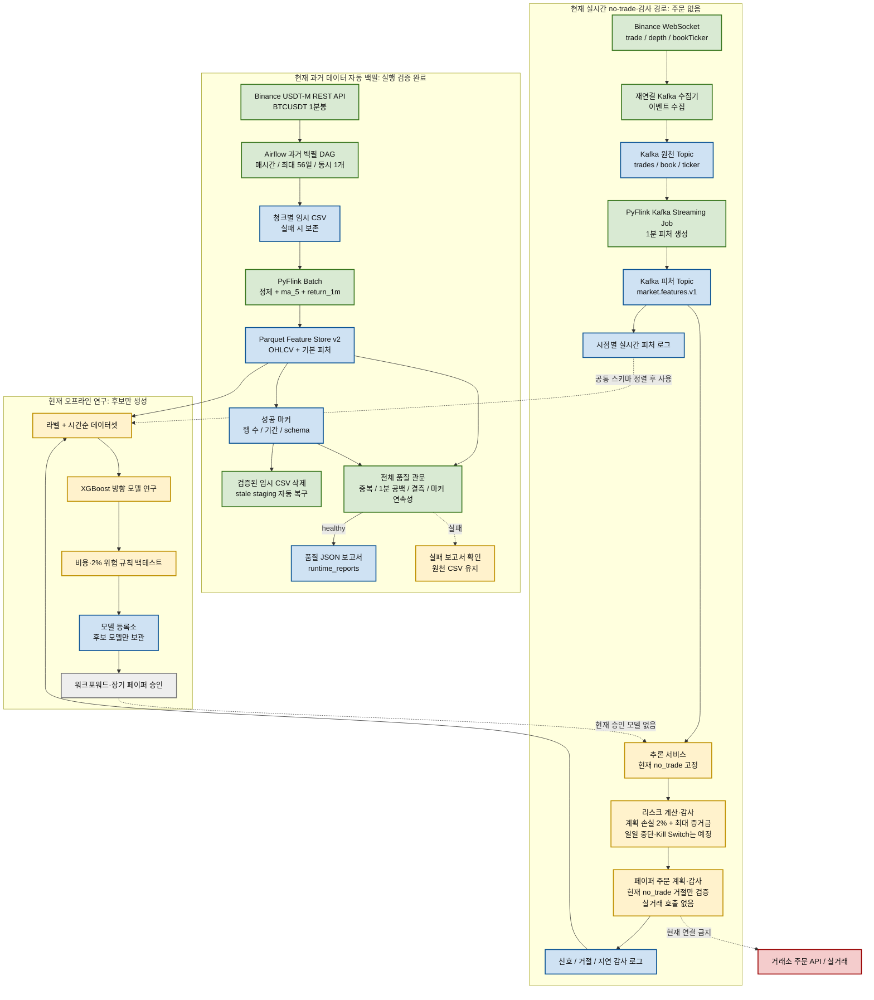
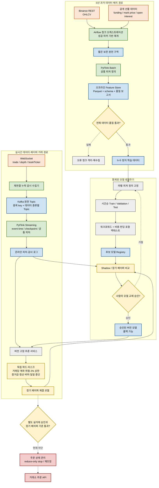

# BTCUSDT USDT-M 데이터 파이프라인과 ML 페이퍼 거래 프로젝트

작성일: 2026-08-25  
대상 시장: Binance BTCUSDT USDT-M 선물  
현재 운영 원칙: 실제 주문 API 미연결, `no_trade`와 감사 로그만 허용

---

## 1. 프로젝트 한눈에 보기

이 프로젝트는 BTCUSDT USDT-M 선물 데이터를 수집하고, 머신러닝이 사용할 수 있는 피처로
가공한 뒤, 모델을 검증하고 페이퍼 환경에서 관찰하기 위한 데이터 엔지니어링·ML 기반 시스템이다.

최종 목표는 자동매매지만, 현재는 실제 주문을 보내지 않는다. 먼저 다음을 안전하게 검증하는 것이
목적이다.

```text
과거 데이터 수집
  -> 피처 생성 및 품질 검증
  -> 시간순 모델 학습과 백테스트
  -> 실시간 피처 생성
  -> 승인 모델의 장기 페이퍼 검증
  -> 별도 승인 뒤에만 실거래 검토
```

### 현재 핵심 상태

| 항목 | 현재 상태 |
| --- | --- |
| 과거 BTCUSDT 1분봉 | Airflow가 14일 청크로 자동 백필 중 |
| 과거 데이터 가공 | PyFlink Batch로 기본 피처 계산 후 Parquet 저장 |
| 저장 데이터 품질 | 중복, 1분 공백, 결측, 마커 연속성 검사 구현·실행 검증 |
| 실시간 데이터 | WebSocket -> Kafka -> PyFlink -> 피처 Topic 경로 실행 검증 |
| ML 연구 | XGBoost 방향 모델과 기초 백테스트 실행 경험 있음 |
| 실시간 모델 신호 | 성능 미달 후보 모델이므로 현재 모든 신호는 `no_trade` |
| 리스크 | 거래당 계좌 위험 2%와 최대 증거금 비중 계산 코드 존재, 현재는 거절 감사만 검증 |
| 실제 주문 | API 키와 거래소 주문 호출 코드 미연결, 의도적으로 차단 |

---

## 2. 왜 이 프로젝트가 필요한가

자동매매는 “모델 하나를 학습해서 주문 API에 연결하는 일”만으로 끝나지 않는다. 실제로는 아래
질문에 모두 답할 수 있어야 한다.

1. 과거 데이터가 중복·공백·결측 없이 신뢰할 수 있는가?
2. 과거 학습에서 쓴 피처를 실시간에서도 같은 의미로 계산할 수 있는가?
3. 모델 성능이 수수료, 슬리피지, 펀딩비, 손실 제한을 고려해도 의미가 있는가?
4. 모델이 잘못된 신호를 내도 계좌 전체 위험을 제한할 수 있는가?
5. 네트워크 단절, Kafka 지연, 서비스 재시작, 부분 체결 같은 운영 문제를 감당할 수 있는가?

이 프로젝트는 위 질문을 하나씩 증명할 수 있게 데이터 경로, 모델 경로, 주문 경로를 분리한다.

---

## 3. 핵심 용어

| 용어 | 의미 |
| --- | --- |
| OHLCV 1분봉 | 1분 동안의 시가, 고가, 저가, 종가, 거래량 |
| 원천 데이터 | 거래소에서 받은 가공 전 데이터 |
| 피처(feature) | 원천 데이터에서 계산한 ML 입력값. 예: `ma_5`, `return_1m` |
| 라벨(label) | 모델이 맞혀야 하는 미래 결과. 예: 15분 뒤 기준 이상 상승했는지 |
| Parquet | 많은 표 데이터를 압축해 컬럼 단위로 저장하는 파일 형식 |
| Feature Store | 가공된 피처를 학습·백테스트용으로 관리하는 저장 규칙과 폴더 |
| Airflow | 정해진 순서와 시간에 작업을 실행·재개하는 워크플로 관리자 |
| Kafka | 계속 들어오는 실시간 이벤트를 중간에 보관하는 메시지 플랫폼 |
| Apache Flink | 배치와 실시간 스트리밍 데이터를 가공하는 처리 엔진 |
| PyFlink | Python으로 Apache Flink Job을 작성하는 방식 |
| 워크포워드 | 과거 구간에서 학습한 뒤 그 다음 기간에서 반복 검증하는 방법 |
| 페이퍼 거래 | 실제 거래소 주문 없이 신호·주문 계획·감사 결과를 관찰하는 단계 |

---

## 4. 전체 설계 원칙과 선택 이유

| 선택 | 왜 이렇게 선택했는가 |
| --- | --- |
| BTCUSDT 하나부터 시작 | 종목을 여러 개로 늘리면 유동성, 수수료, 변동성, 데이터 구조, 모델 품질을 각각 검증해야 한다. 우선 유동성이 큰 BTCUSDT에서 파이프라인을 검증하고 이후 알트코인으로 확장한다. |
| USDT-M 선물 사용 | 최종 목표가 USDT 증거금 선물 자동매매이므로 학습 시장과 실행 시장을 맞춘다. 현물 데이터만 사용하면 펀딩비, 마크 프라이스, 청산 위험 같은 선물 특성이 빠진다. |
| 1분봉 기준 | 틱 단위보다 저장·처리 부담이 작고, 긴 시간봉보다 단기 가격·거래량 변화를 볼 수 있다. 호가·체결 미시구조는 실시간 WebSocket으로 별도 축적한다. |
| 5년 과거 데이터 | 상승·하락·횡보·급변동 등 다양한 시장 상태를 학습과 검증에 포함하기 위해서다. 5년치 자체가 수익을 보장하지는 않는다. |
| 14일 청크 | 한 번의 실패가 전체 5년 작업을 망치지 않게 하고, 개인 PC의 메모리·디스크 사용량을 제한하며, 실패한 기간만 재처리하기 위해서다. |
| Airflow 사용 | 사람이 매번 다음 날짜와 실패 범위를 기억하지 않도록 한다. 성공 마커를 기준으로 미처리 청크를 찾아 자동 재개한다. |
| 과거 백필에는 Kafka 미사용 | 과거 데이터는 날짜 범위가 정해진 유한한 파일 작업이다. Airflow와 파일 기반 처리만으로 재현·재시작이 쉬우며, Kafka를 넣으면 운영 복잡도만 늘 수 있다. |
| 실시간에는 Kafka 사용 | WebSocket 수집 속도와 Flink 가공 속도가 다를 수 있다. Kafka가 중간에 메시지를 보관하면 각 서비스를 독립적으로 재시작하고 남은 데이터를 다시 읽을 수 있다. |
| Flink 사용 | 과거 배치와 실시간 스트리밍을 같은 처리 엔진 계열로 다루기 좋다. Spark도 배치에 적합하지만, 이 프로젝트는 실시간까지 이어지는 구조를 목표로 하므로 Flink를 주 엔진으로 선택했다. |
| 원천 CSV 단기 보관 | 5년 원천 데이터를 모두 보관하면 개인 PC 용량 부담이 크다. 단, Parquet 저장·성공 마커·품질 검사가 모두 끝나기 전에는 삭제하지 않아 재처리 가능성을 보장한다. |
| Parquet Feature Store | CSV보다 저장 효율이 좋고 학습 때 필요한 컬럼만 빠르게 읽을 수 있다. 어떤 피처로 모델을 학습했는지도 관리하기 쉽다. |
| 모델과 리스크 분리 | 모델은 가격 방향 확률을 계산할 뿐 계좌 위험을 보장하지 못한다. 모델 오류와 별개로 거래당 위험 상한을 적용할 독립 방어선이 필요하다. |
| 실제 주문 API 차단 | 현재 후보 모델의 성능이 기준에 미달했고, 승인된 long/short 신호의 장기 페이퍼 운영도 끝나지 않았다. 데이터 처리 성공과 투자 전략 성공은 다른 문제다. |

---

## 5. 현재 실제 구축 아키텍처

아래 Mermaid 코드는 `mermaid.ai`의 `Code` 패널에 그대로 붙여넣어 그림으로 확인할 수 있다.



### 색상 읽는 법

| 색상 | 의미 |
| --- | --- |
| 초록 | 코드와 실행으로 확인된 처리 단계 |
| 파랑 | 데이터·로그·모델을 보관하는 저장소 |
| 노랑 | 일부만 구현됐거나, 통과·승인이 필요한 단계 |
| 회색 | 향후 구현할 단계 |
| 빨강 | 의도적으로 차단한 실제 주문 영역 |

초록색은 수익성이 검증됐다는 뜻이 아니다. 해당 데이터 처리 또는 서비스 연결이 실제 실행으로
확인됐다는 뜻이다.

---

## 6. 과거 5년 데이터 백필 경로

### 6.1 데이터 이동 순서

```text
Binance REST API
  -> Airflow가 다음 미처리 14일 청크를 결정
  -> 임시 CSV에 원천 OHLCV 저장
  -> PyFlink Batch가 정제·피처 계산
  -> Parquet Feature Store 저장
  -> 성공 마커 작성
  -> 전체 품질 검사
  -> 성공한 원천 CSV만 삭제
```

### 6.2 Airflow가 하는 일

사용 DAG: `btcusdt_usdm_historical_backfill`

| 설정 | 값 | 이유 |
| --- | --- | --- |
| 실행 주기 | `@hourly` | PC가 켜져 있는 동안 조금씩 지속 처리 |
| 청크 크기 | 14일 | 재시작·재처리 가능한 작은 작업 단위 |
| 한 번의 최대 처리 범위 | 56일, 14일 청크 4개 | 처리 속도와 PC 자원 사용량 균형 |
| 동시 실행 | 1개 | 같은 날짜를 두 실행이 동시에 처리하지 않게 방지 |
| 목표 시작일 | 2021-08-25 | 약 5년 범위를 과거 방향으로 축적 |
| 재개 기준 | 성공 마커의 연속 구간 | 중간에 실패한 청크를 건너뛰지 않기 위함 |

### 6.3 성공 마커와 품질 검사가 필요한 이유

단순히 Parquet 파일이 있다고 해서 정상 데이터는 아니다. 파일 일부가 중복되거나 1분이 빠져도
학습 코드는 오류 없이 실행될 수 있고, 그때는 모델 성능이 나빠진 이유를 찾기 어렵다.

성공 마커에는 처리 기간, 행 수, 스키마, 처리기 정보가 남는다. 품질 검사는 전체 Feature Store를
읽어 아래를 확인한다.

- Parquet 파일이 모두 읽히는지
- 필수 컬럼과 스키마가 있는지
- 가격·거래량·피처 핵심 컬럼에 결측이 없는지
- timestamp 중복이 없는지
- 1분 간격 공백이 없는지
- 마커 행 수와 실제 Parquet 행 수가 맞는지
- 최신 데이터부터 과거 방향으로 성공 마커가 끊김 없이 이어지는지

품질 검사 실패 시 보고서를 남기고 Airflow 작업을 실패로 표시한다. 원천 CSV는 삭제하지 않으므로
원인을 해결한 뒤 같은 청크를 다시 처리할 수 있다.

### 6.4 현재 확인된 백필 결과

아래 값은 2026-08-25 시점의 검증 결과다. 자동 백필이 계속 실행되면 행 수와 기간은 늘어난다.

| 항목 | 결과 |
| --- | ---: |
| Parquet 파일 | 38개 |
| 성공 마커 | 27개 |
| 총 행 수 | 506,880행 |
| 연속 데이터 기간 | 352일 |
| 데이터 범위 | 2025-09-04 00:00 UTC ~ 2026-08-21 23:59 UTC |
| timestamp 중복 | 0건 |
| 1분 간격 공백 | 0건 |
| 필수 컬럼 결측 | 0건 |
| 전체 품질 상태 | `healthy: true` |

이 결과는 데이터 처리 경로가 정상이라는 증거다. 5년 백필과 수익성 있는 모델이 완성됐다는 뜻은
아니다.

---

## 7. 실시간 데이터와 Kafka·PyFlink 경로

### 7.1 데이터 이동 순서

```text
Binance WebSocket
  -> 재연결 가능한 수집기
  -> Kafka 원천 Topic
  -> PyFlink Kafka Streaming Job
  -> Kafka 피처 Topic: market.features.v1
  -> 추론 서비스: 현재 no_trade
  -> 리스크 계산·거절 감사
  -> 감사 로그
```

### 7.2 Kafka Topic을 나눈 이유

| Topic 역할 | 예시 Topic | 왜 분리하는가 |
| --- | --- | --- |
| 체결 원천 | `market.trade.v1` | 가격·수량·매수/매도 성격을 가진 체결 이벤트만 처리 |
| 호가 요약 원천 | `market.book-ticker.v1` | 최우선 매수·매도 가격과 스프레드를 처리 |
| 호가 변경 원천 | `market.depth.delta.v1` | 상위 호가 잔량 불균형을 계산 |
| 가공 피처 | `market.features.v1` | 수집기 대신 가공된 1분 피처를 추론 서비스에 전달 |
| 모델 신호 | 신호 Topic | 추론 결과를 리스크 서비스로 전달 |
| 리스크 감사 | 감사 Topic | 거절·승인 이유와 안전 상태를 독립적으로 기록 |
| 페이퍼 주문 계획 | 페이퍼 실행 Topic | 미래에 통과한 신호의 주문 계획을 실제 주문 없이 기록 |

데이터 종류가 섞인 하나의 Topic보다, 역할별 Topic이 소비자 코드와 장애 원인을 구분하기 쉽다.
현재는 개인 PC용 단일 Kafka 브로커 구성이다. 대규모 다종목 운영으로 확장할 때는 Topic별
파티션 수와 브로커 수를 데이터량에 맞춰 늘려야 한다.

### 7.3 PyFlink Streaming Job이 만드는 피처

입력 이벤트를 1분 단위로 묶어 다음과 같은 피처를 만든다.

| 피처 | 의미 |
| --- | --- |
| `open`, `high`, `low`, `close`, `volume` | 해당 1분의 거래 기반 OHLCV |
| `trade_count` | 1분 동안 들어온 체결 수 |
| `taker_volume_imbalance` | 적극 매수와 적극 매도의 거래량 차이 비율 |
| `book_mid` | 최우선 매수·매도 가격의 중간값 |
| `book_spread` | 최우선 매도 가격과 매수 가격의 차이 |
| `book_imbalance_top5` | 상위 5호가 매수·매도 잔량 불균형 |
| `ma_5` | 최근 5분 종가 평균 |
| `return_1m` | 직전 1분 대비 수익률 |

### 7.4 중요한 현재 제약: 피처 스키마 정렬 전에는 데이터를 섞지 않는다

과거 자동 Feature Store는 현재 OHLCV, `ma_5`, `return_1m` 중심이다. 반면 실시간 피처에는
체결 수, taker 거래량 불균형, 호가 스프레드, 호가 잔량 불균형 같은 추가 컬럼이 있다.

따라서 이 둘을 지금 그대로 합쳐 한 모델을 학습하면 안 된다. 최종 모델 전에는 아래 둘 중 하나를
선택해야 한다.

1. 과거와 실시간 양쪽에서 똑같이 계산 가능한 공통 피처만 사용한다.
2. 실시간 호가·체결 데이터를 충분히 오래 쌓은 뒤, 그 구간만 사용해 미시구조 모델을 별도로 학습한다.

이 규칙은 과거에는 없던 정보를 실시간에서만 모델이 보게 되는 피처 불일치를 막는다.

---

## 8. 머신러닝 연구와 모델 승인 절차

### 8.1 ML이 하는 일과 하지 않는 일

ML 모델은 피처를 보고 가격 방향 또는 기대 움직임의 확률을 계산하는 역할이다. 반면 아래는
모델이 단독으로 결정하면 안 되는 운영 규칙이다.

| 구분 | 책임 |
| --- | --- |
| ML 모델 | long, short, no_trade 같은 후보 신호와 신뢰도 계산 |
| 라벨·백테스트 코드 | 과거에서 모델이 유효했는지 검증 |
| 리스크 서비스 | 거래당 최대 위험 2%, 최대 증거금 비중 같은 하드 제한 적용 |
| 사람 승인 | 후보 모델을 실시간 페이퍼에 연결할지 결정 |
| 주문 관리 서비스 | 미래의 실제 주문, stop, 재시도, 부분 체결 관리 |

이렇게 분리하는 이유는 모델의 확률 판단이 곧 계좌 안전을 뜻하지 않기 때문이다.

### 8.2 현재 실행한 연구 결과

별도 3개월 연구 저장소에서 OHLCV와 선물 맥락 데이터를 사용해 아래 흐름을 실행했다.

```text
피처 -> 라벨 생성 -> 시간순 학습·테스트 분리 -> XGBoost 방향 모델
     -> 수수료·슬리피지·2% 위험 규칙을 포함한 기초 백테스트
```

| 항목 | 결과 |
| --- | ---: |
| 입력 피처 행 | 129,600행 |
| 라벨·데이터셋 행 | 129,360행 |
| 학습 행 / 테스트 행 | 103,248행 / 25,872행 |
| 모델 정확도 | 41.64% |
| 다수 클래스 기준 정확도 | 42.72% |
| 백테스트 거래 수 | 69회 |
| 승률 | 37.68% |
| 백테스트 수익률 | -28.48% |
| 최대 낙폭 | -29.85% |

이 모델은 기준보다 좋지 않았으므로 승인하지 않았다. 따라서 현재 실시간 추론 서비스는
의도적으로 `no_trade`만 발행한다. 이는 실패를 숨긴 것이 아니라, 성능 미달 모델이 주문 단계로
들어가지 못하게 한 정상적인 검증 결과다.

### 8.3 모델 승인에 필요한 순서

```text
피처·라벨 정의 고정
  -> 시간순 Train / Validation / Test 분리
  -> 워크포워드 검증
  -> 수수료·슬리피지·펀딩비·위험 제한 포함 백테스트
  -> 후보 모델 Registry 기록
  -> 장기 Shadow / Paper 비교
  -> 사람 승인
  -> 승인 버전만 실시간 추론에 연결
```

실시간으로 들어오는 데이터를 모델이 즉시 재학습하게 하지 않는 이유는, 데이터 오류나 일시적인
시장 상태가 그대로 모델에 반영될 수 있기 때문이다. 재학습도 위 검증 절차를 거친 후보만 교체한다.

---

## 9. 리스크와 페이퍼 거래의 현재 상태

### 9.1 현재 구현된 범위

`realtime/risk_paper_service.py`에는 다음 계산이 있다.

```text
거래당 위험 예산 = 계좌 잔고 x 위험 비율
명목 포지션 크기 = 위험 예산 / 손절 거리 비율
필요 증거금 = 명목 포지션 크기 / 레버리지
```

현재 기본 설정은 거래당 위험 비율을 계좌의 최대 2%로 제한하고, 최대 증거금 비중도 검사한다.
그러나 현재 추론 신호가 모두 `no_trade`이므로, 실제로 실행 검증된 결과는 아래까지다.

```text
실시간 피처 수신 -> no_trade 신호 -> 리스크 거절 -> 감사 로그 기록
```

### 9.2 아직 구현 완료로 말하면 안 되는 범위

- 승인된 long/short 모델 신호의 장기 운영
- 가상 체결 가격과 슬리피지를 포함한 장기 페이퍼 성과
- 일일 손실 중단
- Kill Switch
- 청산 버퍼 계산
- 거래소의 reduce-only stop 주문
- 부분 체결, 주문 재시도, 거래소 장애 대응
- 실제 주문 API와 API 키 관리

실제 주문은 위 항목과 장기 페이퍼 기준을 별도로 검증한 뒤에만 검토한다.

---

## 10. 최종 목표 아키텍처

아래 코드는 완성 목표를 보여 준다. 초록색은 현재 구현 기반, 회색은 아직 구현 예정,
빨강은 실거래 전까지 차단할 영역이다. 살구색은 외부 데이터 출처다.



### 현재와 목표의 차이

| 항목 | 현재 | 최종 목표 |
| --- | --- | --- |
| 과거 OHLCV | 자동 백필 중, 약 1년 미만 누적 | 5년 연속 데이터 |
| 선물 맥락 | 3개월 별도 실험·일일 수집 코드 존재, 5년 백필 결합 미완료 | funding, mark price, open interest를 시간축에 맞춘 학습 피처 |
| 피처 스키마 | 과거 기본 피처와 실시간 미시구조 피처가 다름 | 오프라인·온라인 공통 정의 또는 별도 모델 |
| 모델 | 후보 모델 성능 미달, `no_trade` | 워크포워드·장기 페이퍼를 통과한 승인 버전 |
| 페이퍼 | 거절·감사 경로 검증 | long/short 주문 계획과 가상 체결 성과 장기 관찰 |
| 실거래 | 차단 | 별도 사람 승인 뒤에만 검토 |

---

## 11. 프로젝트 구성요소와 파일 위치

| 구역 | 주요 위치 | 역할 |
| --- | --- | --- |
| 과거 백필 DAG | `airflow/dags/btcusdt_usdm_historical_backfill.py` | 다음 미처리 과거 청크를 자동 계획·실행·품질 검사 |
| 다운로드 | `1_chunk_downloader.py`, `backfill_runner.py` | Binance USDT-M 1분봉 수집과 청크 실행 |
| 배치 Flink Job | `flink_jobs/batch_feature_job.py` | OHLCV 정제와 기본 피처 생성 |
| 품질 검사 | `scripts/verify_feature_store.py` | Feature Store 전체 무결성 검사 |
| 실시간 수집기 | `realtime/kafka_websocket_collector.py` | WebSocket 이벤트를 Kafka 원천 Topic으로 전송 |
| 실시간 Flink Job | `flink_jobs/realtime_kafka_feature_job.py` | Kafka 이벤트를 1분 피처로 가공 |
| 추론 서비스 | `realtime/inference_service.py` | 현재는 안전한 `no_trade` 신호만 발행 |
| 리스크·페이퍼 | `realtime/risk_paper_service.py` | 위험 예산 계산, 거절/주문 계획 감사 기록 |
| 모델 등록소 | `model_registry/` | 후보 모델과 향후 승인 증거를 버전별 보관 |
| 저장 데이터 | `feature_store_v2/` | 가공된 과거 Parquet와 성공 마커 |
| 실행 보고서 | `runtime_reports/` | 백필·품질·연구·실시간 실행 결과 |
| Docker 구성 | `docker-compose.yml` | Airflow, Flink, Kafka, 실시간 서비스 실행 |

---

## 12. 실행 방법

### 12.1 사전 조건

- Docker Desktop 실행
- 프로젝트 루트에서 PowerShell 실행
- Binance 공개 API 사용. API 키가 필요하지 않은 수집·연구·페이퍼 전용 구성

### 12.2 전체 기반 서비스 시작

```powershell
PowerShell -ExecutionPolicy Bypass -File .\scripts\start_full_architecture.ps1 -Build
```

시작되는 기반 서비스:

```text
Airflow, Flink JobManager, Flink TaskManager, Kafka, ZooKeeper,
WebSocket 수집기, 개발용 피처 worker, no-trade 추론, 리스크·페이퍼 감사 서비스
```

### 12.3 실제 PyFlink Kafka Job으로 실시간 피처 전환

기본 시작 후에는 Kafka 커넥터를 설치하고, 개발용 worker 대신 PyFlink Job을 제출한다.

```powershell
PowerShell -ExecutionPolicy Bypass -File .\scripts\install_flink_kafka_connector.ps1
PowerShell -ExecutionPolicy Bypass -File .\scripts\submit_realtime_flink_job.ps1
```

두 번째 스크립트는 개발용 worker를 중지하고 `realtime-kafka-feature-job-paper-only` Job을
제출한다.

### 12.4 화면과 결과 확인

```text
Airflow: http://localhost:8080
Flink:   http://localhost:8081
```

```powershell
docker compose exec -T jobmanager flink list
Get-Content .\realtime_runtime\inference_metrics.json
Get-Content .\realtime_runtime\risk_audit.jsonl -Tail 5
```

### 12.5 자동 백필 확인 위치

```text
feature_store_v2/
feature_store_v2/_markers/
runtime_reports/feature_store_quality/
runtime_reports/historical_backfill_airflow/
```

---

## 13. 현재 제약과 주의 사항

1. 공개 REST API만으로 완전한 5년치 호가창과 전체 체결 원본을 동일하게 복원하기는 어렵다.
   호가·체결 미시구조 데이터는 지금부터 WebSocket으로 별도 축적해야 한다.
2. 자동 백필은 PC와 Docker Desktop이 실행되어 있는 동안 진행된다. PC가 꺼진 시간은 다음
   실행에서 성공 마커 기준으로 이어서 처리하지만, 처리 자체는 PC가 켜져 있어야 한다.
3. 현재 5년 백필용 Feature Store와 실시간 Feature Topic의 컬럼이 완전히 같지 않다. 스키마
   정렬 전에는 두 데이터를 하나의 모델 입력으로 임의 결합하지 않는다.
4. 기초 모델 실험의 성능은 기준 미달이다. 모델 파일이 있다고 해서 실시간 매수·매도에 사용하지
   않는다.
5. 현재 리스크 서비스는 장기 long/short 페이퍼 성과나 실제 stop 주문까지 검증한 상태가 아니다.
6. 레버리지와 2% 위험 상한은 수익을 보장하지 않는다. 급격한 가격 변동, 슬리피지, 주문 미체결,
   거래소 장애가 있으면 계획한 손실보다 큰 손실이 날 수 있다.

---

## 14. 다음 개발 순서

### 1단계. 5년 OHLCV 자동 백필 유지

- Airflow 성공·실패와 품질 보고서를 확인한다.
- 실패 청크는 원천 CSV를 이용해 재처리한다.
- 이유: 데이터가 충분하지 않은 상태에서 모델을 반복 변경하면 개선 효과를 객관적으로 판단하기 어렵다.

### 2단계. 선물 맥락 데이터를 5년 Feature Store에 결합

- funding rate, mark price, open interest를 수집한다.
- OHLCV 1분봉과 시간 기준으로 맞춘다.
- 결합 후 중복, 공백, 결측, 미래 정보 누수를 다시 검사한다.
- 이유: 가격만으로는 선물 시장의 포지션 쏠림과 위험 상태를 충분히 설명하기 어렵다.

### 3단계. 피처·라벨·평가 기준 고정

- 공통 피처 또는 별도 미시구조 모델 전략을 정한다.
- 라벨의 예측 시간과 목표 움직임을 정한다.
- Train / Validation / Test를 시간순으로 완전히 분리한다.
- 이유: 미래 데이터가 학습에 섞이면 백테스트가 실제보다 과도하게 좋아 보인다.

### 4단계. 워크포워드·비용 포함 백테스트

- 수수료, 슬리피지, 펀딩비, 위험 2% 제한을 반영한다.
- 수익률뿐 아니라 최대 낙폭, 연속 손실, 거래 횟수도 평가한다.
- 이유: 높은 정확도가 곧 높은 수익이나 낮은 위험을 뜻하지 않기 때문이다.

### 5단계. 승인 후보의 장기 페이퍼 운영

- 통과한 특정 모델 버전만 추론 서비스에 연결한다.
- no-trade가 아닌 long/short 주문 계획과 가상 체결 규칙을 장기간 관찰한다.
- WebSocket 단절, 지연, 데이터 누락, 주문 가정을 기록한다.
- 이유: 백테스트에서는 보이지 않는 운영 문제가 실시간에서는 발생할 수 있다.

### 6단계. 실거래는 별도 승인 단계

- reduce-only stop, 주문 상태 관리, 재시도, 부분 체결, 일일 손실 중단, Kill Switch를 구현·검증한다.
- 장기 페이퍼 기준과 사람 승인을 충족한 경우에만 실거래를 별도 검토한다.
- 이유: 실제 주문은 한 번의 오류도 실제 손실로 이어질 수 있기 때문이다.

---

## 15. 1분 발표 대본

```text
이 프로젝트는 BTCUSDT USDT-M 선물 자동매매를 바로 실행하는 프로그램이 아니라,
먼저 데이터와 모델을 안전하게 검증하는 시스템입니다.

과거 1분봉은 Airflow가 14일 청크로 자동 수집하고, PyFlink가 피처로 가공해
Parquet Feature Store에 저장합니다. 저장 뒤에는 중복, 시간 공백, 결측치가 없는지
전체 품질 검사를 합니다.

실시간 데이터는 WebSocket으로 받고 Kafka에 저장한 뒤, PyFlink가 1분 피처를 만듭니다.
현재 모델은 기준 성능을 통과하지 못했기 때문에 no_trade만 내며, 실제 주문 API는
의도적으로 연결하지 않았습니다.

다음 단계는 펀딩비, 마크 프라이스, 미결제약정을 5년 데이터에 결합하고, 워크포워드
백테스트와 장기 페이퍼 검증을 통과한 모델만 실시간 판단에 연결하는 것입니다.
```

---

## 16. GitHub 업로드 원칙

GitHub에는 코드, Docker 설정, 이 문서, 작은 샘플과 실행 결과만 올린다.

올리지 않는 항목:

- 대용량 원천 CSV와 전체 Parquet 데이터
- `runtime_reports`의 대용량 산출물
- Kafka/Flink 커넥터 JAR
- API 키, 개인 계정 정보, 실제 거래소 주문 권한

이 문서 하나만 읽어도 프로젝트의 목표, 현재 구현 범위, 선택 이유, 실행 방법, 안전장치,
남은 개발 계획을 확인할 수 있도록 구성했다.
