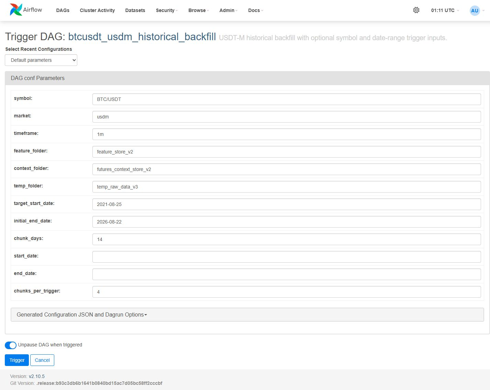
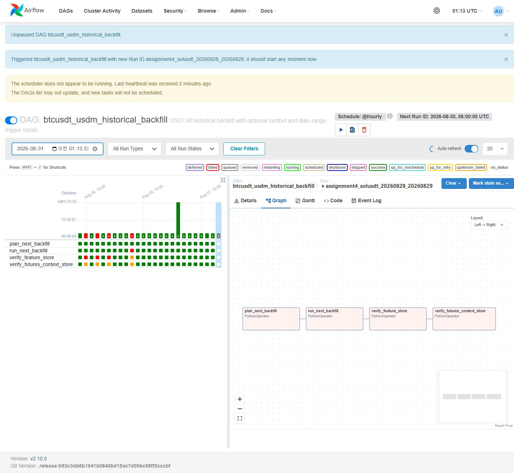
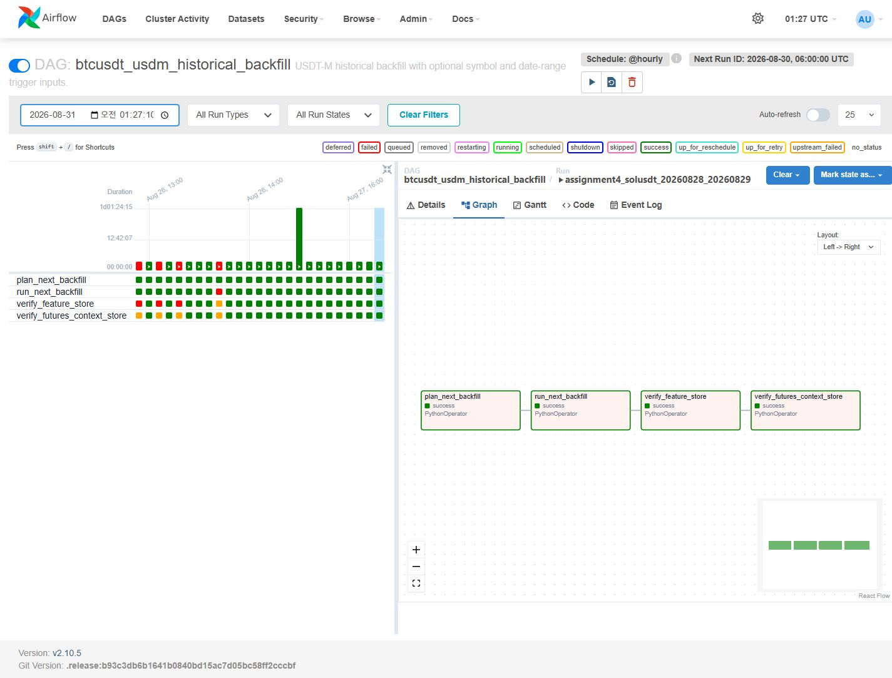
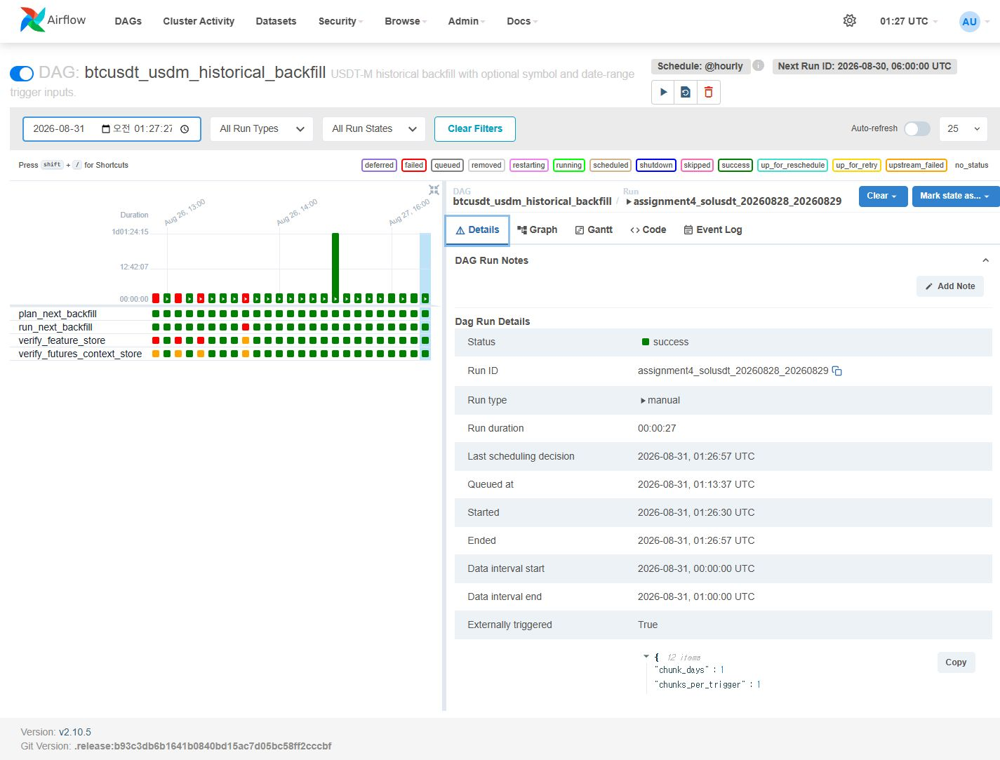
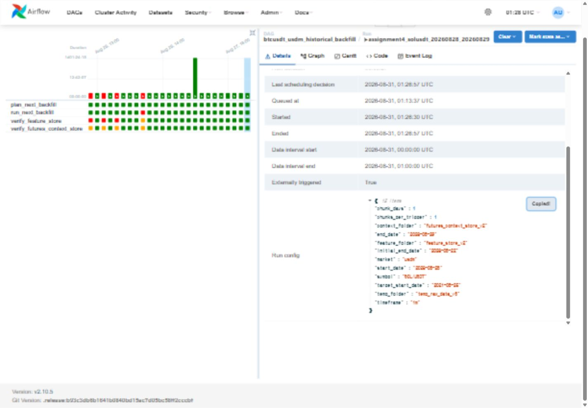

# 4주차 과제: Airflow 매개변수 백필 실행 결과

## 1. 과제에서 한 작업

기존 백필 코드는 종목과 날짜를 명령어에 직접 적어 실행해야 했습니다. 같은 코드를 다시
고치지 않아도 되도록 Airflow DAG가 다음 값을 실행할 때 입력받게 만들었습니다.

- `symbol`: 수집할 종목
- `start_date`, `end_date`: 수집 기간
- `market`: 시장 종류
- `timeframe`: 봉 간격
- `chunk_days`: 한 번에 처리할 기간

이번 확인에서는 Airflow 브라우저에서 `SOL/USDT`와 날짜를 직접 입력해 실행했습니다.

| 항목 | 입력값 |
| --- | --- |
| DAG | `btcusdt_usdm_historical_backfill` |
| Run ID | `assignment4_solusdt_20260828_20260829` |
| 종목 | `SOL/USDT` |
| 시장 | `usdm` |
| 시간 단위 | `1m` |
| 시작일 | `2026-08-28` |
| 종료일 | `2026-08-29` |
| 청크 크기 | 1일 |

종료일은 처리 범위에 포함하지 않습니다. 따라서 실제 데이터는 2026-08-28 하루치인
1,440분입니다.

## 2. 실행 화면

### 입력 화면



DAG에 입력 항목을 선언해 두었기 때문에 Airflow가 이 화면을 자동으로 만듭니다. 종목이나
날짜를 바꿀 때 Python 파일을 수정할 필요가 없습니다.

### SOL/USDT와 날짜 입력


화면에서 값을 바꾸면 아래와 같은 실행 설정 JSON이 만들어집니다.

```json
{
  "symbol": "SOL/USDT",
  "market": "usdm",
  "timeframe": "1m",
  "feature_folder": "feature_store_v2",
  "context_folder": "futures_context_store_v2",
  "temp_folder": "temp_raw_data_v3",
  "target_start_date": "2021-08-25",
  "initial_end_date": "2026-08-22",
  "chunk_days": 1,
  "start_date": "2026-08-28",
  "end_date": "2026-08-29",
  "chunks_per_trigger": 1
}
```

`Trigger`를 누르면 Airflow가 이 JSON을 DAG에 전달합니다.

### 실행 시작과 완료





실행된 네 작업은 다음과 같습니다.

1. `plan_next_backfill`: 입력값을 확인하고 처리할 날짜를 정합니다.
2. `run_next_backfill`: Binance 데이터를 받고 PyFlink로 가공해 Parquet으로 저장합니다.
3. `verify_feature_store`: 피처 파일의 행 수, 중복, 시간 공백, 결측값을 확인합니다.
4. `verify_futures_context_store`: mark price, funding rate, open interest 결과를 확인합니다.





상세 화면에서 상태 `success`, 수동 실행 여부, 입력한 JSON과 실행 시간 27초를 확인했습니다.

## 3. 실행 결과

| 결과 | 피처 데이터 | 선물 컨텍스트 데이터 |
| --- | ---: | ---: |
| 저장 행 수 | 1,440 | 1,440 |
| timestamp 중복 | 0 | 0 |
| 1분 간격 공백 | 0 | 0 |
| 필수값 결측 | 0 | 0 |
| 품질 검사 | `healthy=true` | `healthy=true` |

피처 처리에 사용된 PyFlink Job ID는 `23e4817a84f50f74870da6242c684f65`입니다.
원본 Parquet은 용량 때문에 제출 폴더에서 제외했고, 검사 결과는 아래 JSON으로 남겼습니다.

```text
assignment_evidence/airflow_ui_trigger_2026-08-31/07_run_verification.json
```

실제 저장 경로는 다음과 같습니다.

```text
feature_store_v2/market=usdm/symbol=SOLUSDT/timeframe=1m/year=2026/month=08/
features_SOLUSDT_USDM_1m_20260828_20260829_202608.parquet

futures_context_store_v2/market=usdm/symbol=SOLUSDT/timeframe=1M/
context_SOLUSDT_USDM_CONTEXT_1M_20260828_20260829.parquet
```

## 4. 실행 중 생긴 문제

처음 실행했을 때는 Airflow의 `SequentialExecutor`가 기존 일일 수집 작업을 처리 중이라
SOL 실행이 바로 시작되지 않았습니다. 일일 DAG를 잠시 멈추고 스케줄러를 다시 시작한 뒤
대기 중인 작업이 순서대로 실행됐습니다. 이 문제는 DAG 코드 오류가 아니어서 코드는 바꾸지
않았습니다.

## 5. 제출 항목 확인

- 매개변수를 받는 DAG: `airflow/dags/btcusdt_usdm_historical_backfill.py`
- 종목과 날짜를 바꾼 실행: `SOL/USDT`, 2026-08-28 하루
- 실제 실행 화면: 이 문서의 Airflow 캡처
- 만들어진 결과: 1,440행씩 저장한 경로와 검증 JSON
- GitHub 제외 항목: 대용량 Parquet, 비밀키, 계정 정보

