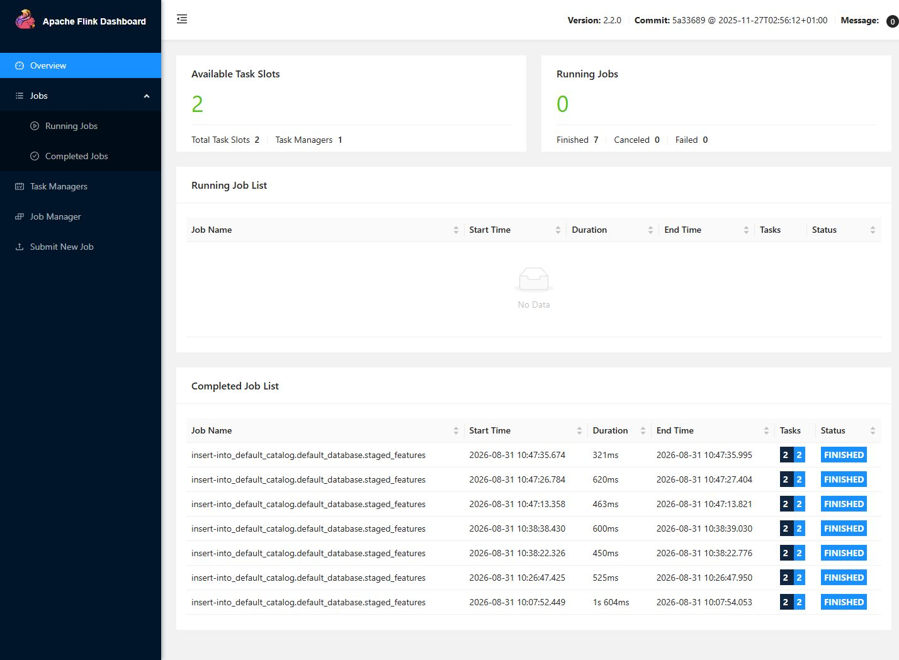
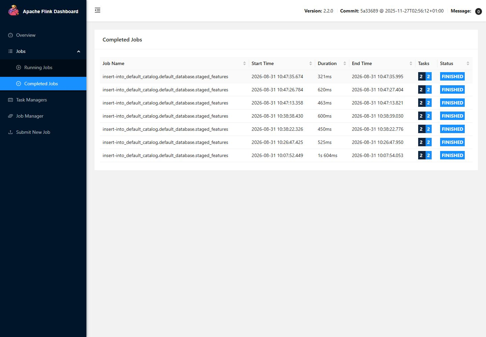
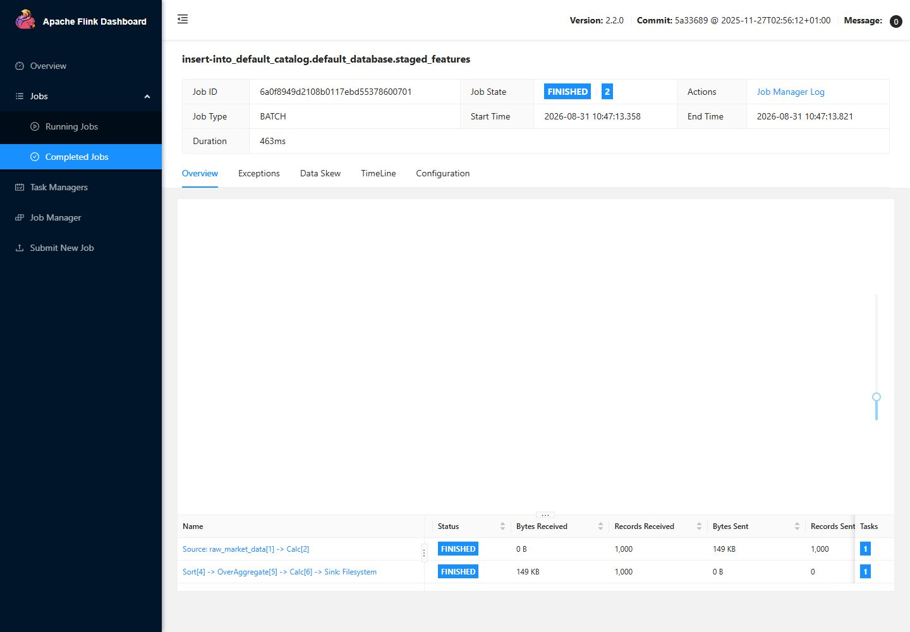

# 5주차 과제: 부하·장애·복구 실험 결과

## 1. 실험 목적

평소보다 데이터가 많거나 잘못된 데이터가 들어왔을 때 파이프라인이 어떻게 동작하는지
확인했습니다. 외부 Binance 서버에는 부하를 보내지 않고, 앞에서 저장한 실제 BTCUSDT
1분봉을 로컬 Kafka에 다시 넣는 방식으로 실험했습니다.

실행 명령은 다음과 같습니다.

```powershell
python assignment5_pipeline_resilience/run_experiment.py
```

```text
저장된 BTCUSDT 1분봉
  -> 로컬 Kafka
  -> event_id 중복 제거
  -> PyFlink 피처 계산
  -> Parquet 저장
  -> 행 수·중복·결측 검사
```

## 2. 정상 실행과 부하 실행

| 측정값 | 정상 실행 | 부하 실행 |
| --- | ---: | ---: |
| Run ID | `assignment5-baseline_1000-20260831T014703Z` | `assignment5-load_10000-20260831T014703Z` |
| 고유 이벤트 | 1,000 | 10,000 |
| 일부러 추가한 중복 | 0 | 500 |
| Producer 전송 | 1,000 | 10,500 |
| Consumer 전체 확인 | 1,000 | 10,500 |
| Consumer 고유 수신 | 1,000 | 10,000 |
| 제거한 중복 | 0 | 500 |
| Kafka 처리 시간 | 3.094초 | 4.422초 |
| PyFlink 입력 / 출력 | 1,000 / 1,000 | 10,000 / 10,000 |
| PyFlink 호출 시간 | 7.953초 | 8.266초 |
| 전체 실행 시간 | 11.141초 | 12.875초 |
| 최종 Parquet 행 | 1,000 | 10,000 |
| timestamp 중복 | 0 | 0 |
| 필수값 결측 | 0 | 0 |

Kafka Topic은 두 실행 모두 `assignment5.market.events.v1`입니다. 입력량을 10배로 늘렸지만
전체 시간은 약 1.16배가 됐습니다. 이번 데이터 크기에서는 Job을 준비하는 시간이 전체 시간의
큰 부분을 차지했기 때문입니다. 데이터가 훨씬 커지면 다시 측정하면서 Kafka 파티션과 Flink
병렬 처리 수를 조절해야 합니다.

## 3. Flink 화면에서 확인한 내용



실험이 끝난 뒤 Flink 화면에는 실행 중인 Job이 없고 실패한 Job도 0개로 표시됐습니다.



이번 실험의 정상, 부하, 복구 Job은 모두 `FINISHED` 상태입니다.

### 정상 1,000건



- Job ID: `6a0f8949d2108b0117ebd55378600701`
- Records Received: 1,000
- 상태: `FINISHED`

### 부하 10,000건


- Job ID: `08e3fad0007754619f5878d65e91b3e3`
- Records Received: 10,000
- 상태: `FINISHED`

Flink 화면의 실행 시간은 클러스터 내부 계산 시간입니다. 표의 PyFlink 시간은 파일 준비,
Job 제출, 완료 확인과 결과 복사까지 포함하므로 두 값이 서로 다릅니다.

## 4. 장애 재현

### 중복 이벤트

부하 실행에서 이미 보낸 `event_id` 500개를 한 번 더 보냈습니다. Kafka에는 10,500건이
들어갔지만 Consumer가 500건을 중복으로 찾아 제외했습니다. 그래서 PyFlink와 최종
Parquet에는 고유한 10,000건만 남았습니다.

### 필수 필드 누락

이벤트 한 건에서 필수 값인 `close`를 지운 뒤 처리했습니다. 잘못된 값을 저장하는 대신
입력 검사에서 아래 오류와 함께 종료 코드 1로 실패했습니다.

```text
RuntimeError: Flink input preparation produced no valid events.
PROCESS_RETURN_CODE: 1
```

이 오류는 Flink Job을 제출하기 전에 발생합니다. 따라서 Flink 화면에 실패 Job이 생기지
않는 것이 정상입니다. 전체 오류 내용은 다음 파일에 있습니다.

```text
assignment5_pipeline_resilience/logs/fault_invalid_input.log
```

## 5. 복구 결과

잘못된 파일 대신 검증을 통과한 정상 JSONL을 입력해 PyFlink를 다시 실행했습니다.


- 복구 Job ID: `10a25bbb76ecde40b0b1106aabd34e4a`
- Records Received: 1,000
- 저장 행 수: 1,000
- timestamp 중복: 0
- 필수값 결측: 0
- 상태: `FINISHED`, `healthy=true`

복구 결과는 기존 파일과 섞이지 않도록 `output/recovery_1000`에 따로 저장했습니다. 정상,
부하, 복구의 세 Parquet 모두 최종 검사에서 중복과 필수값 결측이 없었습니다.

## 6. 확인할 결과 파일

```text
assignment5_pipeline_resilience/results/assignment5_final_report.json
assignment5_pipeline_resilience/results/assignment5_output_quality_check.json
assignment5_pipeline_resilience/results/baseline_1000_producer.json
assignment5_pipeline_resilience/results/baseline_1000_consumer.json
assignment5_pipeline_resilience/results/baseline_1000_flink.json
assignment5_pipeline_resilience/results/load_10000_producer.json
assignment5_pipeline_resilience/results/load_10000_consumer.json
assignment5_pipeline_resilience/results/load_10000_flink.json
assignment5_pipeline_resilience/logs/fault_invalid_input.log
```

최종 자동 검사 결과는 `errors: []`, `healthy: true`입니다. 대용량 원본과 비밀키는 제출
폴더에 넣지 않았습니다.

