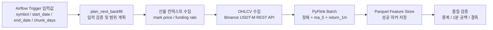

# Airflow 입력값 기반 과거 시장 데이터 백필

## 프로젝트 목적

Binance USDT-M 선물 시장의 1분봉 데이터를 수집하고, PyFlink로 머신러닝용 피처를
만든 뒤 Parquet Feature Store에 저장하는 과거 데이터 처리 파이프라인입니다.

이번 구현의 핵심은 **DAG 코드를 고치지 않고 입력값만 바꿔 다른 종목과 날짜 범위를
처리할 수 있게 한 것**입니다.

## 과제 요구사항 대응

| 과제 요구사항 | 구현 내용 | 증빙 |
| --- | --- | --- |
| 입력값을 받아 재실행 | `symbol`, `start_date`, `end_date`, `chunk_days`를 Airflow Trigger 입력값으로 지원 | DAG 코드와 실행 JSON |
| 값을 바꿔 다시 실행 | 기본 BTC 대신 `ETH/USDT`, 다른 날짜 범위로 실제 실행 | 실행 결과 JSON |
| 기존 수집·처리 연결 | Binance 수집 -> PyFlink 가공 -> Parquet 저장 -> 품질 검증 | Airflow Task 4개 성공 |
| 실행 로그 또는 결과 제출 | DAG Run ID, Flink Job ID, 행 수, 품질 검증 결과 저장 | `docs/airflow_parameterized_backfill_run_2026-08-26.json` |

Spark 작업은 이 프로젝트에 없으므로, 과제 안내의 대안 조건에 맞춰 기존 데이터
수집·backfill 작업을 Airflow로 자동화했습니다. 데이터 가공 엔진은 프로젝트의 기존
구성에 맞춰 PyFlink를 사용했습니다.

## 처리 구조



## 입력값 명세

| 입력값 | 타입 | 예시 | 의미 |
| --- | --- | --- | --- |
| `symbol` | 문자열 | `ETH/USDT` | Binance USDT-M 선물 종목 |
| `start_date` | 날짜 문자열 | `2026-08-20` | 수집 시작일, UTC 포함 |
| `end_date` | 날짜 문자열 | `2026-08-21` | 수집 종료일, UTC 미포함 |
| `chunk_days` | 정수 | `1` | 한 번에 처리할 날짜 청크 크기 |
| `timeframe` | 문자열 | `1m` | 캔들 시간 단위 |

`start_date`와 `end_date`를 함께 입력하면 `manual_range` 모드가 선택됩니다.
이 모드는 자동 백필의 기존 진행 위치를 변경하지 않고, 요청한 기간만 처리합니다.

## 실제 입력값 변경 실행

기본 설정은 BTCUSDT이지만, 아래처럼 `ETH/USDT`와 별도 날짜 범위를 입력해 코드를
수정하지 않고 다시 실행했습니다.

```json
{
  "symbol": "ETH/USDT",
  "start_date": "2026-08-20",
  "end_date": "2026-08-21",
  "chunk_days": 1
}
```

| 항목 | 실제 결과 |
| --- | --- |
| Airflow DAG | `btcusdt_usdm_historical_backfill` |
| DAG Run ID | `manual__2026-08-26T14:00:00+00:00` |
| 선택 모드 | `manual_range` |
| PyFlink Job ID | `c94bb7c92ad132f5237ad24bff3f0481` |
| OHLCV 원천 수집 행 수 | 1,440건 |
| Feature Store 저장 행 수 | 1,440건 |
| Futures Context Store 저장 행 수 | 1,440건 |
| 중복 타임스탬프 | 0건 |
| 1분 공백 | 0건 |
| 최종 결과 | 성공 |

실행된 Airflow Task는 아래 네 단계이며 모두 성공했습니다.

```text
plan_next_backfill
run_next_backfill
verify_feature_store
verify_futures_context_store
```

## 전처리와 저장 결과

### PyFlink 전처리

- OHLCV 필수 값 확인 및 정렬
- 1분 타임스탬프 중복 및 공백 검사
- `ma_5`: 최근 5분 종가 이동평균 생성
- `return_1m`: 1분 수익률 생성

### 최종 Feature Store 컬럼

```text
timestamp, datetime_utc, open, high, low, close, volume,
ma_5, return_1m, symbol, market, timeframe, feature_schema_version
```

### 저장 형식과 위치

| 데이터 | 형식 | 저장 위치 |
| --- | --- | --- |
| OHLCV 피처 | Parquet | `feature_store_v2/market=usdm/symbol=ETHUSDT/timeframe=1m/` |
| 선물 컨텍스트 | Parquet | `futures_context_store_v2/market=usdm/symbol=ETHUSDT/timeframe=1m/` |
| 피처 성공 마커 | JSON | `feature_store_v2/_markers/` |
| 컨텍스트 성공 마커 | JSON | `futures_context_store_v2/_markers/` |

성공 마커에는 처리 기간, 행 수, 스키마 정보가 기록됩니다. 원천 CSV는 가공·검증이
완료된 뒤 삭제할 수 있어 저장 공간을 줄입니다.

## 재실행 방법

Airflow UI에서 `btcusdt_usdm_historical_backfill` DAG의 **Trigger DAG**를 선택하고
아래 JSON을 입력합니다.

```json
{
  "symbol": "ETH/USDT",
  "start_date": "2026-08-20",
  "end_date": "2026-08-21",
  "chunk_days": 1
}
```

PowerShell에서 전체 DAG를 테스트 실행할 수도 있습니다.

```powershell
docker compose exec -T airflow airflow dags test btcusdt_usdm_historical_backfill 2026-08-26T14:00:00+00:00 `
  --conf '{\"symbol\":\"ETH/USDT\",\"start_date\":\"2026-08-20\",\"end_date\":\"2026-08-21\",\"chunk_days\":1}'
```

## 제출 파일

| 파일 | 역할 |
| --- | --- |
| `airflow/dags/btcusdt_usdm_historical_backfill.py` | 입력값 기반 Airflow DAG |
| `backfill_runner.py` | 날짜 청크별 OHLCV 수집·가공 실행 |
| `1_chunk_downloader.py` | Binance OHLCV 원천 수집 |
| `flink_batch_submitter.py`, `flink_jobs/batch_feature_job.py` | PyFlink 가공 실행 코드 |
| `9_futures_context_collector.py` | 선물 컨텍스트 수집 |
| `scripts/verify_feature_store.py` | Feature Store 품질 검증 |
| `scripts/verify_futures_context_store.py` | 컨텍스트 Store 품질 검증 |
| `docs/airflow_parameterized_backfill_run_2026-08-26.json` | 실제 성공 실행 결과 |
| `docs/airflow_parameterized_backfill_assignment_2026-08-26.md` | 상세 과제 문서 |

대용량 원천 CSV, 전체 Parquet 데이터, API 키, 개인정보, 주문 권한 정보는 GitHub에
포함하지 않습니다. 이 실행은 공개 Binance 데이터만 사용했으며 실거래 주문 API를
호출하지 않았습니다.

## 이후 계획

1. 동일 DAG로 BTCUSDT 과거 범위를 청크 단위로 확장
2. Feature Store 데이터를 시간순 학습·검증·테스트 세트로 분리
3. 비용과 리스크 규칙을 포함한 워크포워드 백테스트
4. 장기 페이퍼 트레이딩 검증
5. 별도 승인 후에만 주문 API 연결 검토
