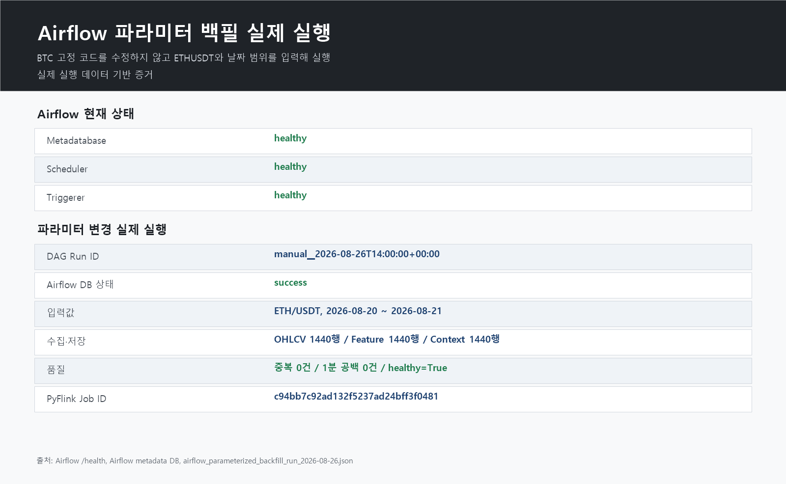
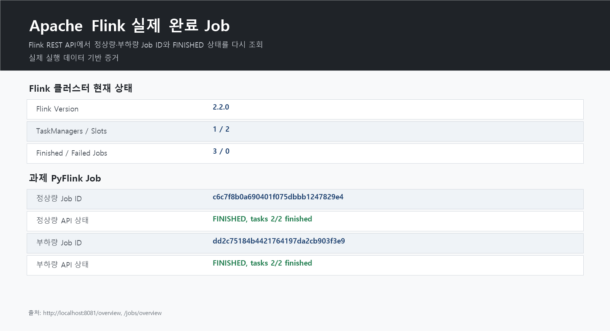
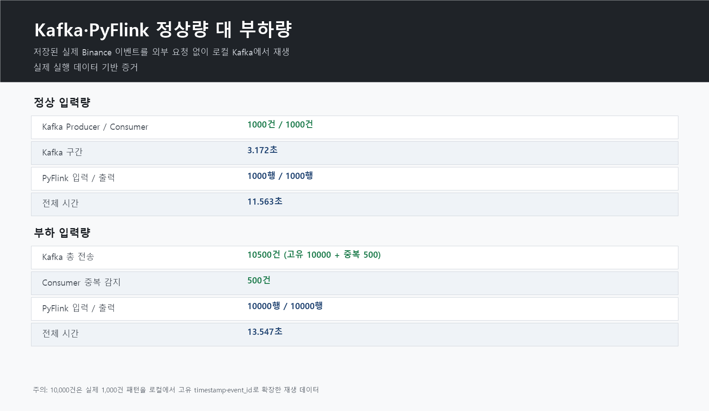
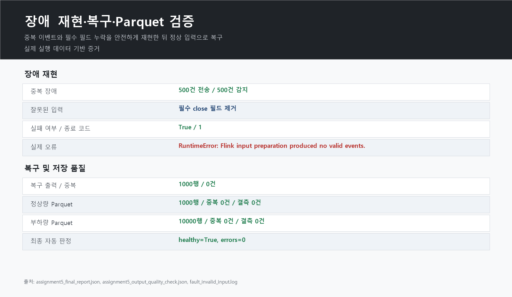

# 4·5차시 과제 실제 실행 증거 이미지

## 1. 문서 목적

이 문서는 Airflow 자동화 과제와 Kafka·PyFlink 부하·장애·복구 과제의 실제 실행 상태를 이미지로
확인하기 위한 GitHub 제출 자료입니다.

아래 이미지는 예시 화면이나 임의 수치가 아닙니다. 현재 실행 중인 Airflow와 Flink의 상태 API,
Airflow metadata DB, 실제 실행 JSON과 최종 Parquet 검증 결과를 읽어 생성했습니다. 브라우저 UI를
그대로 찍은 화면과 구분하기 위해 각 이미지에 `실제 실행 데이터 기반 증거`라고 표시했습니다.

## 2. Airflow 파라미터 변경 실행



확인할 내용:

- Airflow metadatabase, scheduler, triggerer가 `healthy`
- 과제 Run ID `manual__2026-08-26T14:00:00+00:00`이 `success`
- 입력값을 `ETH/USDT`, 2026-08-20~2026-08-21로 변경
- OHLCV, Feature Store, Futures Context Store가 각각 1,440행
- 중복 timestamp와 1분 공백이 0건

## 3. Apache Flink 완료 Job



확인할 내용:

- Flink REST API에서 정상량과 부하량 Job ID를 다시 조회
- 두 Job 모두 `FINISHED`
- 각 Job의 Task가 2/2 완료
- 클러스터 기준 실패 Job 0개

## 4. Kafka·PyFlink 부하 비교



확인할 내용:

- 정상량: Kafka 1,000건, PyFlink 출력 1,000행
- 부하량: 고유 10,000건과 중복 500건, PyFlink 출력 10,000행
- Consumer가 의도한 중복 500건을 정확히 감지
- 외부 Binance에는 부하를 보내지 않고 저장된 실제 이벤트를 로컬에서 재생

## 5. 장애 재현과 복구



확인할 내용:

- 같은 event_id 500건을 중복 전송
- 필수 `close` 필드 누락으로 전처리가 종료 코드 1을 반환
- 정상 입력으로 복구 후 1,000행 저장, 중복 0건
- 부하 결과 Parquet 10,000행, timestamp 중복 0건, 필수 값 결측 0건
- 최종 자동 판정 `healthy=true`

## 6. 원본 증거 파일

이미지에 사용한 원본도 함께 제출합니다.

```text
assignment_evidence/airflow_live_health.json
assignment_evidence/airflow_dag_runs_snapshot.json
assignment_evidence/flink_live_overview.json
assignment_evidence/flink_jobs_snapshot.json
docs/airflow_parameterized_backfill_run_2026-08-26.json
assignment5_pipeline_resilience/results/assignment5_final_report.json
assignment5_pipeline_resilience/results/assignment5_output_quality_check.json
```

따라서 이미지만 보는 것이 아니라 JSON의 Run ID, Job ID, 행 수와 직접 대조할 수 있습니다.

## 7. 이미지 다시 만들기

Airflow와 Flink가 실행 중일 때 프로젝트 루트에서 다음 명령을 실행합니다.

```powershell
PowerShell -ExecutionPolicy Bypass -File .\scripts\capture_assignment_evidence.ps1
```

실제 브라우저 UI 화면이 별도로 필요할 때는 다음 주소를 열어 같은 Run ID와 Job ID를 검색합니다.

```text
Airflow: http://localhost:8080
Flink:   http://localhost:8081
```

## 8. 발표할 때 설명

```text
화면 이미지만 제출하면 수치를 수정했는지 확인하기 어려울 수 있어서, 실행 중인 Airflow와 Flink의
상태 API와 metadata DB에서 Run ID와 Job ID를 다시 읽었습니다. 그 값과 실제 실행 결과 JSON,
Parquet 행 수 검증을 이미지로 만들고 원본 JSON도 함께 첨부했습니다. 따라서 Airflow의 ETHUSDT
1,440행 실행, Flink 정상·부하 Job 완료, 중복 500건 제거와 장애 복구 결과를 서로 대조할 수 있습니다.
```
