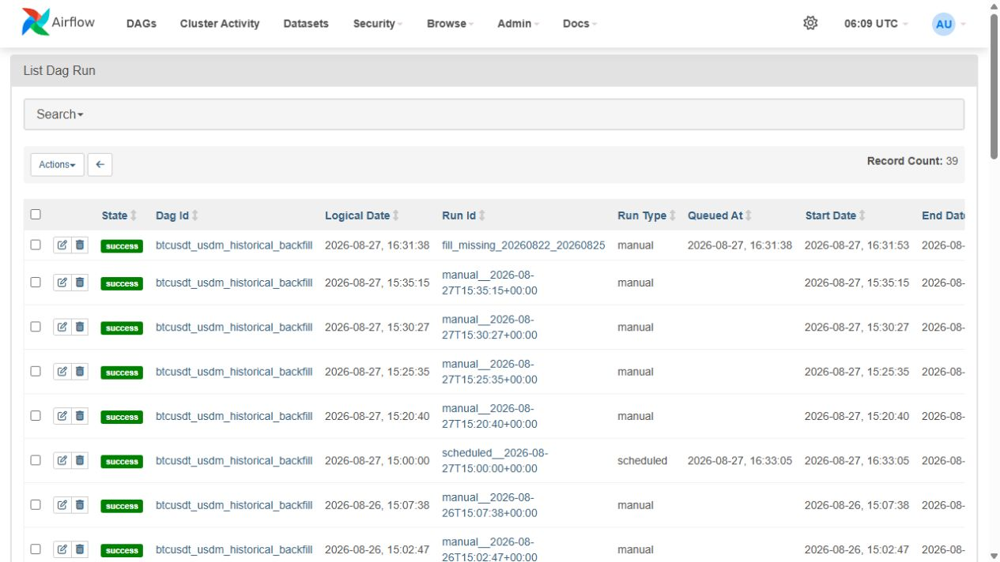
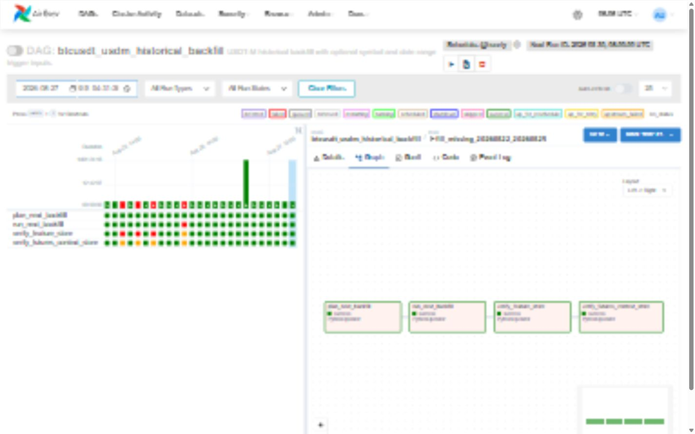
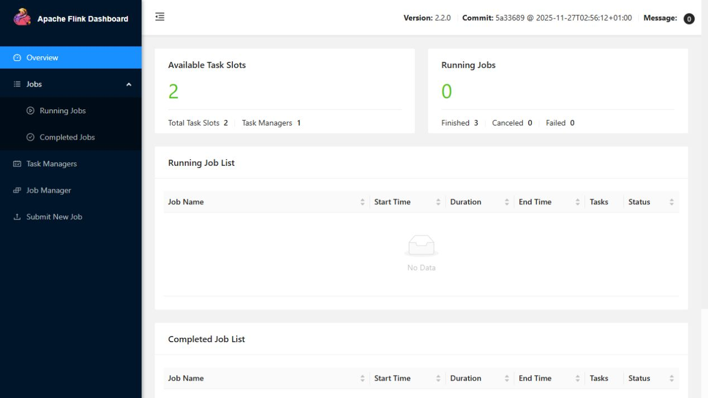

# 4·5차시 과제 실제 실행 증거 이미지

## 1. 문서 목적

이 문서는 Airflow 자동화 과제와 Kafka·PyFlink 부하·장애·복구 과제의 실제 실행 상태를 이미지로
확인하기 위한 GitHub 제출 자료입니다.

아래 이미지는 예시 화면이나 임의 수치가 아닙니다. 현재 실행 중인 Airflow와 Flink의 상태 API,
Airflow metadata DB, 실제 실행 JSON과 최종 Parquet 검증 결과를 읽어 생성했습니다. 브라우저 UI를
그대로 찍은 화면과 구분하기 위해 각 이미지에 `실제 실행 데이터 기반 증거`라고 표시했습니다.

## 2. 직접 캡처한 실제 UI

다음 두 이미지는 2026-08-30에 Codex 내장 브라우저로 `localhost`의 Airflow와 Flink 화면을
직접 열어 캡처한 이미지입니다. 수치를 별도로 그려 만든 이미지가 아닙니다.

### 2.1 Airflow 매개변수 실행 성공 화면



실행 목록에서 `Record Count: 39`, 여러 실행의 `success` 상태와 매개변수 실행
`fill_missing_20260822_20260825`를 확인할 수 있습니다.



확인할 내용:

- DAG: `btcusdt_usdm_historical_backfill`
- Run ID: `fill_missing_20260822_20260825`
- 입력 기간: 2026-08-22~2026-08-25
- `plan_next_backfill`, `run_next_backfill`, `verify_feature_store`,
  `verify_futures_context_store`가 모두 `success`
- 수집, PyFlink 가공, Feature Store 검증, 선물 컨텍스트 검증이 하나의 DAG로 연결됨

### 2.2 Flink 클러스터 실제 화면



확인할 내용:

- Apache Flink `2.2.0`
- TaskManager 1개, Task Slot 2개
- 실행 중 Job 0개
- 누적 완료 Job 3개, 취소 0개, 실패 0개

Flink 클러스터를 재시작하면 완료 Job 상세 목록은 메모리에서 사라질 수 있습니다. 따라서 현재 UI의
누적 완료·실패 수치와 실행 당시 저장한 Job ID JSON을 함께 제출해 서로 대조합니다.

## 3. 실행 데이터 기반 요약: Airflow 파라미터 변경 실행


확인할 내용:

- Airflow metadatabase, scheduler, triggerer가 `healthy`
- 과제 Run ID `manual__2026-08-26T14:00:00+00:00`이 `success`
- 입력값을 `ETH/USDT`, 2026-08-20~2026-08-21로 변경
- OHLCV, Feature Store, Futures Context Store가 각각 1,440행
- 중복 timestamp와 1분 공백이 0건

## 4. 실행 데이터 기반 요약: Apache Flink 완료 Job


확인할 내용:

- Flink REST API에서 정상량과 부하량 Job ID를 다시 조회
- 두 Job 모두 `FINISHED`
- 각 Job의 Task가 2/2 완료
- 클러스터 기준 실패 Job 0개

## 5. Kafka·PyFlink 부하 비교


확인할 내용:

- 정상량: Kafka 1,000건, PyFlink 출력 1,000행
- 부하량: 고유 10,000건과 중복 500건, PyFlink 출력 10,000행
- Consumer가 의도한 중복 500건을 정확히 감지
- 외부 Binance에는 부하를 보내지 않고 저장된 실제 이벤트를 로컬에서 재생

## 6. 장애 재현과 복구


확인할 내용:

- 같은 event_id 500건을 중복 전송
- 필수 `close` 필드 누락으로 전처리가 종료 코드 1을 반환
- 정상 입력으로 복구 후 1,000행 저장, 중복 0건
- 부하 결과 Parquet 10,000행, timestamp 중복 0건, 필수 값 결측 0건
- 최종 자동 판정 `healthy=true`

## 7. 원본 증거 파일

이미지에 사용한 원본도 함께 제출합니다.

```text
assignment_evidence/airflow_live_health.json
assignment_evidence/airflow_dag_runs_snapshot.json
assignment_evidence/flink_live_overview.json
assignment_evidence/flink_jobs_snapshot.json
assignment_evidence/actual_ui/airflow_dag_runs_actual.png
assignment_evidence/actual_ui/airflow_success_graph_actual.png
assignment_evidence/actual_ui/flink_overview_actual.png
docs/airflow_parameterized_backfill_run_2026-08-26.json
assignment5_pipeline_resilience/results/assignment5_final_report.json
assignment5_pipeline_resilience/results/assignment5_output_quality_check.json
```

따라서 이미지만 보는 것이 아니라 JSON의 Run ID, Job ID, 행 수와 직접 대조할 수 있습니다.

## 8. 이미지 다시 만들기

Airflow와 Flink가 실행 중일 때 프로젝트 루트에서 다음 명령을 실행합니다.

```powershell
PowerShell -ExecutionPolicy Bypass -File .\scripts\capture_assignment_evidence.ps1
```

데이터 기반 요약 이미지는 위 명령으로 다시 만들 수 있습니다. `actual_ui` 폴더의 이미지는 실제
브라우저 화면을 직접 캡처한 파일이므로 자동 생성 이미지와 구분해서 보관합니다.

```text
Airflow: http://localhost:8080
Flink:   http://localhost:8081
```

## 9. 발표할 때 설명

```text
먼저 실제 Airflow UI에서 매개변수 백필 실행의 네 작업이 모두 성공한 화면을 확인할 수 있습니다.
실제 Flink UI에서는 TaskManager 1개, Slot 2개, 완료 3건, 실패 0건을 확인할 수 있습니다. 화면만으로
세부 수치를 모두 읽기 어려운 부분은 상태 API와 metadata DB에서 Run ID와 Job ID를 다시 읽고,
실제 실행 결과 JSON 및 Parquet 행 수 검증과 대조했습니다. 따라서 화면 캡처와 원본 실행 데이터를
함께 확인할 수 있습니다.
```
