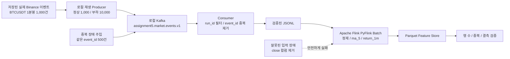

# 5차시 과제: 데이터 파이프라인 부하·장애·복구 실험

## 1. 과제와 프로젝트의 연결

이 실험은 자동매매 프로젝트의 다음 데이터 흐름을 대상으로 합니다.

```text
저장된 Binance USDT-M BTCUSDT 1분봉
  -> 로컬 Kafka 재생
  -> Consumer 수집 및 event_id 중복 제거
  -> PyFlink 배치 정제·피처 계산
  -> Parquet Feature Store 저장
  -> 건수·중복·결측 검증
```

실제 운영에서는 WebSocket 이벤트가 Kafka로 계속 들어오지만, 외부 서비스에 부하를 주면 안 된다는
과제 조건 때문에 이번 실험에서는 이전에 저장한 실제 Binance 공개 시장 이벤트를 로컬 Kafka에
재생했습니다. Spark 대신 이 프로젝트의 표준 처리 엔진인 Apache Flink의 Python API인 PyFlink를
사용했습니다.

## 2. 사용 데이터

원본은 Binance USDT-M BTCUSDT 실제 1분봉 1,000건입니다.

```text
assignment4_kafka_spark/data/consumed_binance_usdm_events.jsonl
```

부하 시나리오의 10,000건은 외부 API에서 새로 10,000건을 요청한 것이 아닙니다. 저장된 실제
1,000건의 가격 패턴을 로컬에서 반복하고 timestamp와 event_id를 고유하게 만들어 확장한 재생
데이터입니다. 여기에 중복 장애를 시험하기 위해 같은 event_id 500건을 의도적으로 추가했습니다.

## 3. 실험 아키텍처



## 4. 실행 방법

프로젝트 루트에서 Docker Kafka, Flink, Airflow를 먼저 실행합니다.

```powershell
docker compose up -d zookeeper kafka jobmanager taskmanager airflow
```

그다음 전체 실험을 한 번에 실행합니다.

```powershell
python assignment5_pipeline_resilience/run_experiment.py
```

기본값은 다음과 같습니다.

| 인자 | 기본값 | 의미 |
| --- | ---: | --- |
| `--baseline-count` | 1,000 | 정상 입력 고유 건수 |
| `--load-count` | 10,000 | 부하 입력 고유 건수 |
| `--duplicate-count` | 500 | 부하 실행에 추가할 중복 이벤트 수 |
| `--topic` | `assignment5.market.events.v1` | 실험 전용 Kafka Topic |
| `--bootstrap-servers` | `localhost:9092` | 로컬 Kafka 주소 |

건수를 바꾸어 다시 실행할 수도 있습니다.

```powershell
python assignment5_pipeline_resilience/run_experiment.py `
  --baseline-count 1000 `
  --load-count 20000 `
  --duplicate-count 1000
```

## 5. 실제 실행 결과

최신 재실행 시각은 2026-08-31 10:47 KST입니다. 최종 자동 검증 결과는 `healthy=true`였습니다.
실제 Flink 브라우저 화면과 최신 결과 해설은 루트의
`ASSIGNMENT5_ACTUAL_EXECUTION_AND_UI_EVIDENCE_2026-08-31.md`에서 확인할 수 있습니다.

### 정상 입력량

| 항목 | 결과 |
| --- | ---: |
| Producer 전송 | 1,000건 |
| Consumer 고유 수신 | 1,000건 |
| 감지된 중복 | 0건 |
| Kafka 구간 시간 | 3.094초 |
| PyFlink 처리 입력 | 1,000행 |
| PyFlink 처리 출력 | 1,000행 |
| PyFlink 시간 | 7.953초 |
| 전체 파이프라인 시간 | 11.141초 |
| Parquet timestamp 중복 | 0건 |
| 필수 컬럼 결측 | 0건 |

PyFlink Job ID:

```text
6a0f8949d2108b0117ebd55378600701
```

### 부하 입력량

| 항목 | 결과 |
| --- | ---: |
| Producer 총 전송 | 10,500건 |
| 고유 이벤트 | 10,000건 |
| 의도적으로 보낸 중복 | 500건 |
| Consumer가 감지한 중복 | 500건 |
| Kafka 구간 시간 | 4.422초 |
| PyFlink 처리 입력 | 10,000행 |
| PyFlink 처리 출력 | 10,000행 |
| PyFlink 시간 | 8.266초 |
| 전체 파이프라인 시간 | 12.875초 |
| Parquet timestamp 중복 | 0건 |
| 필수 컬럼 결측 | 0건 |

PyFlink Job ID:

```text
08e3fad0007754619f5878d65e91b3e3
```

입력 고유 건수는 10배가 되었지만 전체 시간은 약 1.16배가 됐습니다. 이번 크기에서는 Flink Job
시작과 Docker 실행에 드는 고정 시간이 큰 비중을 차지했기 때문입니다. 이 결과가 무제한 확장성을
뜻하지는 않으며, 더 큰 규모에서는 메모리·Kafka partition·Flink parallelism을 별도로 측정해야
합니다.

## 6. 장애 재현과 복구

### 장애 1: 중복 이벤트

부하 실행에서 같은 event_id 500건을 추가 전송했습니다. Consumer는 총 10,500개 메시지를 읽고
500건을 중복으로 정확히 감지했으며, 고유 10,000건만 PyFlink에 전달했습니다. 최종 Parquet은
10,000행이고 timestamp 중복은 0건입니다.

### 장애 2: 필수 필드 누락

정상 이벤트에서 `close` 필드를 제거해 잘못된 입력을 만들었습니다. 전처리 단계는 다음 오류로
의도한 대로 종료 코드 1을 반환했습니다.

```text
RuntimeError: Flink input preparation produced no valid events.
```

잘못된 데이터를 억지로 저장하지 않았기 때문에 오염된 Parquet은 생성되지 않았습니다. 이후 검증된
정상 JSONL을 사용해 별도 복구 Job `10a25bbb76ecde40b0b1106aabd34e4a`를 실제 실행했고,
`output/recovery_1000`에 1,000행을 저장한 뒤 중복 0건과 결측 0건을 확인했습니다.

### 추가 장애 증거: Flink TaskManager 재시작

이전 실제 스트리밍 검증에서는 처리 중 TaskManager를 재시작했습니다. Job은 checkpoint 6에서
복원된 뒤 checkpoint 7을 생성했고, 복구 후 committed 피처 5건의 고유 ID 5개, 중복 0개,
1분 공백 0개를 확인했습니다.

```text
docs/realtime_checkpoint_restart_verification_2026-08-29.md
runtime_reports/realtime_checkpoint_restart_2026-08-29.json
```

## 7. 최종 저장 컬럼과 형식

저장 형식은 Parquet입니다.

```text
assignment5_pipeline_resilience/output/baseline_1000/
assignment5_pipeline_resilience/output/load_10000/
assignment5_pipeline_resilience/output/recovery_1000/
```

주요 컬럼:

| 컬럼 | 의미 |
| --- | --- |
| `timestamp`, `datetime_utc` | 1분봉 시각 |
| `symbol`, `market`, `timeframe` | BTCUSDT, USDT-M, 1m 식별 정보 |
| `open`, `high`, `low`, `close`, `volume` | 원본 OHLCV |
| `ma_5` | 최근 5개 종가 이동평균 |
| `return_1m` | 직전 1분 대비 수익률 |
| `run_id` | 실험 실행 구분값 |
| `feature_schema_version` | 피처 스키마 버전 |

## 8. 결과 파일 읽는 순서

1. 이 `README.md`로 실험 목적과 결과를 확인합니다.
2. `run_experiment.py`에서 자동 실행 순서를 확인합니다.
3. `results/assignment5_final_report.json`에서 전체 수치를 확인합니다.
4. `results/assignment5_output_quality_check.json`에서 Parquet 재검증 결과를 확인합니다.
5. `results/baseline_1000_*.json`에서 정상 실행의 단계별 증거를 확인합니다.
6. `results/load_10000_*.json`에서 부하 실행의 단계별 증거를 확인합니다.
7. `logs/fault_invalid_input.log`에서 잘못된 입력의 실제 실패 내용을 확인합니다.

## 9. GitHub 제출 시 주의

제출에 포함할 핵심 파일은 코드, README, 작은 JSON 결과, 작은 로그입니다. `data/`의 재생 중간
파일은 최대 약 4.6MB이고 다시 생성할 수 있으므로 제외합니다. API key와 계정 정보는 사용하지
않았습니다. 실제 주문 API도 연결하지 않았습니다.

## 10. 발표용 짧은 설명

```text
이 프로젝트의 실시간 데이터 경로와 같은 Kafka-Flink 구조를 대상으로 부하와 장애를 시험했습니다.
외부 Binance에는 부하를 보내지 않고, 이전에 저장한 실제 BTCUSDT 1분봉 1,000건을 로컬 Kafka에
재생했습니다. 정상량 1,000건과 부하량 10,000건을 비교했고, 부하 실행에는 중복 이벤트 500건도
추가했습니다. Consumer가 500건을 정확히 제거해 PyFlink와 Parquet에는 고유 10,000건만
저장됐습니다. close 필드가 없는 잘못된 입력은 안전하게 실패시킨 뒤 정상 입력으로 복구해
1,000행이 빠짐없이 저장되는 것도 확인했습니다.
```

