# Kafka·Flink 과제 아키텍처 코드

아래 코드를 [Mermaid AI](https://mermaid.ai/)에 그대로 붙여 넣으면 과제 제출 범위의
아키텍처 그림을 만들 수 있습니다. GitHub도 Mermaid 다이어그램을 렌더링합니다.

```mermaid
flowchart LR
    classDef source fill:#E0F2FE,stroke:#0369A1,stroke-width:2px,color:#0C4A6E
    classDef kafka fill:#FEF3C7,stroke:#B45309,stroke-width:2px,color:#78350F
    classDef process fill:#DCFCE7,stroke:#15803D,stroke-width:2px,color:#14532D
    classDef storage fill:#F3E8FF,stroke:#7E22CE,stroke-width:2px,color:#581C87
    classDef report fill:#FCE7F3,stroke:#BE185D,stroke-width:2px,color:#831843

    API["Binance USDT-M 공개 API<br/>BTCUSDT 완료 1분봉 1,000건"]:::source
    PRODUCER["kafka_market_event_producer.py<br/>Kafka Producer"]:::source
    TOPIC[("Kafka Topic<br/>btc_market_events_v1")]:::kafka
    CONSUMER["kafka_market_event_consumer.py<br/>Kafka Consumer"]:::process
    JSONL[("수신 원본 JSONL<br/>GitHub 제외")]:::storage
    PREPARE["prepare_flink_input.py<br/>OHLCV 검증 · 중복 제거 · 시간 정렬"]:::process
    CSV[("Flink 입력 CSV<br/>GitHub 제외")]:::storage
    SUBMIT["flink_batch_submitter.py<br/>Flink Job 제출 · 성공 마커 확인"]:::process
    FLINK["flink_jobs/batch_feature_job.py<br/>Apache Flink / PyFlink<br/>ma_5 · return_1m 생성"]:::process
    PARQUET[("Parquet Feature Store<br/>1,000건 저장 · GitHub 제외")]:::storage
    REPORTS["실행 증거 JSON<br/>Producer 1,000 · Consumer 1,000<br/>검증 1,000 · Parquet 1,000"]:::report

    API --> PRODUCER --> TOPIC --> CONSUMER --> JSONL
    JSONL --> PREPARE --> CSV --> SUBMIT --> FLINK --> PARQUET
    PRODUCER -. 전송 결과 .-> REPORTS
    CONSUMER -. 수신 결과 .-> REPORTS
    PREPARE -. 검증 결과 .-> REPORTS
    SUBMIT -. 처리·저장 결과 .-> REPORTS
```

## 제출 코드와 그림의 연결

| 아키텍처 단계 | 제출 파일 |
| --- | --- |
| 실제 1분봉 수집과 Kafka 전송 | `kafka_market_event_producer.py` |
| Kafka 수신과 JSONL 저장 | `kafka_market_event_consumer.py` |
| 데이터 검증·정렬·중복 제거 | `prepare_flink_input.py` |
| Flink 작업 제출 | `flink_batch_submitter.py` |
| 피처 생성과 Parquet 저장 | `flink_jobs/batch_feature_job.py` |
| 실제 실행 건수 증명 | `results/*_binance_live.json` |

이 그림은 **제출한 데이터 엔지니어링 구간만** 나타냅니다. 라벨 생성, ML 학습,
백테스트, 실시간 WebSocket, 주문 실행은 아직 포함하지 않습니다.
