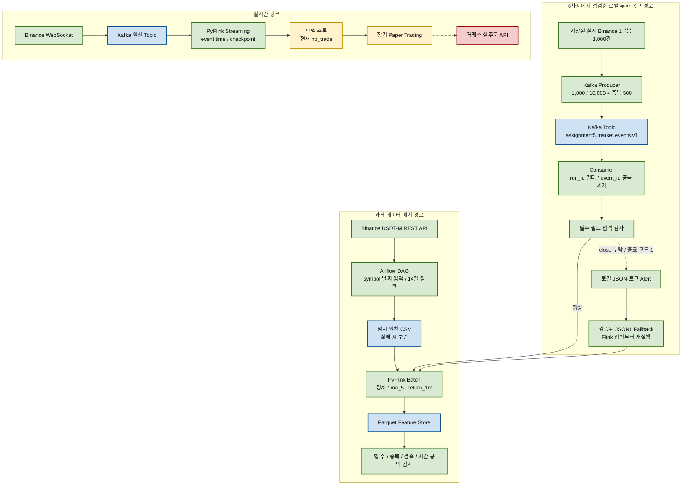

# 6차시 최신 구성도와 데이터 모델

## 1. 전체 프로젝트 구성도

초록색은 이번 프로젝트에서 실제 실행해 검증한 단계, 노란색은 기능은 있으나 운영 검증이 더
필요한 단계, 빨간색은 현재 의도적으로 차단한 단계입니다.



과거 데이터를 날짜 범위로 가져올 때는 파일 기반 배치이므로 Kafka가 필수는 아닙니다. Kafka는
실시간 이벤트의 수집 속도와 처리 속도를 분리하고 재생할 필요가 있을 때 사용합니다. 이번 부하
실험은 실시간 경로의 Kafka 처리 특성을 외부 Binance에 부하를 주지 않고 확인하기 위해 저장된
실제 이벤트를 로컬에서 재생했습니다.

## 2. 단계별 책임

| 구성 요소 | 입력 | 처리 | 출력 |
| --- | --- | --- | --- |
| Airflow | symbol, 시작일, 종료일 | 수집·가공·검증 작업 순서 관리 | 각 작업 상태와 실행 로그 |
| Kafka Producer | 저장된 Binance JSONL | event_id와 run_id를 포함해 Topic 전송 | Kafka 메시지 |
| Kafka | 시장 이벤트 | 메시지 보관과 Consumer 속도 분리 | Consumer가 읽는 이벤트 |
| Consumer | Kafka 메시지 | run_id 선택, event_id 중복 제거 | 검증 전 JSONL |
| 입력 검사 | JSONL | 필수 OHLCV 타입·값 확인 | PyFlink 입력 CSV 또는 실패 |
| PyFlink | 검증된 CSV | 정제, 이동평균, 1분 수익률 계산 | 피처 행 |
| Parquet | 피처 행 | 컬럼 기반 압축 저장 | Feature Store 파일 |
| 품질 검사 | Parquet | 행 수·timestamp 중복·필수값 결측 검사 | healthy 또는 오류 목록 |

이 프로젝트는 Spark 대신 기존 표준 처리 엔진인 Apache Flink의 Python API인 PyFlink를
사용합니다. 따라서 과제에서 말하는 Spark 처리 단계는 이 제출물에서는 PyFlink 처리 단계에
해당합니다.

## 3. Kafka 이벤트 모델

```json
{
  "event_id": "binance:usdm:BTCUSDT:candle:1m:1787359320000",
  "run_id": "assignment5-load_10000-20260831T014703Z",
  "event_type": "ohlcv",
  "event_time_ms": 1787359320000,
  "symbol": "BTCUSDT",
  "market": "USDT-M",
  "timeframe": "1m",
  "open": 60850.1,
  "high": 60880.0,
  "low": 60840.2,
  "close": 60872.5,
  "volume": 12.34,
  "source": "local-replay",
  "event_schema_version": "market_event_v1"
}
```

| 필드 | 타입 | 역할 |
| --- | --- | --- |
| `event_id` | string | 동일 시장 이벤트의 중복을 판단하는 업무 ID |
| `run_id` | string | 기준·부하 실행을 구분하는 실행 ID |
| `event_type` | string | 이벤트 종류 |
| `event_time_ms` | integer | 거래소 기준 이벤트 발생 시각 |
| `symbol`, `market`, `timeframe` | string | 종목·시장·시간 단위 |
| `open`, `high`, `low`, `close`, `volume` | number | 원본 1분봉 OHLCV |
| `source` | string | 데이터 출처 |
| `event_schema_version` | string | 이벤트 계약 버전 |

## 4. Parquet 피처 모델

| 컬럼 | 타입 | 생성 위치 | 의미 |
| --- | --- | --- | --- |
| `timestamp` | int64 | 원천 이벤트 | 1분봉 UTC millisecond timestamp |
| `datetime_utc` | timestamp | PyFlink | 사람이 읽을 수 있는 UTC 시각 |
| `symbol` | string | 원천 이벤트 | `BTCUSDT` |
| `market` | string | 원천 이벤트 | `usdm` |
| `timeframe` | string | 원천 이벤트 | `1m` |
| `run_id` | string | Producer | 실행 추적 ID |
| `open`, `high`, `low`, `close` | double | 원천 이벤트 | 1분 가격 |
| `volume` | double | 원천 이벤트 | 1분 거래량 |
| `ma_5` | double | PyFlink | 최근 5개 종가 이동평균 |
| `return_1m` | double | PyFlink | 직전 1분 대비 종가 수익률 |
| `feature_schema_version` | string | PyFlink | 피처 스키마 버전 |
| `event_time_ms` | int64 | 원천 이벤트 | 이벤트 발생 시각 |
| `timestamp_unit` | string | 표준화 계층 | timestamp 단위 |
| `metadata_schema_version` | string | 표준화 계층 | 시장 메타데이터 계약 버전 |

최종 저장 경로는 Hive 스타일 파티션을 사용합니다.

```text
output/<실행명>/market=usdm/symbol=BTCUSDT/timeframe=1m/year=2026/month=08/*.parquet
```

## 5. 현재 실행 경계

- 실제 실행됨: Kafka 재생, 중복 제거, PyFlink 배치, Parquet 저장, 품질 검사, 입력 오류 Alert,
  검증된 입력 Fallback, Airflow 파라미터 백필
- 별도 과거 검증에서 실행됨: WebSocket 수집, PyFlink Streaming, checkpoint 재시작
- 아직 운영되지 않음: 승인 모델 실시간 로딩, 장기 Paper Trading, 거래소 Testnet 주문
- 의도적으로 차단: 실제 자금 주문 API
