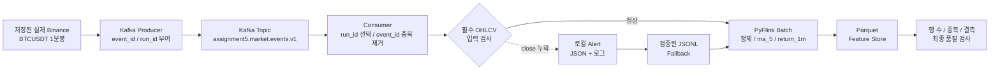

# 6차시 최종 보고서

## 부하·복구 결과 보완 및 전체 데이터 흐름 점검

## 1. 프로젝트 개요

이 프로젝트는 Binance USDT-M 선물 시장 데이터를 수집하고, 머신러닝이 사용할 수 있는
피처로 가공한 뒤 Parquet Feature Store에 저장하는 데이터 파이프라인입니다. 최종 목표는
자동매매이지만, 현재 성능이 승인된 모델이 없으므로 실제 주문은 차단되어 있습니다.

이번 과제에서는 이미 실행한 Kafka·PyFlink 부하 및 장애 복구 실험을 바탕으로 다음 항목을
보완했습니다.

1. 기준 실행과 부하 실행의 건수·시간·처리량·저장 결과 비교
2. 실패 단계와 재실행 시작 위치 확인
3. 실제 입력 오류에 대한 Alert와 Fallback 결과 확인
4. Airflow부터 Parquet 저장까지 전체 흐름 점검
5. 최신 구성도와 데이터 모델 정리
6. 아직 실행되지 않는 단계와 남은 작업 구분

과제 문구에는 Spark가 포함되어 있지만, 이 프로젝트는 처음부터 Apache Flink를 표준 처리
엔진으로 사용했습니다. 따라서 Spark 단계는 **Apache Flink의 Python API인 PyFlink**로
처리했습니다.

## 2. 이 작업을 진행한 목적

### 2.1 가장 중요한 목적

이번 작업의 가장 중요한 목적은 **데이터가 많아지거나 일부 단계가 실패해도 시장 데이터가
빠지거나 중복되지 않고 최종 Parquet까지 정확하게 도착하는지 확인하는 것**입니다.

자동매매 프로젝트에서는 프로그램이 실행됐다는 사실만으로 데이터 파이프라인이 정상이라고
판단할 수 없습니다. Producer가 10,000건을 보냈더라도 Consumer가 9,900건만 받았거나,
PyFlink가 10,000건을 처리했지만 Parquet에 9,800건만 저장했다면 학습 데이터가 불완전해집니다.
반대로 재실행 과정에서 같은 데이터가 여러 번 저장되면 특정 시장 상황이 실제보다 많이 발생한
것처럼 학습될 수 있습니다.

이런 문제는 모델 정확도와 백테스트 결과를 왜곡하고, 나중에는 잘못된 진입 신호로 이어질 수
있습니다. 따라서 모델을 더 복잡하게 만들기 전에 **수집·전송·가공·저장 단계의 데이터 수가
정확히 이어지는지** 먼저 증명해야 했습니다.

### 2.2 평소 기준을 먼저 측정한 이유

부하 상태가 느린지 빠른지 판단하려면 평소 실행 결과가 필요합니다. 그래서 기준 실행에서는
고유 이벤트 1,000건을 다음 단계로 전달하고 각 단계의 건수와 시간을 기록했습니다.

```text
Producer 전송
  -> Consumer 고유 수신
  -> PyFlink 입력
  -> PyFlink 출력
  -> Parquet 최종 저장
```

이 기준값은 이후 입력량을 늘렸을 때 다음 질문에 답하기 위한 비교 대상입니다.

- 데이터가 10배 증가했을 때 실행 시간은 몇 배 증가하는가?
- 처리량은 데이터 증가에 맞게 높아지는가?
- 어느 단계에서 데이터가 대기하거나 누락되는가?
- 작은 입력에서는 보이지 않던 오류가 큰 입력에서 발생하는가?

즉, 기준 실행은 단순한 예제 실행이 아니라 앞으로 성능 저하나 장애가 발생했을 때 비교할 수 있는
**정상 상태의 기준선**을 만드는 작업입니다.

### 2.3 부하 실행을 진행한 이유

실시간 시장에서는 거래량이 항상 일정하지 않습니다. 평소보다 거래가 몰리면 짧은 시간에 많은
체결과 호가 이벤트가 들어올 수 있습니다. 작은 테스트 데이터만 처리해 본 파이프라인은 이런
상황에서 Kafka 지연, Consumer 적체, Flink 처리 지연 또는 저장 실패가 발생할 수 있습니다.

이번 실험에서는 고유 이벤트를 1,000건에서 10,000건으로 늘려 다음 사항을 확인했습니다.

1. Kafka가 늘어난 메시지를 받아 보관할 수 있는가?
2. Consumer가 모든 메시지를 읽고 고유 이벤트만 분리할 수 있는가?
3. PyFlink가 입력 건수와 같은 수의 피처를 생성하는가?
4. Parquet에 최종 저장된 행 수가 고유 입력과 일치하는가?
5. 입력량 증가에 따라 전체 시간과 처리량이 어떻게 변하는가?

이 결과를 통해 현재 설정이 최소 10,000건까지 정상 동작했다는 것을 확인할 수 있습니다. 다만
Kafka가 멈추는 최대 한계를 찾기 위한 파괴적인 실험은 아니므로, 시스템의 절대 최대 용량을
측정했다고 표현하지 않습니다.

### 2.4 외부 Binance가 아닌 로컬 재생을 사용한 이유

외부 서비스에 의도적으로 많은 요청을 보내면 거래소의 rate limit을 위반하거나 다른 이용자에게
영향을 줄 수 있습니다. 또한 같은 시장 데이터를 다시 받을 때마다 가격과 시각이 달라지므로
실험 결과를 정확하게 비교하기 어렵습니다.

그래서 이전에 정상 수집한 실제 Binance BTCUSDT 1분봉을 로컬 Kafka에 재생했습니다. 이 방식은
다음 장점이 있습니다.

- 외부 Binance 서버에 부하를 보내지 않습니다.
- 동일한 입력으로 실험을 다시 실행할 수 있습니다.
- 기준 실행과 부하 실행의 결과를 공정하게 비교할 수 있습니다.
- 네트워크 상태가 아니라 파이프라인 자체의 처리 결과에 집중할 수 있습니다.
- 실제 가격 구조를 유지하면서 timestamp와 event_id만 고유하게 확장할 수 있습니다.

따라서 이번 부하는 외부 API 성능 시험이 아니라 **내 로컬 Kafka·Consumer·PyFlink·Parquet
파이프라인의 처리 능력과 데이터 정합성 시험**입니다.

### 2.5 중복 이벤트를 일부러 추가한 이유

실시간 시스템에서는 네트워크 재연결, Producer 재시도, Consumer 재시작 등의 이유로 같은 이벤트가
두 번 이상 도착할 수 있습니다. Kafka를 사용한다고 해서 업무 데이터의 중복이 자동으로 모두
사라지는 것은 아닙니다.

그래서 부하 실행에서는 고유 이벤트 10,000건 외에 같은 event_id를 가진 이벤트 500건을 일부러
추가했습니다. Consumer가 event_id를 기준으로 500건을 정확하게 중복으로 판단하고, PyFlink와
Parquet에는 고유한 10,000건만 전달하는지 확인하기 위한 실험입니다.

이 검증이 필요한 이유는 중복 데이터가 머신러닝 학습에 다음 문제를 만들 수 있기 때문입니다.

- 특정 가격 움직임이 실제보다 자주 나타난 것처럼 보일 수 있습니다.
- 거래량과 변동성 피처가 과장될 수 있습니다.
- 백테스트 거래 횟수와 수익률이 실제보다 높게 계산될 수 있습니다.
- 동일 신호가 반복되어 중복 주문으로 이어질 수 있습니다.

이번 결과에서 전송 10,500건과 저장 10,000건의 차이 500건은 유실이 아니라 의도한 중복 제거
결과입니다.

### 2.6 잘못된 입력 장애를 재현한 이유

실제 운영에서는 API 응답 변경, 네트워크 중단, 파일 손상, 스키마 변경 등으로 필수 필드가 없는
데이터가 들어올 수 있습니다. 이런 데이터를 그대로 피처로 계산하면 결측값이 생기거나 잘못된
가격으로 학습 데이터가 만들어질 수 있습니다.

이번에는 필수 가격 필드인 `close`를 제거해 입력 장애를 안전하게 재현했습니다. 확인하려는 핵심은
프로그램이 무조건 끝까지 실행되는지가 아니라 다음과 같습니다.

1. 잘못된 입력을 Flink 제출 전에 발견하는가?
2. 오류가 발생했을 때 종료 코드가 0이 아닌 값으로 남는가?
3. 잘못된 Parquet 파일을 만들지 않는가?
4. 실패 위치와 원인을 로그로 확인할 수 있는가?

파이프라인은 오류 입력을 억지로 저장하는 대신 종료 코드 1로 중단했습니다. 이것은 실패 자체를
없앤 것이 아니라 **데이터 오염을 막는 안전한 실패 방식**이 동작했다는 의미입니다.

### 2.7 Alert를 확인한 이유

자동화된 파이프라인은 사람이 계속 화면을 보고 있지 않기 때문에 실패가 발생했다는 사실을
기록하고 알려야 합니다. 오류가 발생했지만 아무 기록도 남지 않으면 데이터가 비어 있는 상태로
며칠 동안 운영될 수 있습니다.

이번 제출에서는 다음 정보를 로컬 JSON과 로그 Alert로 남겼습니다.

- Alert 발생 여부
- 오류 심각도
- 오류 코드
- 실패 단계
- 프로세스 종료 코드
- 실제 오류 메시지
- 복구 실행 여부와 최종 상태

현재는 과제 범위에 맞춰 로컬 파일 Alert까지만 구현했습니다. Slack이나 이메일 알림이 실제로
연결된 것처럼 표현하지 않았습니다. 향후 상시 운영할 때는 같은 Alert 정보를 외부 모니터링
채널로 전달할 수 있습니다.

이 Alert는 장애가 발생한 순간에 전송되는 실시간 운영 알림이 아니라, 실행 후 실제 실패 JSON과
로그를 검사해 생성한 로컬 사후 Alert입니다. 과제의 실제 복구 근거는 별도로 실행된 recovery
Flink Job과 최종 1,000행 Parquet 결과입니다.

### 2.8 Fallback과 중간 지점 재실행을 확인한 이유

파이프라인 후반부에서 오류가 발생했을 때 수집부터 전부 다시 실행하면 API 요청량, 처리 시간과
저장 공간을 낭비합니다. 재실행 과정에서 이미 저장된 데이터와 겹쳐 중복이 생길 위험도 있습니다.

이번 장애는 Kafka와 Consumer 처리가 끝난 다음 입력 검사에서 발생했습니다. 따라서 검증이 끝난
마지막 정상 JSONL을 Fallback 입력으로 사용하고 다음 위치부터 재실행했습니다.

```text
검증된 JSONL -> PyFlink 입력 준비 -> PyFlink -> Parquet -> 품질 검사
```

이 방식으로 Kafka 메시지를 다시 보내지 않고도 1,000행을 복구했습니다. 복구 후 저장 행 수,
timestamp 중복과 필수값 결측을 다시 확인했습니다. 이를 통해 단순히 작업을 다시 실행한 것이
아니라 **어느 위치부터 재개해야 안전하고 효율적인지** 확인했습니다.

### 2.9 최종 저장 건수를 다시 확인한 이유

Producer와 Flink가 성공해도 실제 저장 파일이 완전하다는 보장은 없습니다. 파일 경로 오류,
부분 저장, 스키마 문제로 최종 Parquet이 비어 있거나 일부 행만 기록될 수 있습니다.

그래서 처리 성공 상태와 별개로 Parquet 파일을 다시 읽어 다음 항목을 확인했습니다.

- 기대 행 수와 실제 저장 행 수
- timestamp 고유 개수
- 중복 timestamp 개수
- 필수 컬럼 존재 여부
- 필수 컬럼의 결측값 개수

자동매매 모델은 최종적으로 Kafka 메시지가 아니라 Feature Store에 저장된 데이터를 읽기 때문에,
최종 저장 결과를 확인해야 파이프라인이 끝까지 연결됐다고 말할 수 있습니다.

### 2.10 최신 구성도와 데이터 모델을 작성한 이유

파이프라인은 여러 프로그램이 연결되므로 각 구성 요소가 무엇을 입력받고 무엇을 출력하는지
문서로 고정해야 합니다. 구성도가 없으면 Airflow가 데이터를 직접 가공하는지, Kafka가 과거
데이터까지 보관하는지, Flink와 Parquet이 어떤 관계인지 혼동하기 쉽습니다.

데이터 모델은 Producer와 Consumer, PyFlink가 같은 필드와 타입을 사용하도록 하는 계약입니다.
예를 들어 `event_time_ms`의 단위가 한쪽에서는 초이고 다른 쪽에서는 밀리초라면 전혀 다른 날짜로
처리될 수 있습니다. `event_id` 규칙이 실행마다 달라지면 중복을 안정적으로 제거할 수도 없습니다.

따라서 최신 구성도와 데이터 모델은 단순 시각 자료가 아니라 다음 기능을 담당합니다.

- 단계별 책임과 경계 명확화
- 필드명·타입·시간 단위 통일
- 장애 발생 위치 추적
- 오프라인과 실시간 피처 구조 비교
- 이후 개발자가 같은 형식으로 기능을 확장할 수 있는 기준 제공

### 2.11 실제 화면과 로그를 제출한 이유

코드가 존재하는 것과 실제로 실행된 것은 다릅니다. 실행 화면과 로그는 다음 사실을 증명합니다.

- Airflow가 입력 파라미터를 받아 실제 DAG를 실행했습니다.
- Flink Job이 기준·부하·복구 데이터로 실행돼 `FINISHED` 상태가 됐습니다.
- 입력 오류가 실제 종료 코드 1과 RuntimeError를 남겼습니다.
- Alert와 Fallback 결과가 실제 JSON에 저장됐습니다.
- 최종 품질 검사가 `healthy=true`로 끝났습니다.

과제 안내에서 기존 실험은 다시 하지 않아도 된다고 했으므로, 이미 실행한 실제 화면과 JSON을
재사용하고 부족했던 Alert·Fallback 설명과 최종 캡처만 보완했습니다.

### 2.12 자동매매 프로젝트 전체에서 갖는 의미

이번 과제는 수익이 나는 전략을 찾는 실험이 아닙니다. **머신러닝과 자동매매가 신뢰할 수 있는
데이터를 받도록 기반을 확인하는 데이터 엔지니어링 작업**입니다.

전체 프로젝트에서의 연결 관계는 다음과 같습니다.

```text
정확한 시장 데이터
  -> 중복·누락 없는 피처
  -> 신뢰할 수 있는 라벨과 학습 데이터
  -> 과장되지 않은 백테스트
  -> 안전한 실시간 추론
  -> 위험 관리와 Paper Trading
  -> 모든 기준 통과 후에만 실거래 검토
```

수집 단계에서 데이터가 잘못되면 이후 모델이 아무리 복잡해도 결과를 신뢰할 수 없습니다. 이번
작업은 모델 이전 단계에서 데이터의 완전성, 재현성, 장애 격리와 복구 가능성을 확인했다는 데
의미가 있습니다.

### 2.13 이번 작업에서 확인하려고 한 질문

최종적으로 이번 과제는 다음 질문에 실제 결과로 답하기 위해 진행했습니다.

| 확인 질문 | 확인 결과 |
| --- | --- |
| 입력이 10배 늘어도 고유 데이터가 모두 저장되는가? | 10,000건 입력, 10,000행 저장 |
| 중복 이벤트를 구분할 수 있는가? | 의도적 중복 500건 모두 제거 |
| 예상하지 못한 데이터 유실이 있는가? | 0건 |
| 필수 필드가 없으면 잘못된 파일을 만드는가? | 저장하지 않고 종료 코드 1로 차단 |
| 실패 원인을 확인할 수 있는가? | JSON과 로그에 단계·코드·메시지 기록 |
| 수집부터 전부 다시 하지 않고 복구 가능한가? | 검증된 JSONL부터 재실행 성공 |
| 복구 결과에도 중복과 결측이 없는가? | 중복 0건, 필수값 결측 0건 |
| 최종 저장소까지 데이터 흐름이 이어지는가? | Kafka부터 Parquet 품질 검사까지 확인 |
| 현재 실거래까지 가능한가? | 아니며, 모델·Paper·Testnet 단계는 계속 차단 |

## 3. 실험 대상과 데이터 출처

실험 원본은 Binance USDT-M에서 수집해 저장해 둔 실제 BTCUSDT 1분봉 1,000건입니다.

```text
pipeline_code/assignment4_kafka_spark/data/consumed_binance_usdm_events.jsonl
```

외부 Binance API에 부하를 보내지 않기 위해 1,000건을 로컬에서 재생했습니다. 부하 실행에서는
이 1,000건의 실제 OHLCV 값을 순환 사용하면서 timestamp와 실행 내 event_id가 겹치지 않도록
확장해 재현 가능한 고유 이벤트 10,000건을 만들었습니다. 따라서 10,000건 전체가 Binance에서
서로 다른 시각에 새로 수집된 원본이라는 뜻은 아닙니다. 중복 처리도 확인하기 위해 기존 event_id
500건을 추가로 전송했습니다.

```text
기준 실행: 저장된 실제 Binance 이벤트 1,000건
부하 실행: 실제 OHLCV 1,000건을 순환 확장한 10,000건 + 의도적 중복 500건
외부 서비스에 보낸 부하: 0건
```

현재 로컬 재생의 event_id는 `run_id + sequence`로 만들어집니다. 이번 실험은 같은 실행 안에서
재전송한 중복 500건을 제거하는 동작을 확인했습니다. 실행이 달라진 뒤 같은 시장 이벤트가 다시
들어오는 경우까지 제거하는 멱등성은 아직 검증하지 않았으며, 운영 버전에서는 run_id와 독립적인
결정적 event_id가 필요합니다.

## 4. 전체 데이터 흐름



### 각 도구를 사용한 이유

| 도구 | 사용 이유 |
| --- | --- |
| Airflow | 종목과 날짜를 입력받아 수집·가공·검증 작업을 정해진 순서로 실행하기 위해 사용 |
| Kafka | Producer와 Consumer의 처리 속도를 분리하고 이벤트를 다시 읽을 수 있도록 사용 |
| PyFlink | 프로젝트의 배치·실시간 피처 계산 방식을 통일하기 위해 사용 |
| Parquet | 컬럼 기반 압축 형식으로 저장해 분석과 머신러닝에서 필요한 컬럼만 빠르게 읽기 위해 사용 |
| JSON 보고서 | 단계별 처리 건수와 실행 상태를 프로그램으로 다시 검증하기 위해 사용 |
| event_id | 동일한 시장 이벤트가 반복 전송됐는지 판단하기 위해 사용 |
| run_id | 기준 실행과 부하 실행처럼 서로 다른 실행을 구분하기 위해 사용 |

Airflow 화면은 파라미터 기반 과거 배치 경로의 실행 증거이고, Kafka 부하 실험은 별도의 로컬 재생
경로입니다. 하나의 DAG Run에서 Kafka 부하 실험까지 실행한 것처럼 해석하면 안 됩니다. 두 경로는
PyFlink 피처 계산과 Parquet 저장 규칙을 공통으로 사용합니다.

## 5. 기준 실행과 부하 실행 결과

원본 실험 실행 시각은 **2026-08-31 10:47 KST**입니다.

| 측정 항목 | 기준 실행 | 부하 실행 |
| --- | ---: | ---: |
| 실행 이름 | `baseline_1000` | `load_10000` |
| 고유 입력 건수 | 1,000 | 10,000 |
| Producer 총 전송 | 1,000 | 10,500 |
| 의도적으로 추가한 중복 | 0 | 500 |
| Consumer가 확인한 전체 메시지 | 1,000 | 10,500 |
| Consumer 고유 수신 | 1,000 | 10,000 |
| Consumer가 제거한 중복 | 0 | 500 |
| PyFlink 입력 | 1,000 | 10,000 |
| PyFlink 출력 | 1,000 | 10,000 |
| 최종 Parquet 저장 | 1,000 | 10,000 |
| 예상하지 못한 미처리 | 0 | 0 |
| Kafka 구간 시간 | 3.094초 | 4.422초 |
| PyFlink 구간 시간 | 7.953초 | 8.266초 |
| 전체 파이프라인 시간 | 11.141초 | 12.875초 |
| 최종 처리량 | 89.759행/초 | 776.699행/초 |
| timestamp 중복 | 0 | 0 |
| 필수값 결측 | 0 | 0 |
| 오류 | 0 | 0 |

### 결과 해석

- 고유 입력량은 10배 증가했습니다.
- 전체 실행 시간은 1.156배 증가했습니다.
- 최종 처리량은 8.653배 증가했습니다.
- 부하 실행에서 전송과 저장의 차이인 500건은 유실이 아니라 의도한 중복 제거 결과입니다.
- 고유 이벤트 10,000건은 Consumer, PyFlink, Parquet 단계에서 모두 동일하게 유지됐습니다.

이번 결과는 현재 설정에서 10,000건까지 정상 처리했다는 의미입니다. Kafka가 실패하는 최대
한계를 찾은 실험은 아니므로 무제한 처리할 수 있다는 뜻으로 해석하지 않습니다.

## 6. 실행 화면 확인

### 5.1 Airflow 파라미터 입력


Airflow DAG 코드를 수정하지 않고 `symbol`, `start_date`, `end_date` 값을 입력할 수 있습니다.
실제 검증에서는 `SOL/USDT`와 날짜 범위를 입력해 다시 실행했습니다.

### 5.2 Airflow 작업 성공


수집, PyFlink 가공, 피처 품질 검사와 선물 문맥 품질 검사가 순서대로 성공한 화면입니다.


실제 DAG Run에 전달된 종목과 날짜 JSON을 확인할 수 있습니다.

### 5.3 Flink 완료 작업


기준, 부하, 복구 작업이 모두 `FINISHED` 상태로 표시됐습니다.


기준 Job ID는 `6a0f8949d2108b0117ebd55378600701`이고 Records Received는
1,000입니다.


부하 Job ID는 `08e3fad0007754619f5878d65e91b3e3`이고 Records Received는
10,000입니다.

## 7. 장애 발생과 실패 위치

### 장애 조건

이벤트에서 필수 필드인 `close`를 제거했습니다.

```text
장애 종류: missing_close_field
실패 위치: Consumer JSONL을 PyFlink 입력 CSV로 변환하기 전 입력 검사
종료 코드: 1
오류: RuntimeError: Flink input preparation produced no valid events.
```

잘못된 입력을 억지로 저장하지 않고 Flink Job 제출 전에 중단했습니다. 따라서 오염된 Parquet이
생성되지 않았고 Flink 화면에 실패 Job이 남지 않는 것이 정상입니다.

실제 오류는 다음 파일에 저장했습니다.

```text
logs/fault_invalid_input.log
```

## 8. Alert와 Fallback 결과

입력 검증 실패를 실제 실행 JSON에서 확인해 로컬 Alert 파일과 로그를 생성했습니다.

```text
Alert 코드: REQUIRED_FIELD_MISSING
Alert 발생: true
외부 Slack·이메일 전송: 사용하지 않음
Alert 저장: 로컬 JSON 및 로그
```

Fallback은 Kafka부터 전체 데이터를 다시 보내는 대신 마지막으로 검증된 기준 JSONL부터
PyFlink 입력 준비를 재실행하도록 구성했습니다.

```text
검증된 baseline JSONL
  -> PyFlink 입력 준비
  -> 복구 PyFlink Job
  -> recovery_1000 Parquet
```

| 복구 항목 | 결과 |
| --- | ---: |
| 복구 Job ID | `10a25bbb76ecde40b0b1106aabd34e4a` |
| 기대 저장 | 1,000행 |
| 실제 저장 | 1,000행 |
| timestamp 중복 | 0건 |
| 필수값 결측 | 0건 |
| Fallback 성공 | `true` |
| 최종 상태 | `resolved` |


위 이미지는 `results/assignment6_alert_and_fallback.json`을 로컬 서버로 열어 캡처한 실제
Chrome 화면입니다. Alert 발생, 복구 건수, 중복·결측 검사와 최종 해결 상태를 한 화면에서
확인할 수 있습니다.


복구 작업도 Records Received 1,000과 `FINISHED` 상태를 확인했습니다.

## 9. 최종 저장 데이터 모델

저장 형식은 Parquet이고 다음과 같이 시장·종목·시간 단위·연·월로 나눕니다.

```text
output/<실행명>/market=usdm/symbol=BTCUSDT/timeframe=1m/year=2026/month=08/*.parquet
```

| 컬럼 | 타입 | 의미 |
| --- | --- | --- |
| `timestamp` | int64 | 1분봉 UTC millisecond 시각 |
| `datetime_utc` | timestamp | 사람이 읽을 수 있는 UTC 시각 |
| `symbol`, `market`, `timeframe` | string | 종목·시장·시간 단위 |
| `run_id` | string | 파이프라인 실행 식별자 |
| `open`, `high`, `low`, `close` | double | 1분 OHLC 가격 |
| `volume` | double | 1분 거래량 |
| `ma_5` | double | 최근 5개 종가 이동평균 |
| `return_1m` | double | 직전 1분 대비 수익률 |
| `feature_schema_version` | string | 피처 스키마 버전 |
| `event_time_ms` | int64 | 표준화한 원천 이벤트 발생 시각 |
| `timestamp_unit` | string | timestamp 단위 |
| `metadata_schema_version` | string | 시장 메타데이터 계약 버전 |

전체 이벤트 모델과 상세 구성도는 `ARCHITECTURE_AND_DATA_MODEL.md`에 분리해 작성했습니다.

## 10. 단계별 결과 확인 방법

| 확인할 내용 | 파일 | 핵심 값 |
| --- | --- | --- |
| 통합 비교 | `results/assignment6_pipeline_review.json` | `validation.healthy=true` |
| Alert·Fallback | `results/assignment6_alert_and_fallback.json` | `triggered=true`, `succeeded=true` |
| Producer 건수 | `source_results/*_producer.json` | `producer_sent_count` |
| Consumer·중복 | `source_results/*_consumer.json` | `consumer_received_count`, `duplicate_message_count` |
| PyFlink 처리·저장 | `source_results/*_flink.json` | `flink_input_valid_count`, `flink_output_processed_count` |
| Parquet 품질 | `source_results/assignment5_output_quality_check.json` | 행 수·중복·결측 |
| 실제 오류 내용 | `logs/fault_invalid_input.log` | RuntimeError, 실패 명령과 경과 시간 |
| 종료 코드 | `results/assignment6_alert_and_fallback.json`, `logs/assignment6_alert.log` | `process_return_code=1` |
| Alert 로그 | `logs/assignment6_alert.log` | 실패 단계와 복구 상태 |
| 최종 저장 파일 | `output_samples/*.parquet` | 실제 행 수, 컬럼, 중복·결측 |

Parquet은 바이너리 파일이므로 텍스트 편집기로 열지 않고 다음처럼 확인합니다.

```powershell
python -c "import pandas as pd; print(pd.read_parquet('파일경로.parquet').head())"
```

GitHub에서 최종 저장 결과를 직접 확인할 수 있도록 실제 실행에서 생성된 다음 Parquet 파일도 작은
결과 샘플로 포함했습니다.

```text
output_samples/baseline_1000.parquet  = 1,000행
output_samples/load_10000.parquet     = 10,000행
output_samples/recovery_1000.parquet  = 1,000행
```

## 11. 현재 재검증 방법

기존 실제 결과로 6차시 통합 보고서와 Alert·Fallback 판정을 다시 만들 수 있습니다.

```powershell
python assignment6_submission/scripts/build_assignment6_report.py
```

이 명령은 외부 Binance나 Kafka에 새 부하를 보내지 않습니다. 결과가 정상이라면 다음 값이
생성됩니다.

```text
assignment6_pipeline_review.json
  validation.errors = []
  validation.healthy = true

assignment6_alert_and_fallback.json
  alert.triggered = true
  fallback.succeeded = true
  final_status = resolved
```

전체 부하 실험을 다시 실행해야 할 때만 제출 폴더의 코드 디렉터리에서 다음 명령을 사용합니다.

```powershell
Set-Location assignment6_submission/pipeline_code
docker compose up -d zookeeper kafka jobmanager taskmanager airflow
python assignment5_pipeline_resilience/run_experiment.py
```

## 12. 아직 실행되지 않는 단계

| 단계 | 현재 상태 | 남은 작업 |
| --- | --- | --- |
| 승인 모델 실시간 추론 | `no_trade` | 비용 후 양의 기대수익 모델 승인 |
| 장기 Paper Trading | 운영 전 | 실제 spread·funding·부분 체결을 반영해 수 주간 실행 |
| 모델 자동 교체 | 미연결 | Registry manifest, 사람 승인, rollback 구현 |
| 거래소 Testnet | 미실행 | reduce-only stop, 주문 재시도, 상태 reconciliation |
| 실제 자금 주문 | 차단 | Testnet과 장기 Paper 기준을 통과한 뒤 별도 승인 |
| 외부 Alert | 미연결 | 필요 시 Slack·이메일·모니터링 시스템 연결 |
| 최대 부하 한계 | 미측정 | 단계적으로 건수를 늘리고 CPU·메모리·Kafka lag 수집 |
| 실행 간 중복 제거 | 미검증 | run_id와 독립적인 결정적 event_id 적용 후 재실행 검증 |
| 이벤트 시간 단위 | 변환기에서 `1m` 고정 | 다음 이벤트 스키마에 `timeframe` 필수 필드 추가 |

BI, API, inference 웹 화면은 이번 과제에서 새로 추가하지 않았습니다. 현재 승인된 수익 모델도
없으므로 실제 예측이 동작하는 것처럼 보이는 예시는 제출하지 않았습니다.

## 13. 결론

이번 점검에서 정상 1,000건과 부하 10,000건의 고유 이벤트가 Kafka, Consumer, PyFlink,
Parquet 단계에서 빠짐없이 유지되는 것을 확인했습니다. 의도적 중복 500건은 정확히 제거됐고,
예상하지 못한 미처리는 0건이었습니다.

필수 필드가 누락된 데이터는 Flink 제출 전에 차단됐습니다. 이후 검증된 JSONL에서 재시작해
1,000행을 중복과 결측 없이 복구했고, Alert와 Fallback 결과는 최종 `resolved`로 기록됐습니다.

따라서 현재 데이터 파이프라인은 **정상 처리, 부하 처리, 잘못된 입력 차단, 중복 제거, 검증된
지점부터 복구, 최종 저장 품질 확인**까지 연결되어 있습니다. 다만 이 결과는 데이터 파이프라인의
안정성을 확인한 것이며, 머신러닝 수익성과 실거래 안전성을 증명한 결과는 아닙니다. 실거래 단계는
계속 차단 상태로 유지합니다.

## 14. 제출 범위

GitHub에는 `assignment6_submission` 폴더 전체를 업로드합니다. 다음 항목은 포함하지 않았습니다.

- API key와 계정 정보
- 개인정보
- 5년 대용량 원천 데이터
- 실제 거래소 주문 기능
- 외부 서비스에 부하를 보내는 코드
