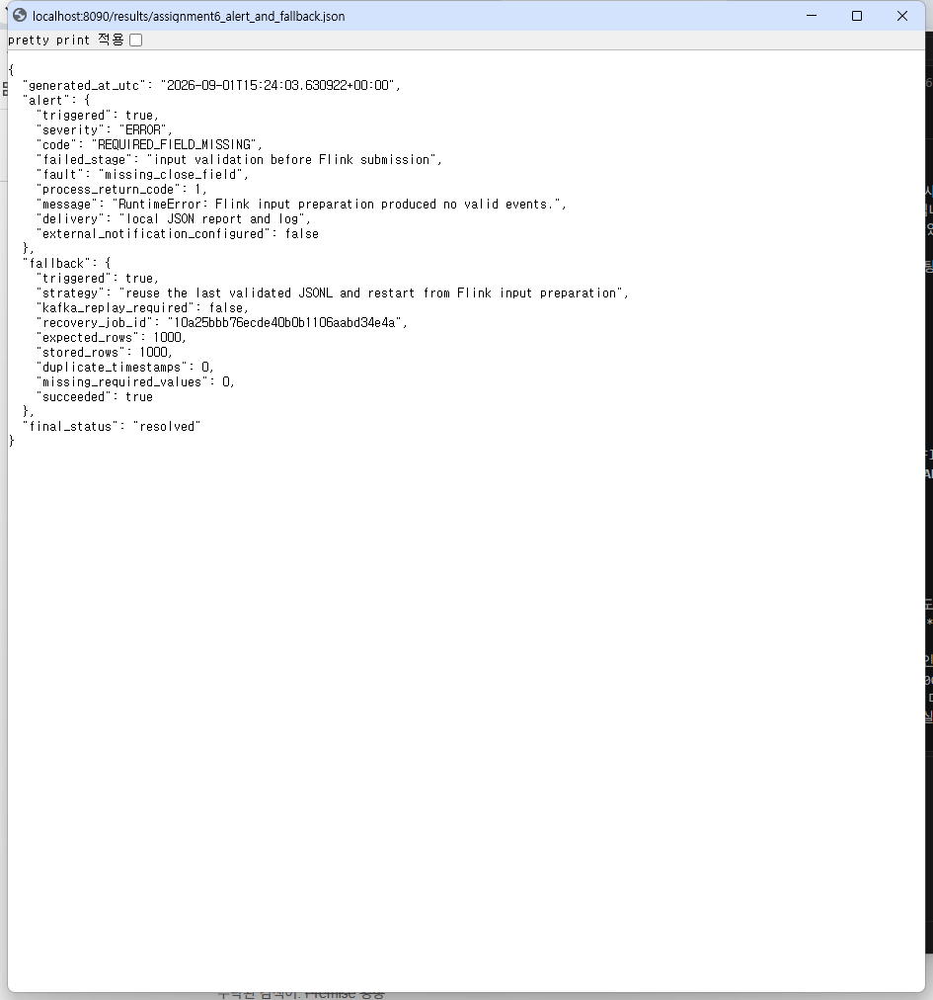
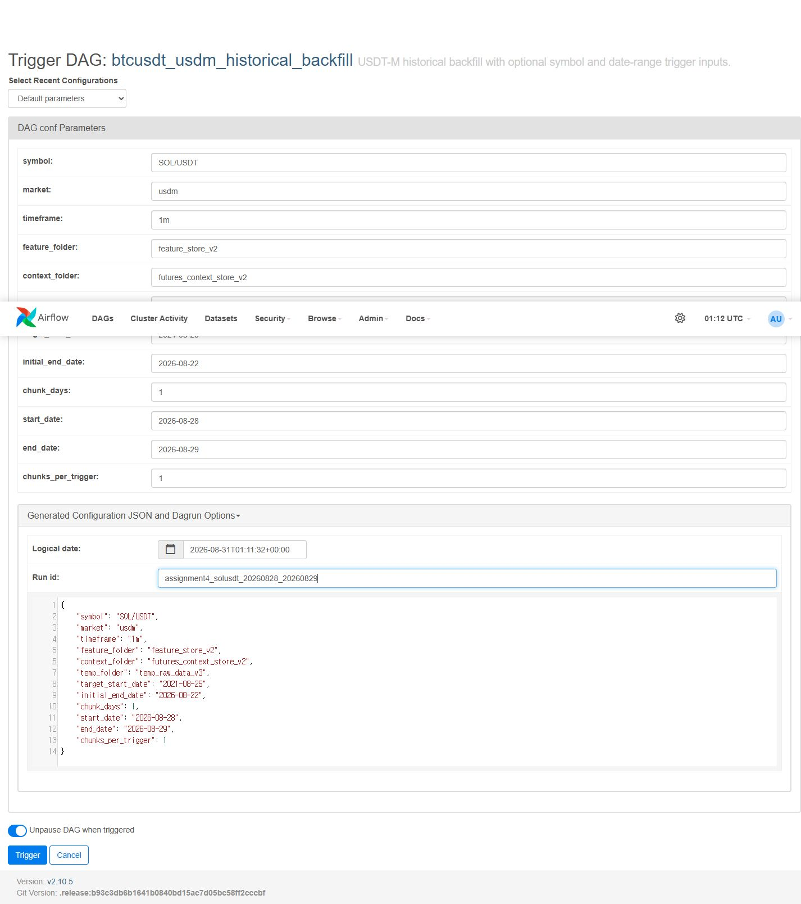
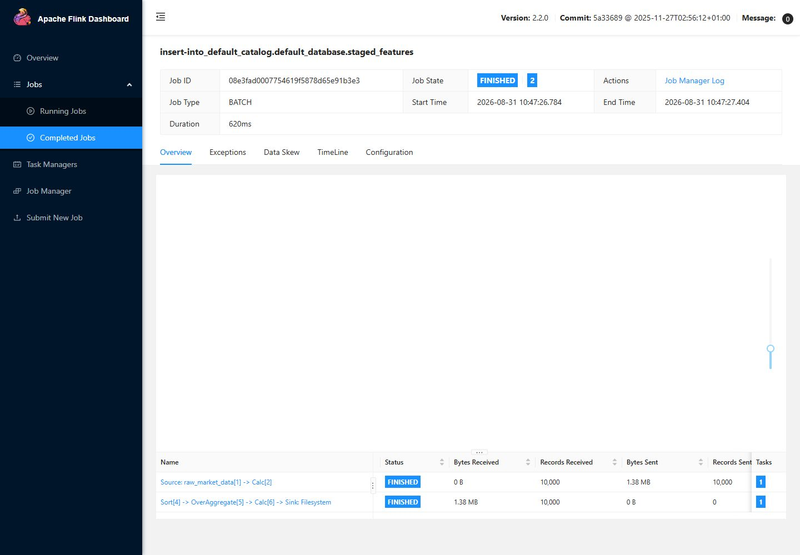

# 6차시 과제: 부하·복구 결과 보완 및 전체 흐름 점검

## 1. 제출 내용 요약

Binance USDT-M 자동매매 프로젝트에서 이미 실행한 5차시 Kafka·PyFlink 부하 및 복구 실험을
다시 실행하지 않고, 6차시 요구사항에 맞춰 다음 내용을 보완했습니다.

- 기준 실행과 부하 실행의 처리량, 최종 저장 건수, 미처리 건수 비교
- 실패 단계와 재실행 시작 위치 명시
- 입력 검증 Alert와 검증된 입력 Fallback 결과를 별도 JSON·로그로 생성
- Airflow, Kafka, PyFlink, Parquet을 연결한 최신 구성도와 데이터 모델 정리
- 실제 브라우저 화면, 로그, 단계별 JSON의 확인 위치 연결
- 현재 실행되지 않는 추론·장기 Paper·실거래 단계 구분

처리 엔진은 Spark가 아니라 프로젝트에서 사용 중인 **Apache Flink PyFlink**입니다. 외부 서비스에
부하를 주지 않기 위해 저장된 실제 Binance BTCUSDT 1분봉 1,000건을 로컬 Kafka에 재생했습니다.
부하용 10,000건은 이 실제 OHLCV 값을 순환 사용하면서 시각과 실행 내 ID를 확장한 재현 가능한
로컬 부하 데이터이며, Binance에서 서로 다른 10,000분을 새로 수집한 데이터는 아닙니다.

### 2026-09-03 최종 재점검

| 확인 항목 | 결과 |
| --- | --- |
| 6차시 보고서 재생성 | 성공, `validation.healthy=true` |
| Alert·Fallback 판정 | `triggered=true`, `succeeded=true`, `resolved` |
| 최종 Parquet 직접 읽기 | 1,000 / 10,000 / 1,000행, 중복·필수값 결측 0건 |
| Python 전체 테스트 | `python -m unittest discover -s tests -v`, 53개 통과 |
| 제출 JSON·Markdown 검사 | JSON 11개 정상, 깨진 내부 링크·코드 블록 0개 |

## 2. 먼저 확인할 파일

1. `ASSIGNMENT6_FINAL_REPORT.md`: 실제 캡처와 전체 결과를 포함한 최종 제출 보고서
2. `FILE_AND_TERMINOLOGY_GUIDE.md`: 제출 파일별 역할과 어려운 용어의 상세 해설
3. `README.md`: 과제 요구사항과 재실행 방법
4. `ARCHITECTURE_AND_DATA_MODEL.md`: 최신 구성도와 이벤트·Parquet 데이터 모델
5. `results/assignment6_pipeline_review.json`: 기준·부하·복구 통합 수치
6. `results/assignment6_alert_and_fallback.json`: Alert와 Fallback 실제 판정
7. `logs/fault_invalid_input.log`: `close` 필드 누락으로 발생한 원본 오류
8. `logs/assignment6_alert.log`: 오류 감지와 복구 상태를 읽기 쉽게 정리한 로그
9. `output_samples/*.parquet`: 기준·부하·복구 실행에서 실제 생성된 최종 저장 파일

## 3. 파이프라인 흐름

```text
저장된 실제 Binance BTCUSDT 1분봉
  -> Kafka Producer
  -> assignment5.market.events.v1 Topic
  -> Consumer의 event_id 중복 제거
  -> 필수 필드 입력 검사
  -> PyFlink Batch 피처 계산
  -> Parquet Feature Store 저장
  -> 행 수·중복·결측 검사
```

Airflow 과거 백필은 별도 배치 경로에서 종목과 날짜를 입력받아 수집, PyFlink 가공, Parquet 저장,
품질 검사를 순서대로 실행합니다. 과거 배치 경로는 Kafka가 필수가 아니며, Kafka는 실시간 경로와
이번 로컬 재생 부하 실험에 사용했습니다.

따라서 Airflow 캡처와 Kafka 부하 결과는 하나의 동일한 DAG Run 화면이 아닙니다. Airflow 화면은
파라미터 기반 과거 배치 경로를, Kafka·Flink 결과는 로컬 재생 부하·복구 경로를 각각 증명합니다.
두 경로는 최종적으로 같은 PyFlink 가공과 Parquet 저장 방식을 사용합니다.

## 4. 기준 실행과 부하 실행 비교

실제 원본 실행 시각은 2026-08-31 10:47 KST입니다.

| 항목 | 기준 실행 | 부하 실행 |
| --- | ---: | ---: |
| 실행 이름 | `baseline_1000` | `load_10000` |
| 고유 입력 | 1,000건 | 10,000건 |
| Producer 총 전송 | 1,000건 | 10,500건 |
| 의도적 중복 | 0건 | 500건 |
| Consumer 고유 수신 | 1,000건 | 10,000건 |
| Consumer가 제거한 중복 | 0건 | 500건 |
| PyFlink 입력 | 1,000행 | 10,000행 |
| 최종 Parquet 저장 | 1,000행 | 10,000행 |
| 예상하지 못한 미처리 | 0건 | 0건 |
| Kafka 구간 시간 | 3.094초 | 4.422초 |
| PyFlink 구간 시간 | 7.953초 | 8.266초 |
| 전체 실행 시간 | 11.141초 | 12.875초 |
| 최종 처리량 | 89.759행/초 | 776.699행/초 |
| timestamp 중복 | 0건 | 0건 |
| 필수값 결측 | 0건 | 0건 |
| 정상 시나리오 오류 | 0건 | 0건 |

고유 입력은 10배, 전체 시간은 1.156배, 최종 처리량은 8.653배가 됐습니다. 부하 실행에서
`Producer 전송 10,500 - 최종 저장 10,000 = 500`은 유실이 아니라 의도적으로 넣은 중복을
Consumer가 제거한 수치입니다. 고유 데이터 기준 미처리는 0건입니다.

이번 결과는 10,000건까지 정상 처리했다는 증거이며 최대 처리 한계를 찾았다는 뜻은 아닙니다.

## 5. 실패 단계와 재실행 위치

### 5.1 재현한 실패

정상 이벤트에서 필수 필드 `close`를 제거했습니다.

```text
실패 위치: Consumer 출력 JSONL -> PyFlink 입력 CSV 변환 전 입력 검사
종료 코드: 1
오류: RuntimeError: Flink input preparation produced no valid events.
```

오류가 Flink 제출 전에 감지됐으므로 잘못된 Parquet은 생성되지 않았고, Flink 화면에 실패 Job이
없는 것도 정상입니다.

### 5.2 재실행 위치

Kafka부터 모든 데이터를 다시 보내지 않고 마지막으로 검증된 기준 JSONL에서 재개했습니다.

```text
검증된 baseline JSONL
  -> PyFlink 입력 준비부터 재실행
  -> 복구 PyFlink Job
  -> recovery_1000 Parquet
```

| 복구 항목 | 결과 |
| --- | ---: |
| 복구 Job ID | `10a25bbb76ecde40b0b1106aabd34e4a` |
| 기대 행 수 | 1,000행 |
| 최종 저장 | 1,000행 |
| timestamp 중복 | 0건 |
| 필수값 결측 | 0건 |
| 결과 | `FINISHED`, `healthy=true` |

## 6. Alert와 Fallback 실제 결과

`scripts/build_assignment6_report.py`는 실제 5차시 실행 JSON을 다시 검증하면서 다음 조건을
검사합니다. 여기서 Alert는 장애 발생 순간에 외부로 전송되는 실시간 알림이 아니라, 실행 후 실제
실패 결과를 판정해 생성하는 로컬 사후 Alert입니다.

```text
failure_reproduced=true AND process_return_code!=0
  -> REQUIRED_FIELD_MISSING Alert 생성
  -> 검증된 JSONL Fallback 결과 확인
  -> 기대 행 수와 복구 저장 행 수가 같으면 resolved
```

실행 결과:

| 항목 | 결과 |
| --- | --- |
| Alert 발생 | `true` |
| Alert 코드 | `REQUIRED_FIELD_MISSING` |
| 실패 단계 | Flink 제출 전 입력 검사 |
| Fallback 실행 | `true` |
| Kafka 재전송 필요 | `false` |
| 복구 저장 | 1,000 / 1,000행 |
| 최종 상태 | `resolved` |



위 화면은 생성된 결과를 꾸민 이미지가 아니라 로컬 서버에서 실제
`results/assignment6_alert_and_fallback.json` 파일을 연 Chrome 화면입니다.

이 Alert는 외부 Slack·이메일 알림이 아니라 제출 범위에 맞춘 **로컬 JSON·로그 Alert**입니다.
외부 알림이 연결됐다고 과장하지 않았습니다.

## 7. 실제 실행 화면

### Airflow 입력값 변경



코드를 수정하지 않고 `symbol`, `start_date`, `end_date`를 입력할 수 있습니다.


Airflow가 수집, PyFlink 처리, 피처 검사와 선물 문맥 검사를 순서대로 완료한 화면입니다.


실제 DAG Run에 전달된 JSON 입력값을 확인할 수 있습니다.

### Flink 기준·부하·복구





세 Job이 모두 `FINISHED`이고 화면의 Records Received가 각각 1,000, 10,000, 1,000임을
확인할 수 있습니다.

## 8. 단계별 결과 확인 방법

| 확인 대상 | 파일 | 확인 필드 |
| --- | --- | --- |
| 전체 비교 | `results/assignment6_pipeline_review.json` | `baseline_and_load`, `comparison` |
| Alert·Fallback | `results/assignment6_alert_and_fallback.json` | `alert.triggered`, `fallback.succeeded` |
| Producer | `source_results/*_producer.json` | `producer_sent_count`, `send_records_per_second` |
| Consumer | `source_results/*_consumer.json` | `consumer_received_count`, `duplicate_message_count` |
| PyFlink | `source_results/*_flink.json` | `flink_input_valid_count`, `flink_output_processed_count` |
| Parquet 품질 | `source_results/assignment5_output_quality_check.json` | `parquet_rows`, `duplicate_timestamps`, `missing_required_values` |
| 실제 오류 내용 | `logs/fault_invalid_input.log` | `RuntimeError`, 실패 명령과 경과 시간 |
| 종료 코드 | `results/assignment6_alert_and_fallback.json`, `logs/assignment6_alert.log` | `process_return_code=1` |
| 최종 저장 파일 | `output_samples/*.parquet` | 실제 행 수, 컬럼, 중복·결측 |

Parquet은 텍스트 파일이 아니므로 VS Code 일반 편집기로 열지 않습니다. Python에서 다음과 같이
확인합니다.

```powershell
python -c "import pandas as pd; print(pd.read_parquet('파일경로.parquet').head())"
```

제출 폴더에는 실행 시 생성된 최종 Parquet 중 다음 세 파일을 작은 결과물로 포함했습니다.

```text
output_samples/baseline_1000.parquet  = 1,000행
output_samples/load_10000.parquet     = 10,000행
output_samples/recovery_1000.parquet  = 1,000행
```

세 파일의 행 수와 주요 품질을 한 번에 확인하려면 다음 명령을 사용합니다.

```powershell
python -c "from pathlib import Path; import pandas as pd; [(lambda d: print(p.name, len(d), d['timestamp'].duplicated().sum(), d[['timestamp','close','ma_5','return_1m']].isna().sum().sum()))(pd.read_parquet(p)) for p in sorted(Path('assignment6_submission/output_samples').glob('*.parquet'))]"
```

## 9. 현재 실행 방법

### 9.1 기존 결과로 6차시 보고서 다시 생성

이 명령은 외부 API나 Kafka에 새 부하를 보내지 않습니다.

```powershell
python assignment6_submission/scripts/build_assignment6_report.py
```

성공 기준:

```text
results/assignment6_pipeline_review.json
  -> validation.healthy = true

results/assignment6_alert_and_fallback.json
  -> alert.triggered = true
  -> fallback.succeeded = true
  -> final_status = resolved
```

### 9.2 전체 부하 실험을 다시 실행해야 할 때만

`pipeline_code`에는 당시 실제 실행 코드를 GitHub 제출용으로 함께 넣었습니다. 전체 실험을 다시
실행해야 할 때는 다음처럼 해당 폴더로 이동한 뒤 실행합니다.

```powershell
Set-Location assignment6_submission/pipeline_code
docker compose up -d zookeeper kafka jobmanager taskmanager airflow
python assignment5_pipeline_resilience/run_experiment.py
```

과제 안내상 이미 제출한 실험은 다시 할 필요가 없으므로 이번 보완에서는 실행 결과를 재검증하는
9.1 명령만 실행했습니다.

## 10. 아직 실행되지 않는 단계와 남은 작업

| 단계 | 현재 상태 | 남은 작업 |
| --- | --- | --- |
| 승인 모델 실시간 추론 | `no_trade` | 비용 후 양의 Walk-Forward 모델 승인 |
| 장기 Paper Trading | 단기 구조 검증 | 실제 spread·funding·부분 체결을 반영해 수 주 운영 |
| 모델 자동 교체 | 미연결 | Registry manifest, 사람 승인, rollback 구현 |
| 거래소 Testnet 주문 | 미실행 | reduce-only stop, 재시도, 주문 상태 reconciliation |
| 실제 자금 주문 | 차단 | Testnet과 장기 Paper 기준 통과 후 별도 승인 |
| 외부 Alert | 미연결 | 필요 시 Slack·이메일·운영 모니터링 연결 |
| 최대 처리 한계 | 미측정 | 10만 건 이상 단계 확대와 CPU·메모리·lag 수집 |
| 실행 간 중복 제거 | 미검증 | run_id와 독립적인 결정적 event_id로 변경 후 재실행 검증 |
| 이벤트 시간 단위 | 변환기에서 `1m` 고정 | 다음 이벤트 스키마에 `timeframe` 필수 필드 추가 |

저장 결과를 사용하는 BI, API 또는 웹 화면은 이번 과제에 새로 추가하지 않았으므로 선택 제출
항목은 포함하지 않았습니다. 기존 ML 연구에서는 Feature Store를 사용하지만 현재 승인된 수익
모델이 없어 실시간 inference 예시를 제출 결과로 꾸미지 않았습니다.

## 11. 과제 요구사항 대응표

| 과제 요구사항 | 제출 위치 | 상태 |
| --- | --- | --- |
| 기준·부하 건수, 시간, 처리량, 저장, 오류·미처리 | README 4절, 통합 JSON | 완료 |
| 실패 단계, 재실행 위치, 저장 결과 | README 5절, 실패 로그 | 완료 |
| fallback 또는 alert 실제 동작 | README 6절, Alert JSON·로그 | 완료 |
| 최신 구성도와 데이터 모델 | `ARCHITECTURE_AND_DATA_MODEL.md` | 완료 |
| Kafka·Flink·저장·Airflow 화면과 로그 | README 7~8절, `evidence/`, `source_results/` | 완료 |
| Spark 처리 단계 | 프로젝트 표준인 PyFlink로 대체하고 사유 명시 | 완료 |
| 아직 실행되지 않는 단계 | README 10절 | 완료 |
| 현재 실행 방법과 확인 결과 README | README 9절 | 완료 |
| BI·API·inference 선택 항목 | 새로 추가하지 않아 제출 대상 아님을 10절에 명시 | 해당 없음 |

