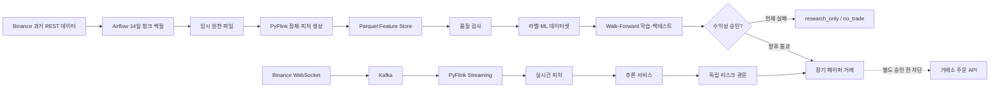

# 현재 프로젝트 상태 요약

- 기준일: `2026-09-04`
- 대상: Binance USDT-M `BTCUSDT`
- 최종 목표: 과거·실시간 시장 데이터를 가공해 모델을 검증하고, 안전 기준을 통과한 모델만 페이퍼 거래와 실거래 후보로 연결한다.

## 1. 한눈에 보는 현재 상태

현재 프로젝트는 **데이터 수집·가공·저장·학습·백테스트가 끝까지 실행되는 연구용 파이프라인**까지 구축됐다.

다만 현재 모델은 거래 비용을 반영한 Walk-Forward 검증에서 수익성을 통과하지 못했다. 따라서
추론 서비스는 `no_trade`만 출력하고 거래소 주문 API는 의도적으로 연결하지 않은 상태다.

```text
5년 1분봉·선물 문맥 수집    완료
Airflow 청크 자동 백필       완료
PyFlink 배치 가공            완료
Parquet 저장·품질 검사       완료
Kafka·PyFlink 실시간 경로    구축 및 기능 검증 완료
모델 학습·Walk-Forward       실행 완료, 수익성 승인 실패
체결 데이터 장기 축적        3.79일 / 최소 목표 90일
장기 페이퍼 거래             승인 모델이 없어 대기
실거래 주문                  안전상 차단
```

## 2. 전체 데이터 흐름



과거 데이터는 날짜 범위가 정해진 배치이므로 파일 중심으로 처리한다. 실시간 데이터는 수집 속도와
처리 속도를 분리하고 재생할 필요가 있어 Kafka를 중간 저장소로 사용한다.

## 3. 완료된 작업

| 영역 | 완료 내용 | 확인 결과 |
| --- | --- | --- |
| 과거 데이터 | 2021-08-25~2026-08-26 BTCUSDT 1분봉·선물 문맥 백필 | 약 263만 개의 연속 1분 행 |
| 자동화 | Airflow가 성공 마커를 기준으로 14일 청크를 이어서 처리 | 중단 후 재개와 날짜 범위 변경 실행 확인 |
| 배치 가공 | PyFlink로 정제, 이동평균, 수익률 등 피처 생성 | Parquet Feature Store 저장 완료 |
| 품질 관리 | 중복, 1분 공백, 결측치, 스키마, 마커 연속성 검사 | 전체 품질 보고서 생성 |
| 원천 정리 | 결과와 성공 마커를 검증한 청크만 임시 CSV 삭제 | 실패 시 원천 파일 보존 |
| 실시간 수집 | WebSocket의 aggTrade, depth, bookTicker를 Kafka로 전달 | 재연결·호가 sequence 복구 검증 |
| 실시간 가공 | PyFlink Kafka Job의 event time, watermark, checkpoint 적용 | late event와 재시작 복구 검증 |
| 정합성 | 배치·실시간 기본 피처, 메타데이터, downstream 중복 방지 검사 | 관련 자동 테스트 통과 |
| Kafka 내구성 | 안정적인 업무 event ID, named volume, 72시간 보존 적용 | 컨테이너 재생성 뒤 메시지 재확인 |
| 처리량 | 저장된 데이터를 1만·5만·10만 건으로 로컬 재생 | 10만 건까지 누락·예상 밖 중복 0건 |
| ML 연구 | 라벨링, 시간순 분할, 기준선·2단계·롱/숏 모델 실행 | 학습 절차는 완료, 모델 승인은 실패 |
| 안전 장치 | 음의 기대값이면 강제 no_trade, 거래 위험 2% 상한 구조 | 실주문 호출 0건 |

현재 회귀 테스트는 `53개`가 통과한 상태다.

## 4. 모델 검증 결과

### 5년 기준선 모델

- ML 데이터셋: `2,632,080`행
- 테스트 정확도: `38.27%`
- 다수 클래스 기준: `46.04%`
- 백테스트: `1,472`거래, 평균 `-0.2225R`, 누적 수익률 `-99.88%`
- 판단: 배포 불가

### 시간순 Walk-Forward

- 365일 학습, 60일 검증, 60일 테스트를 4개 구간에 적용
- 미래 라벨이 다음 구간으로 넘어가지 않도록 경계 데이터를 제거
- 네 구간 모두 비용 포함 양의 검증 기대값 후보가 없었음
- 안전 관문 적용 후 `345,563`개 테스트 예측 전부 `no_trade`
- 최종 상태: `research_only`

이 결과는 파이프라인 실패가 아니다. 손실 가능성이 큰 모델을 주문 경로에 연결하지 않은 안전
관문의 정상 작동 결과다.

## 5. 체결·호가 데이터 상태

실제 aggTrade `4,500,772`건을 `5,760`개의 연속 1분 행으로 집계했다. 이 데이터로 매수·매도
불균형, 거래 강도, 평균 체결 금액, 5·15·60분 비율 등 `22개`의 체결 피처를 만들었다.

- 최종 결합 데이터: `5,461`행, `61`컬럼
- 중복 timestamp: `0`
- 누락 조인: `0`
- 미래 정보 사용 검사: 통과
- 연속 데이터 기간: `3.79일`
- 모델 학습 최소 기준: `90일`

따라서 체결 피처 생성 코드는 검증됐지만, 이 피처를 사용하는 모델 학습은 데이터 부족으로 차단됐다.
depth와 bookTicker도 수집·복구 구조는 있으나 장기간 학습 자료는 아직 부족하다.

## 6. 남은 작업과 순서

### 1순위: 미시구조 데이터 누적

- Airflow 일일 수집으로 aggTrade를 최소 90일 연속 누적한다.
- depth와 bookTicker의 장기 저장 정책을 확정하고 누락을 감시한다.
- PC가 꺼지는 기간은 공개 API로 복구 가능한 데이터와 복구 불가능한 호가 데이터를 구분한다.

### 2순위: 통합 피처 데이터셋 완성

- OHLCV, mark price, funding, open interest, aggTrade, 호가 피처를 timestamp 기준으로 결합한다.
- 배치와 실시간 경로가 같은 정의로 같은 값을 만드는지 다시 검사한다.
- 데이터 누수, 중복, 결측, 시간 공백을 품질 관문에서 차단한다.

### 3순위: 모델 재학습과 승인 검사

- 90일 이상 누적된 체결·호가 피처로 모델을 다시 학습한다.
- 수수료, 스프레드, 슬리피지, 펀딩비, 지연을 모두 반영한다.
- 시간순 Walk-Forward에서 양의 기대값과 허용 가능한 최대 낙폭을 동시에 통과해야 한다.
- 통과하지 못하면 계속 `no_trade`를 유지한다.

### 4순위: 장기 페이퍼 거래

- 승인 후보 모델을 실제 실시간 데이터에 연결하되 거래소 주문은 보내지 않는다.
- 수 주에서 수개월 동안 신호, 거절, 가상 체결, 손익, 지연을 기록한다.
- 백테스트와 실시간 페이퍼 결과의 차이를 분석한다.

### 5순위: 주문·운영 안정성

- 거래소 테스트넷에서 reduce-only stop, 부분 체결, 취소, 재시도, 주문 상태 복구를 검증한다.
- 일일 손실 제한, 청산 버퍼, Kill Switch를 끝까지 시험한다.
- Kafka lag, Flink checkpoint, 데이터 공백, 모델 성능 저하에 대한 외부 알림을 추가한다.
- 단일 Kafka 브로커를 계속 사용할지 다중 브로커·백업 구조로 바꿀지 결정한다.

### 6순위: 실거래 검토

실거래는 다음 조건을 모두 만족한 뒤 별도로 판단한다.

1. 여러 시장 구간의 Walk-Forward 기준 통과
2. 비용 포함 양의 기대값 확인
3. 장기 페이퍼 기준 통과
4. 주문 장애·복구 시험 통과
5. 사람이 모델 버전과 위험 한도를 명시적으로 승인

## 7. 현재 가장 중요한 결론

5년치 1분봉을 더 받는 것이 현재 병목은 아니다. 지금 필요한 것은 **실제 체결·호가 데이터를
연속적으로 쌓아 기존 가격 중심 모델에 없던 시장 미시구조 정보를 추가하는 것**이다.

또한 계좌 위험 2%는 계획상 상한일 뿐 실제 손실을 정확히 2%로 보장하지 않는다. 급격한 가격 변화,
슬리피지, 주문 지연으로 실제 손실이 커질 수 있으므로 청산 버퍼, 일일 손실 제한과 Kill Switch가
독립적으로 필요하다.

## 8. 상세 근거 문서

- [전체 아키텍처 구축 현황](full_architecture_build_status_2026-08-25.md)
- [5년 과거 데이터 백필 완료 기록](five_year_backfill_completion_2026-08-28.md)
- [5년 ML 기준선 실행 기록](five_year_ml_baseline_execution_2026-08-28.md)
- [5년 Walk-Forward 실행 기록](walk_forward_validation_execution_2026-08-30.md)
- [롱·숏 독립 수익성 모델 결과](action_profitability_walk_forward_execution_2026-09-02.md)
- [aggTrade 체결 피처 결합 결과](trade_enriched_feature_integration_execution_2026-09-02.md)
- [Kafka·PyFlink 처리량 결과](pipeline_capacity_test_execution_2026-08-31.md)
- [Kafka 내구성·이벤트 ID 검증](kafka_durability_and_stable_event_id_execution_2026-08-31.md)

## 9. 다음 작업을 시작할 때 확인할 한 문장

```text
다음 작업은 aggTrade·depth·bookTicker를 장기간 자동 누적하고, 90일 이상 확보된 시점에
체결·호가 피처를 포함한 데이터셋으로 Walk-Forward 모델 검증을 다시 실행하는 것이다.
```
