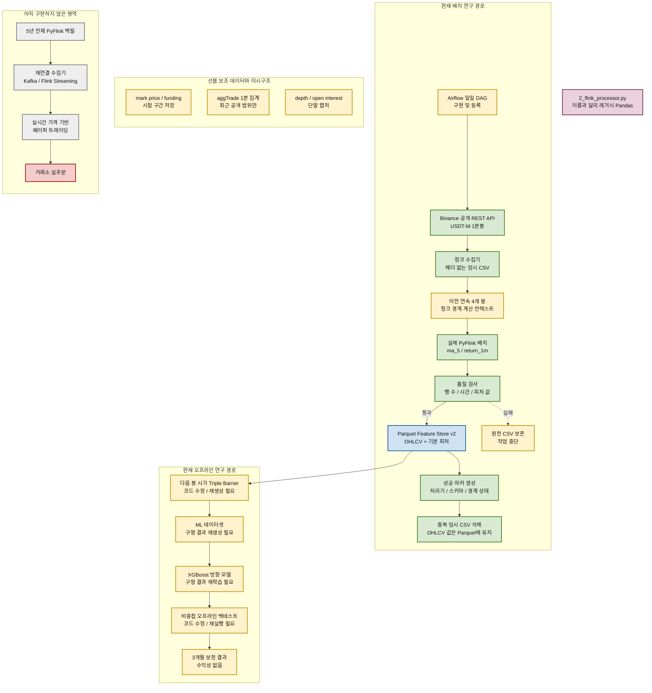
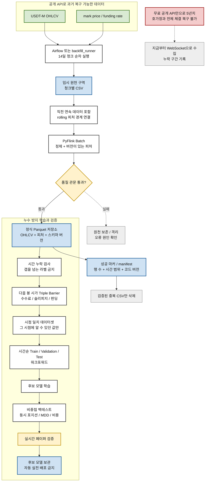
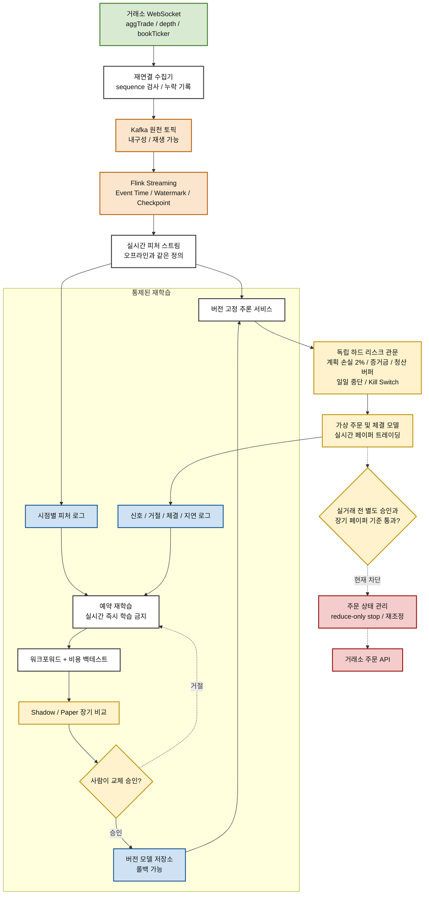

# 아키텍처

수정일: 2026-08-20

각 코드 블록은 서로 독립적입니다. 원하는 그림의 코드 블록 하나만 복사해
Mermaid AI의 `Code` 패널에 붙여넣으면 됩니다.

기존 PNG 3개는 2026-08-17 당시의 목표 그림입니다. 현재 구현과 미구현 기능이
섞여 있으므로 최신 기준본으로 사용하지 않습니다. 아래 코드로 다시 출력한 그림을
최신 아키텍처로 사용합니다.

상태 색상은 다음 뜻입니다.

- 초록색: 구현하고 실행한 영역
- 노란색: 일부 구현했거나 재검증이 필요한 영역
- 회색: 앞으로 구현할 영역
- 빨간색: 현재 차단된 실거래 영역

## 1. 현재 실제 구현 상태

이 그림에서 `Airflow`는 구현·등록과 고정 데이터 검증까지 끝났지만, 수정된 경계
컨텍스트 코드를 포함한 실제 공개 API 하루 전체 실행은 다시 확인해야 하므로 노란색입니다.

## 2. 5년 과거 데이터 백필 목표 아키텍처

핵심은 원천을 무조건 지우는 것이 아닙니다. OHLCV 값은 정식 Parquet에 그대로
남기고 중복 CSV만 지웁니다. 체결·호가 원천은 피처 정의와 재생 검사가 안정되기
전까지 짧은 보존 기간을 두는 편이 안전합니다.

## 3. 향후 실시간 페이퍼 트레이딩 아키텍처

이 구조에서는 머신러닝이 계좌 손실 한도를 바꿀 수 없습니다. 모델은 신호 후보를
만들고, 독립된 리스크 관문이 포지션 크기와 거래 허용 여부를 결정합니다. 새 모델도
백테스트 결과 하나만으로 자동 교체하지 않습니다.

## 4. 기존 PNG에서 잘못 보였던 부분

| 기존 표현 | 문제 | 수정 방향 |
| --- | --- | --- |
| REST API에서 5년치 체결·호가 수집 | 무료 공개 API로 전체 과거 호가창을 복구할 수 없음 | 복구 가능한 배치 데이터와 지금부터 쌓는 WebSocket 데이터를 분리 |
| Feature Processor가 RSI·VWAP·Imbalance 생성 | 현재 실제 PyFlink는 `ma_5`, `return_1m`만 생성 | 현재 피처와 목표 피처를 별도 표시 |
| Model Registry에 검증된 모델 존재 | 현재는 `models/` 파일뿐이며 수익성이 검증되지 않음 | 후보 모델 보관으로 표시 |
| 새 모델이 기존 모델보다 좋으면 즉시 교체 | 백테스트 과적합과 운영 장애 위험 | 워크포워드, Shadow/Paper, 사람 승인, 롤백 추가 |
| 주문 실행 봇에서 거래소 API로 직결 | 리스크·주문 상태·Kill Switch 관문 부족 | 독립 하드 리스크와 페이퍼 단계를 먼저 배치 |
| 원천 데이터 전체 삭제 | 재가공 불가능 위험 | 정식 Parquet에 원천 필드를 유지하고 중복 임시 파일만 삭제 |
